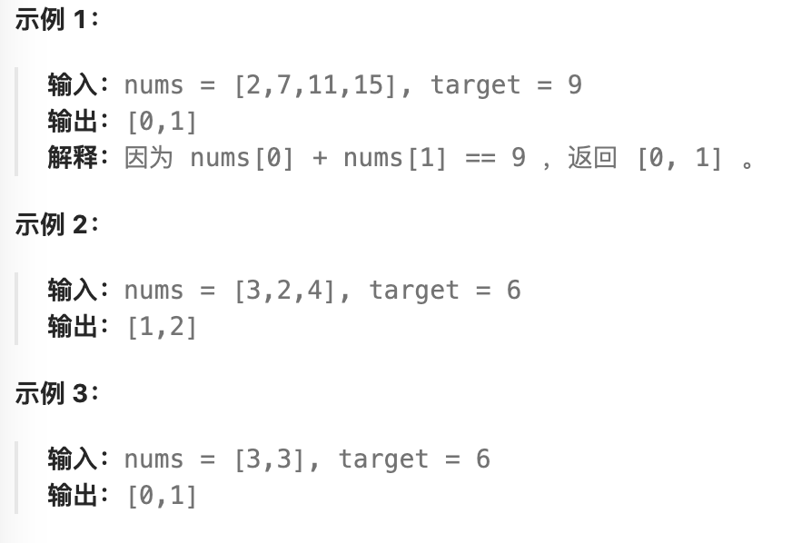

- #哈希表
- https://leetcode.cn/problems/two-sum
- 
  id:: 65276418-8965-468d-91a6-bac195b72933
- ```java
  import java.util.HashMap;
  
  class Solution {
      public int[] twoSum(int[] nums, int target) {
          HashMap<Integer, Integer> map = new HashMap<>();
          for (int i = 0; i < nums.length; i++) {
              int value = nums[i];
              Integer index = map.get(target - value);
              if (index != null) {
                  return new int[]{index, i};
              }
              map.put(value, i);
          }
          return new int[]{};
      }
  }
  ```
-