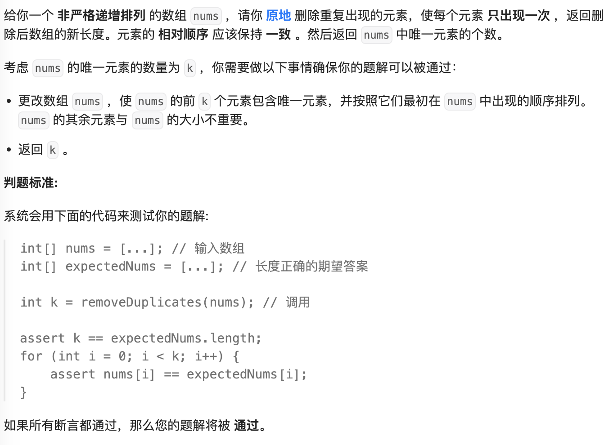
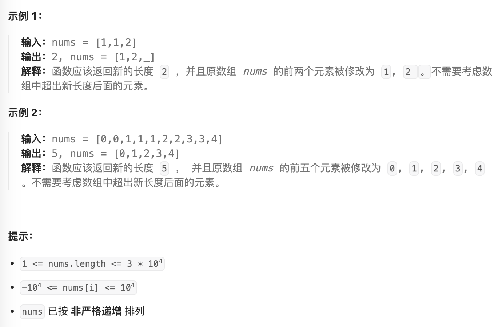

- #数组 #暴力 #双指针 #filter
- https://leetcode.cn/problems/remove-duplicates-from-sorted-array/description/
- 
- 
-
- ```java
  public int removeDuplicates(int[] nums) {
    //暴力
    Set<Integer> sets = new HashSet<>();
    for (int n : nums) {
      sets.add(n);
    }
    Integer[] sorted = sets.stream().sorted().toArray(Integer[]::new);
    for (int i = 0; i < sorted.length; i++) {
      nums[i] = sorted[i];
    }
    return sorted.length;
  }
  ```
- ```java
  public int removeDuplicates2(int[] nums) {
    //filter
    int n = 1;
    for (int i = 1; i < nums.length; i++) {
      if (nums[i] != nums[i - 1]) {
        nums[n] = nums[i];
        n++;
      }
    }
    return n;
  }
  ```
-