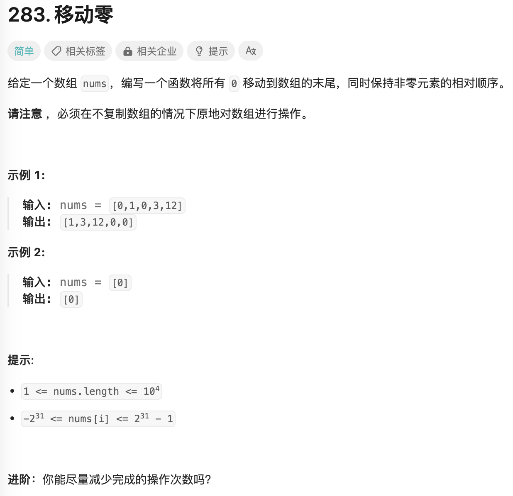

- #array #filter
- https://leetcode.cn/problems/move-zeroes/description/
- 
-
- 同样适用filter模型
- ```java
  public void moveZeroes(int[] nums) {
    int n = 0;
    for (int i = 0; i < nums.length; i++) {
      if (nums[i] != 0) {
        nums[n] = nums[i];
        n++;
      }
    }
    for (int i = n; i < nums.length; i++) {
      nums[i] = 0;
    }
  }
  ```