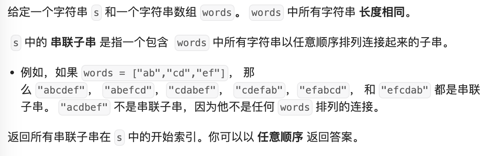
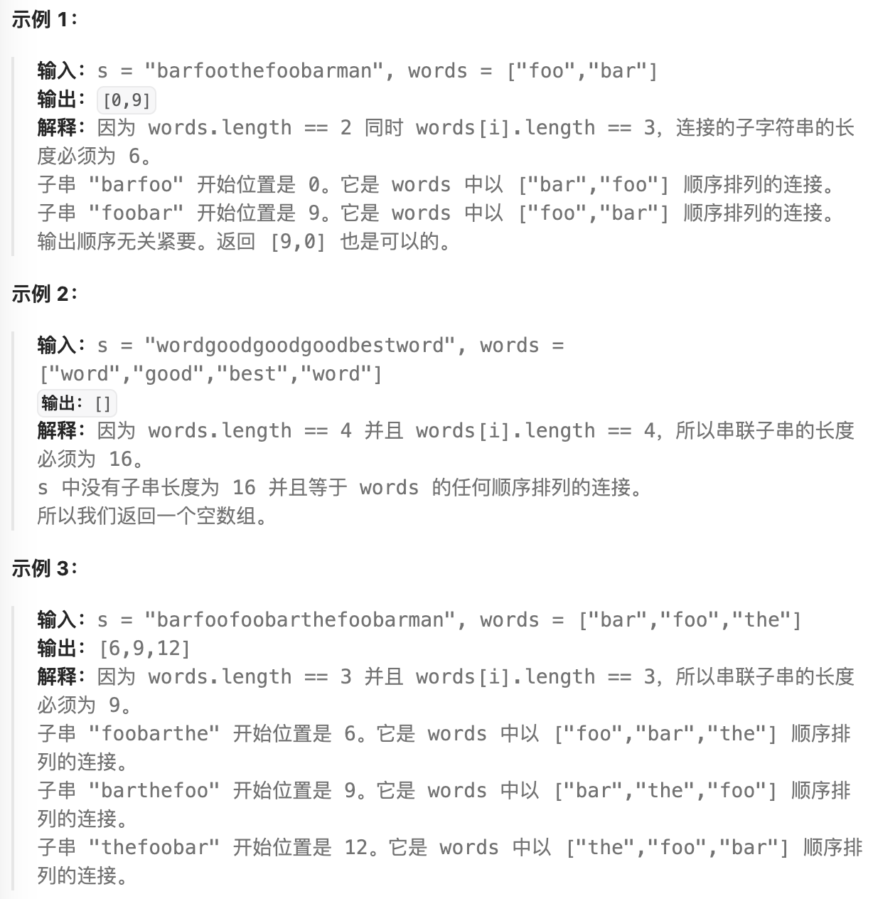

- #滑动窗口 #哈希表
- https://leetcode.cn/problems/substring-with-concatenation-of-all-words/description/
- 
- 
- ```java
  public List<Integer> findSubstring(String s, String[] words) {
    List<Integer> rs = new ArrayList<>();
    int wordLength = words[0].length();
    int subStringLength = words.length * wordLength;
  
    Map<String, Integer> wordsCounts = new HashMap<>();
    for (String word : words) {
      Integer count = wordsCounts.getOrDefault(word, 0);
      wordsCounts.put(word, count + 1);
    }
  
    for (int i = 0; i + subStringLength <= s.length(); i++) {
      String subStr = s.substring(i, i + subStringLength);
      Map<String, Integer> subWordsCounts = new HashMap<>();
      for (int j = 0; j + wordLength <= subStringLength; j += wordLength) {
        String subWord = subStr.substring(j, j + wordLength);
        Integer count = subWordsCounts.getOrDefault(subWord, 0);
        subWordsCounts.put(subWord, count + 1);
      }
  
      if (wordsCounts.equals(subWordsCounts)) rs.add(i);
    }
    return rs;
  }
  ```
-