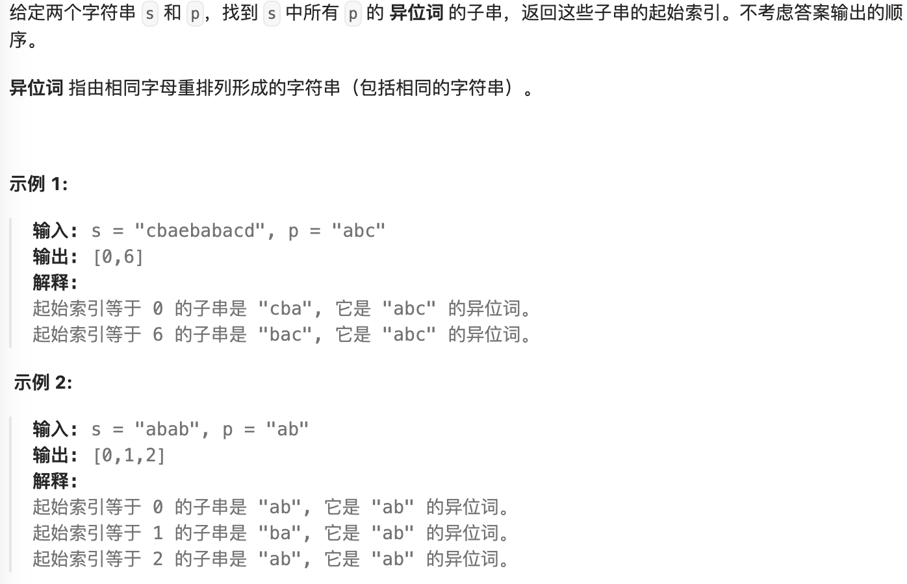

- #统计次数 #滑动窗口
- https://leetcode.cn/problems/find-all-anagrams-in-a-string/description/
- 
- ```java
  public class FindAllAnagramsInAString {
      public List<Integer> findAnagrams(String s, String p) {
          final char[] pChars = p.toCharArray();
          final char[] chars = s.toCharArray();
          if(pChars.length > chars.length) return Collections.emptyList();
  
          final List<Integer> rs = new ArrayList<>();
          final Map<Character, Integer> counts = new HashMap<>();
          final Map<Character, Integer> pCounts = new HashMap<>();
  
          for (char pChar : pChars) {
              int count = pCounts.getOrDefault(pChar, 0);
              pCounts.put(pChar, count + 1);
          }
  
          for (int i = 0; i < pChars.length; i++) {
              int count = counts.getOrDefault(chars[i], 0);
              counts.put(chars[i], count + 1);
          }
          if (counts.equals(pCounts)) {
              rs.add(0);
          }
  
          for (int i = 1, j = i + pChars.length - 1; i < chars.length && j < chars.length; i++, j++) {
              char pre = chars[i - 1];
              int preCount = counts.get(pre) - 1;
              if (preCount == 0) {
                  counts.remove(pre);
              } else {
                  counts.put(pre, preCount);
              }
  
              char last = chars[j];
              int lastCount = counts.getOrDefault(last, 0);
              counts.put(last, lastCount + 1);
  
              if (counts.equals(pCounts)) {
                  rs.add(i);
              }
          }
          return rs;
      }
  
      public List<Integer> findAnagrams2(String s, String p) {
          int sLen = s.length(), pLen = p.length();
  
          if (sLen < pLen) {
              return new ArrayList<Integer>();
          }
  
          List<Integer> ans = new ArrayList<Integer>();
          int[] sCount = new int[26];
          int[] pCount = new int[26];
          for (int i = 0; i < pLen; ++i) {
              ++sCount[s.charAt(i) - 'a'];
              ++pCount[p.charAt(i) - 'a'];
          }
  
          if (Arrays.equals(sCount, pCount)) {
              ans.add(0);
          }
  
          for (int i = 0; i < sLen - pLen; ++i) {
              --sCount[s.charAt(i) - 'a'];
              ++sCount[s.charAt(i + pLen) - 'a'];
  
              if (Arrays.equals(sCount, pCount)) {
                  ans.add(i + 1);
              }
          }
  
          return ans;
      }
  }
  ```
-