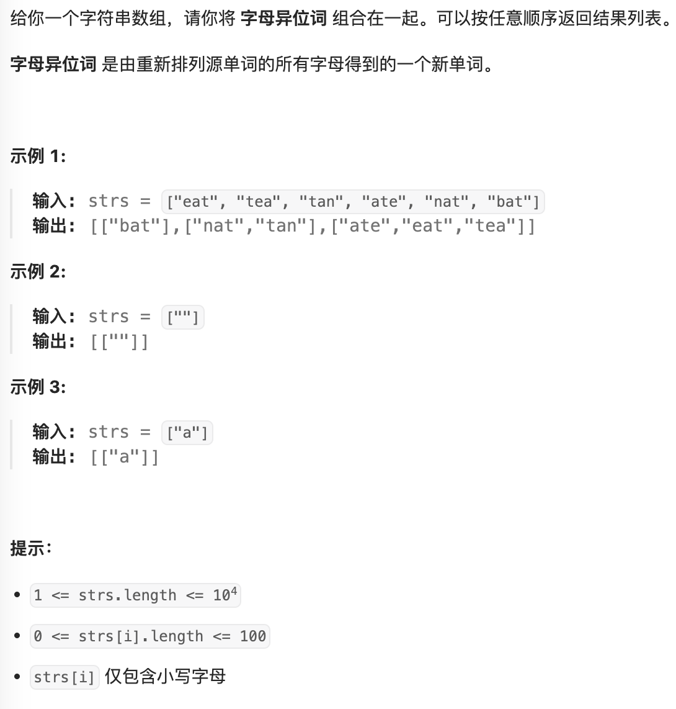

- #排序
- https://leetcode.cn/problems/group-anagrams/description/
- 
- ```java
  public List<List<String>> groupAnagrams(String[] strs) {
          Map<String, List<String>> map = new HashMap<>();
          for (String str : strs) {
              char[] charArray = str.toCharArray();
              Arrays.sort(charArray);
              String sortedString = new String(charArray);
              List<String> group = map.get(sortedString);
              if (group != null) {
                  group.add(str);
              } else {
                  List<String> newGroup = new ArrayList<>();
                  newGroup.add(str);
                  map.put(sortedString, newGroup);
              }
          }
          return map.values().stream().toList();
      }
  ```