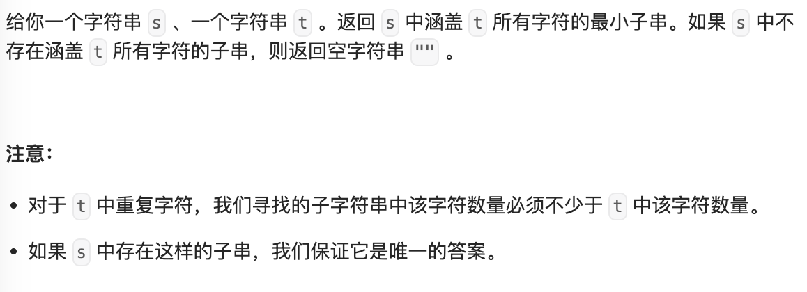

- #滑动窗口
- https://leetcode.cn/problems/minimum-window-substring/description/
- 
  id:: 6528a998-fb5f-414b-a30b-4afd7f02a197
- **示例 1**
	- ```
	  **输入：**s = "ADOBECODEBANC", t = "ABC"
	  **输出：**"BANC"
	  **解释：**最小覆盖子串 "BANC" 包含来自字符串 t 的 'A'、'B' 和 'C'。
	  ```
- **示例 2**
	- ```
	  **输入：**s = "a", t = "a"
	  **输出：**"a"
	  **解释：**整个字符串 s 是最小覆盖子串。
	  ```
- **示例 3**
	- ```
	  **输入:** s = "a", t = "aa"
	  **输出:** ""
	  **解释:** t 中两个字符 'a' 均应包含在 s 的子串中，
	  因此没有符合条件的子字符串，返回空字符串。
	  ```
-
-