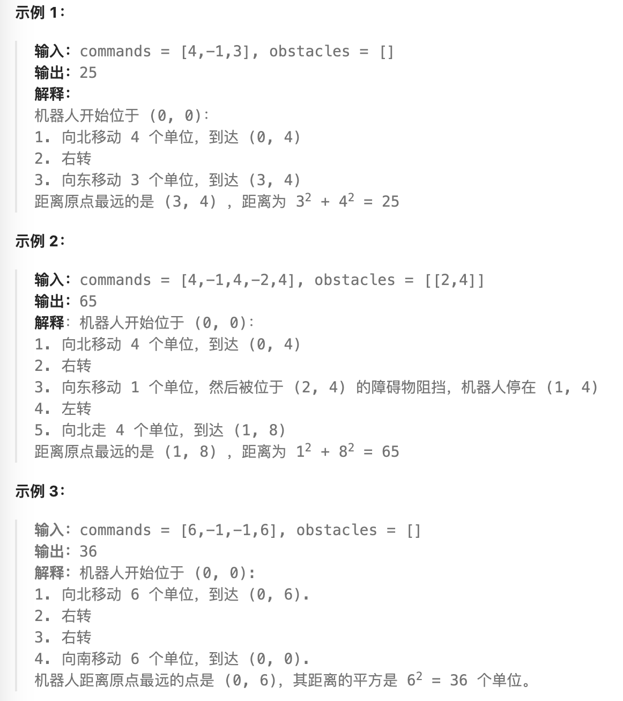

- #取模 #二维数组 #字符串转整型
- https://leetcode.cn/problems/walking-robot-simulation/description/
- 
- ```java
  public int robotSim(int[] commands, int[][] obstacles) {
          int rs = 0;
          int[][] dirs = {{0, 1}, {1, 0}, {0, -1}, {-1, 0}};
          HashSet<String> sets = new HashSet<>();
          for (int[] obstacle : obstacles) {
              sets.add(toKey(obstacle));
          }
          int[] location = new int[]{0, 0};
          int direction = 0;
          for (int command : commands) {
              if (command == -1) {
                  direction = (direction + 1) % 4;
              } else if (command == -2) {
                  direction = (direction + 3) % 4;
              } else {
                  for (int s = 1; s <= command; s++) {
                      int[] step = dirs[direction];
                      int[] target = {location[0] + step[0], location[1] + step[1]};
                      if (sets.contains(toKey(target))) {
                          break;
                      }
                      location = target;
                  }
                  rs = Math.max(rs, location[0] * location[0] + location[1] * location[1]);
              }
          }
          return rs;
      }
  
      public String toKey(int[] target) {
          return target[0] + "," + target[1];
      }
  
      // 整型计算优于字符串计算
  	public long toKey2(int[] target) {
          return ((target[0] + 30000L) << 16) + (target[1] + 30000L);
      }
  ```
-