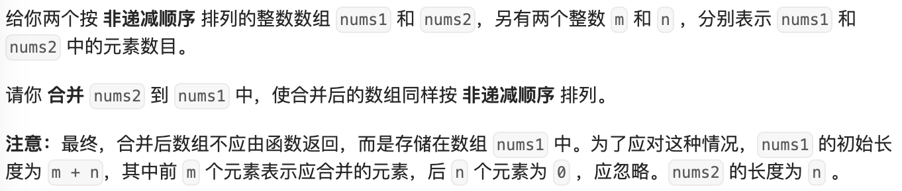
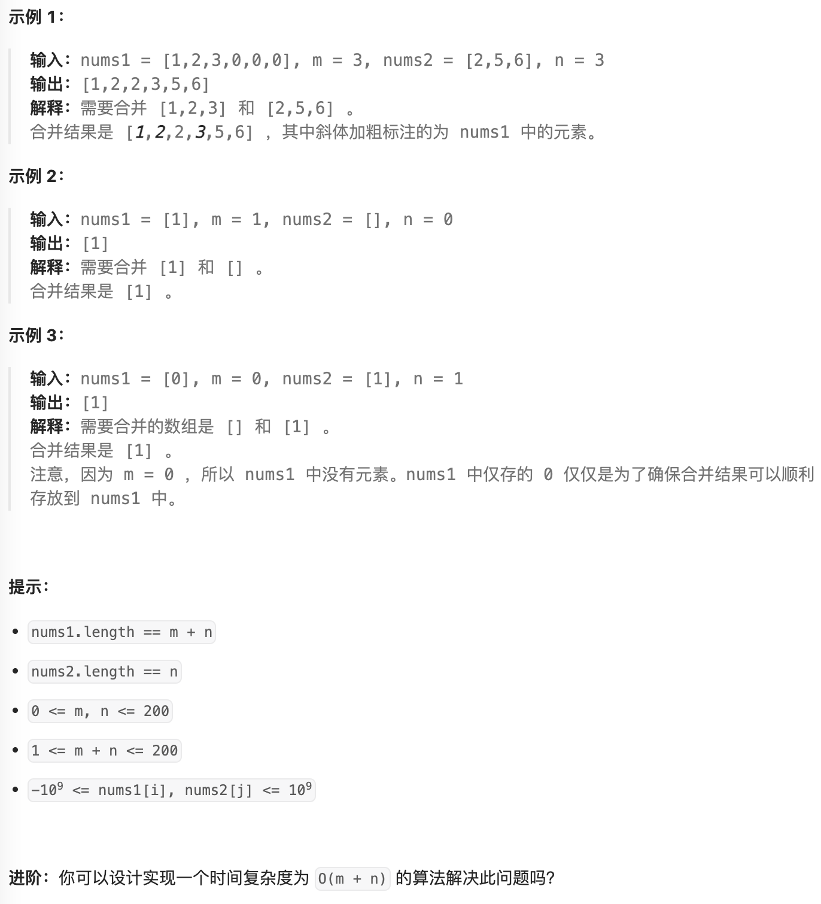

- #array #倒排 #临时存储
- https://leetcode.cn/problems/merge-sorted-array/description/
- 
- 
-
- 先使用临时数组，再替换原数组
	- ```java
	  public void merge(int[] nums1, int m, int[] nums2, int n) {
	    //临时存储
	    int[] rs = new int[m + n];
	    int i = 0;
	    int j = 0;
	    for (int k = 0; k < rs.length; k++) {
	        if (j >= n || (i < m && nums1[i] <= nums2[j])) {
	            rs[k] = nums1[i];
	            i++;
	        } else {
	            rs[k] = nums2[j];
	            j++;
	        }
	    }
	  - for (int k = 0; k < rs.length; k++) {
	        nums1[k] = rs[k];
	    }
	  }
	  ```
- 倒排， 原数组空间可能冲突，倒着排
	- ```java
	  public void merge2(int[] nums1, int m, int[] nums2, int n) {
	      int i = m - 1;
	      int j = n - 1;
	      for (int k = nums1.length - 1; k >= 0; k--) {
	          if (j < 0 || (i >= 0 && nums1[i] > nums2[j])) {
	              nums1[k] = nums1[i];
	              i--;
	          } else {
	              nums1[k] = nums2[j];
	              j--;
	          }
	      }
	  }
	  ```