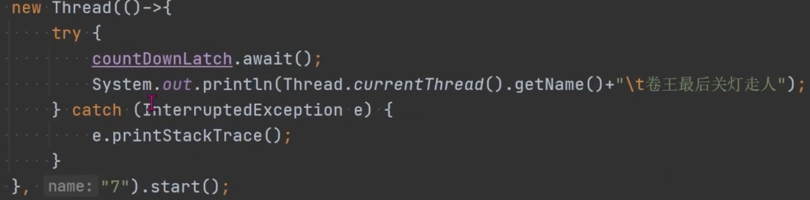

- #CountDownLatch 计数门栓
	- 倒数结束之前，一直处于等待状态，直到数到0，等待线程才继续工作。
	- 方法
		- new CountDownLatch(int count)
		- await() 调用此方法的线程会阻塞，支持多个线程调用，当计数为0，则唤醒线程
		- countDown() 其他线程调用此方法，计数减
		- {:height 306, :width 619}
		- {:height 167, :width 620}
		- {:height 316, :width 194}
	- 场景：拼团，分布式锁
		- 