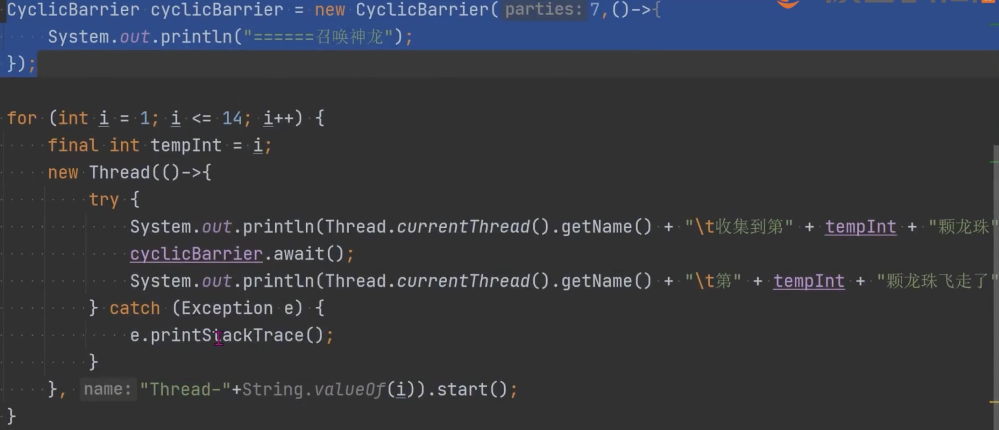

- #CyclicBarrier 循环栅栏
	- 线程会等待，直到线程到了事先规定的数目，然后触发执行条件进行下一步动作
	- 方法
		- new CyclicBarrier(int parties, Runnable barrierAction)
			- 参数1：集结线程数，
			- 参数2：凑齐之后执行的任务
		- await() 阻塞当前线程，待凑齐线程数量之后继续执
- 场景：并行计算
	- 
	-