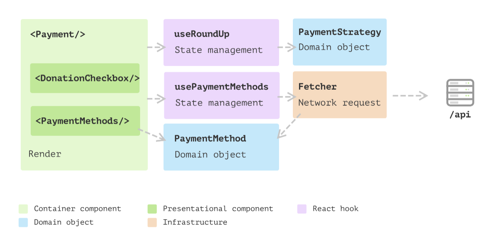

- ```tsx
  src/hooks/usePaymentMethods.ts…
  - const fetchPaymentMethods = async () => {
    const response = await fetch("https://5a2f495fa871f00012678d70.mockapi.io/api/payment-methods?countryCode=AU");
    const methods: RemotePaymentMethod[] = await response.json();
  
    return convertPaymentMethods(methods)
  }
  - export const usePaymentMethods = () => {
    const [paymentMethods, setPaymentMethods] = useState<PaymentMethod[]>(
      []
    );
  
    useEffect(() => {
      fetchPaymentMethods().then(methods => setPaymentMethods(methods))
    }, []);
  
    return {
      paymentMethods,
    };
  };
  ```
- 
-
-