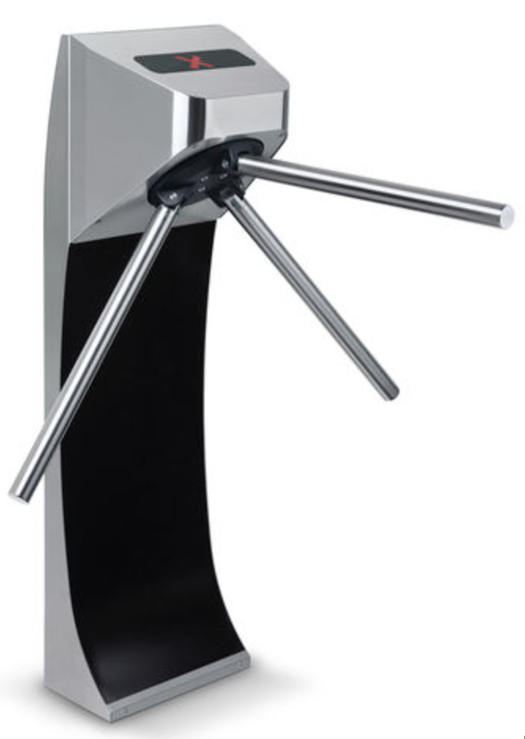
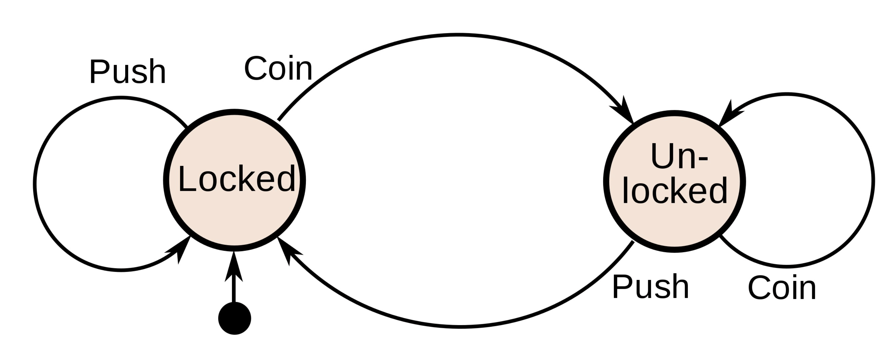
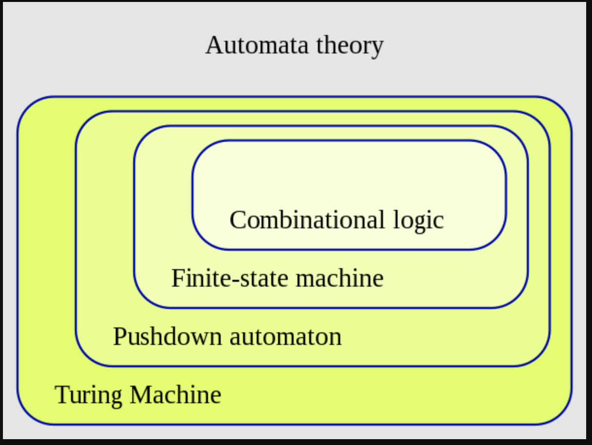
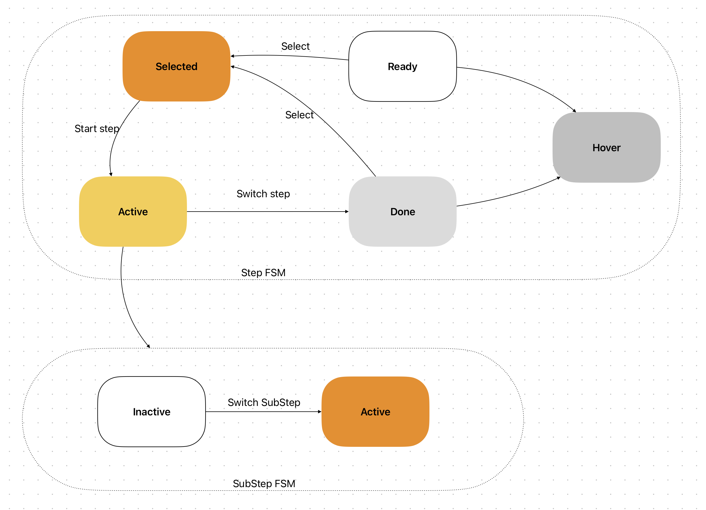

- 有限状态机（FSM - finite state machine）
- What
	- 是一种数学模型，用于表示和控制在任何时候都可以处于有限数量的状态之一的系统。
	- 描述了一组状态，其中每个状态都表示系统可能处于的状态，根据输入或事件在不同状态之间进行转换。
	- 广泛用于计算机科学、工程和其他领域
		- 自动控制
		- 软件工程
		- 信息工程
- 例如：设计一个旋转闸门系统
	- {:height 320, :width 210}
	- 作为一个状态机，旋转门有两种可能的状态：**Locked** 和 **Unlocked**
	- 有两种可能的输入会影响它的状态：将硬币放入投币口 ( **coin** ) 和推动手臂 ( **push** )
		- 
-
- FSM可以分为两种
	- 确定性有限状态机（DFA）
		- DFA具有确定性转移规则，意味着从当前状态只能有一种转移方式到下一个状态。
			- 每个输入都会产生一个唯一的下一个状态
			- 易于理解和分析，但是其表达能力有限
	- 非确定性有限状态机（NFA）
		- NFA则可以有多种转移方式，因此在某些情况下，NFA比DFA更强大并且更灵活。
			- 每个输入可能会产生多个下一个状态
			- 具有更强大的表达能力，但是需要更复杂的算法来模拟和分析
- Why
	- FSM的历史可以追溯到20世纪初期
		- 最初是由美国数学家埃米尔·波斯特尔（Emil Post）在上世纪30年代提出的。他的工作主要涉及对自动机理论的初步研究，并且建立了有限状态机的基本概念和性质。
	- 用于解决很多自动化的问题：
		- 自动控制：例如机器人、交通信号灯、电梯等。通过设置状态和转移条件，可以实现系统的自动控制和优化。
		- 编译器设计：在编译器的词法分析阶段，用于识别程序中的关键字、符号、标识符等。
		- 计算机网络：用于协议分析、流量控制和错误检测等。
		- 数据库系统：用于数据库系统中的查询优化和数据访问控制等方面。
		- 模式匹配：用于字符串匹配和模式匹配等应用。
- 自动机理论
	- {:height 301, :width 391}
	- 自动机是指一种具有状态和状态转移规则的数学模型，
		- 使用抽象的自动机模型来描述计算过程和语言，以及如何使用自动机来解决计算问题。
		- 广泛应用于编译器、正则表达式匹配、密码学、自然语言处理等领域。
	- 图灵机（Turing Machine，TM）和可计算性理论（Computability Theory）
		- 用于描述计算过程，研究哪些问题可以通过计算解决。
	- 下推自动机 (Pushdown automaton，PDA）
		- PDA是一种比有限状态自动机更加强大的自动机模型，可以用于识别上下文有关语言。PDA的特点是除了有限状态之外，还有一个栈（stack）来辅助状态转移。PDA的状态转移规则和栈的操作可以用一个表格或者一个状态图来表示，与有限状态自动机类似。PDA广泛应用于编译器、自然语言处理等领域。
	- 有限状态自动机（Finite State Machine，FSM）
		- 包括确定有限状态自动机（Deterministic Finite Automaton，DFA）和非确定有限状态自动机（Nondeterministic Finite Automaton，NFA），用于识别正则语言。
	- 组合逻辑（Combinational logic）
		- 是一种数字电路模型，它可以实现任意的布尔函数，并且输出只取决于当前的输入。Combinational logic可以看作是一种没有状态的自动机模型，因为它的输出只取决于输入，与时间无关。Combinational logic广泛应用于数字电路设计、计算机体系结构、嵌入式系统等领域。
-
- Web应用中的运用
	- 状态管理
		- 使用FSM可以帮助开发人员更好地管理和控制状态。
		- 例如，可以使用FSM来管理用户界面的状态，以及实现用户交互时的状态转换。
	- 自动化测试
		- 可以帮助开发人员更好地描述测试场景，并生成相应的测试用例。
		- 例如，在UI自动化测试中，可以使用FSM来描述不同的UI状态，以及不同状态之间的转换规则，从而生成相应的测试用例。
- How
	- Foraging Step FSM
		- 