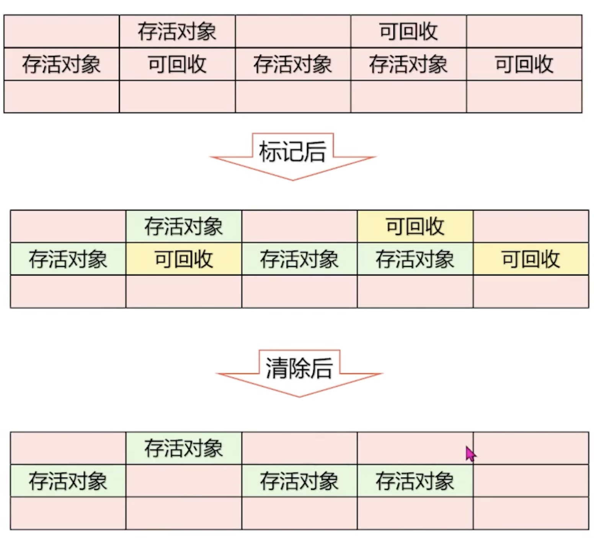

- WHY
	- 内存数据有限
- WHAT
	- 垃圾对象
		- 没有被使用（引用）的对象
	- 引用
	  id:: 654da127-ec71-4a4e-99d0-f65c335c1350
		- #强引用
		  id:: 654da12f-2928-41ce-87a6-01b32aeea701
			- 不会被回收
			  id:: 654da18c-6fb0-42b0-8bb0-4885cc4f2caf
			- `new Object()`
			  id:: 654da15c-fa65-4d31-a2e1-07574dc72ab0
		- #软引用
		  id:: 654da138-7a2e-4712-83e4-da8420c0b125
			- 有用但非必需，内存不足时会被回收
			  id:: 654da1d9-6cc1-420a-9892-455b55b35f5f
			- `new SoftReference<object>(obj)`
			  id:: 654da1af-8f29-47b6-8a9c-939d94658f2c
			- 常用于缓存，有效防止OOM
			  id:: 654da2d4-06a3-4ee6-9f73-5c10cca60906
		- #弱引用
		  id:: 654da13c-e2f4-43ec-ba13-a1c951489136
			- 常用与缓存，GC必回收
			  id:: 654da275-70ac-4301-aec5-fa6ac3d903ee
			- `new WeakReference<object>(obj)`
			  id:: 654da235-a497-476e-9273-5603c11d5428
			- 监控对象是否已经被垃圾回收器标记为即将回收的垃圾
			  id:: 654da2f4-4be1-4527-a3ac-97b9f7ea1c2f
				- #ThreadLocal 中使用了 WeakReference
				  id:: 654da324-b02e-4a18-85c2-ced3d388b367
		- #虚引用
		  id:: 654da142-7fd7-416e-a2b1-51b9a97498d4
			- 和没有被引用一样，GC必回收
			  id:: 654da26d-8561-4d8b-8527-469766846fa5
			- `new PhantomReference<object>(obj, new ReferenceQueue<());`
			  id:: 654da237-498b-47ba-85bb-92a8df513ae3
			- 常用于管理直接内存，可以在对象被回收时进行一些清理操作
			  id:: 654da338-4a07-4fb2-a36a-238078994009
		- #无引用
		  id:: 654da147-45a8-4928-8435-e006b60e6b71
			- GC必回收
			  id:: 654da296-c4cd-4089-836f-49a4e99cb846
- HOW
	- 如何清除垃圾
		- 标记清除 Mark-Sweep
			- 两个阶段 - 适合老年代
				- 标记：标记出所有需要回收对象
				- 清除：统一回收掉所有对象
				- {:height 462, :width 397}
			- 缺点
				- 执行效率不稳定
				- 空间碎片：会产生大量不连续内存碎片
		- 复制算法 Copying
			- 复制清空 - 适合年轻代
				- 内存分为两块，清除垃圾时，将存活对象复制到另一块，原内存块直接删除
				- 适合有大量垃圾时的快速删除（年轻代），SO和S1区就是基于这个算法诞生的（Eden:S = 8:2）
				- {:height 399, :width 434}
			- 优缺点
				- 优点：没有内存空间碎片化
				- 缺点：存在空间浪费
		- 标记-整理算法 Mark-Compact
			- 三个阶段 - 适合老年代
				- 标记：标记出所有需要回收对象
				- 清除：统一回收掉所有对象
				- 整理：将所有存活对象向一端移动
				- {:height 658, :width 369}
			- 优缺点
				- 优点：空间没有浪费，没有内存碎片化问题
				- 缺点：性能较低
	- 如何标记垃圾
		- 引用计数法 Reference Counting
			- 性能差，无法处理循环引用
			- 三种引用关系
				- 单一引用
					- {:height 241, :width 285}
				- 循环引用
					- {:height 161, :width 281}
				- 无引用
		- 根可达分析算法 GCRooting Tracing
			- 通过GCROOts作为对象起点向下搜索，当对象到GCROOts没有任何 **引用链 ReferenceChain**时，此对象是垃圾。
			- 可作为GCRoot的对象：
				- 虚拟机栈中，栈帧的本地变量表引用的对象
				- 方法区中，类静态属性引用的对象
				- 方法区中，常量引用的对象
				- 本地方法栈，JNI指针引用的对象
			- {:height 266, :width 480}
			- 两次标记后回收
				- 第一次：可达性分析后，没有引用链对象会被第一次标记
				- 第二次：标记后的对象会经历筛选，如果筛选不通过，则会被第二次标记
- 不同的[[垃圾回收器]]
- 类的finalize方法
	- GC 时调用一次，只有一次
		- **Java 虚拟机 (JVM) 只允许每个对象调用一次`finalize`方法**。一旦对象被终结，JVM 就会在对象头中设置一个标志，表明它已经被终结，并且不会再次终结。如果用户尝试对同一个对象使用 `finalize` 方法两次，JVM 会忽略它。
		- 不建议依赖`finalize` 方法进行资源释放：`finalize` 方法的行为是不确定的
		- Java 9及以后版本，`finalize` 方法已被废弃