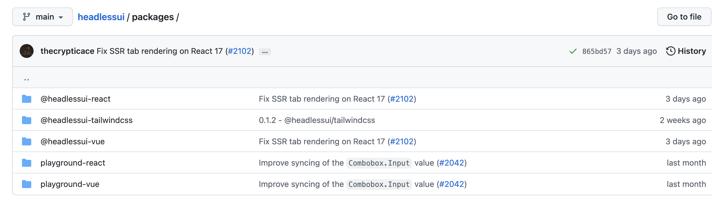

- What is headless components
	- 不关心 UI，关心功能
	- 有助于构建可重用的组件
-
- Scenario：
	- 例如构建 Table 组件
		- 业务期望的功能有：
			- 排序
			- 搜索
			- 可编辑
		- Building a smart component
			- 通过内部状态存储 Table 的数据
			- 构建一个 Table 的 UI 组件
			- 用户输入事件的监听
			- 远端 API 响应的监听
		- 业务期望一个新样式的 Table，但具有相同的功能
			- Building a new smart component
			- Building a Headless component
				- 抽离功能逻辑：数据排序、过滤。。。
				- UI component + Dump(logic) component - renders the table
-
- How to building
	- 单独隔离 UI 以实现组件的可重用性
	- [[Demo：Headless components]]
-
- When we need
	- 在构建组件库时 (最终用户自制 UI)
	- 使用不同的 UI 构建相同的功能时
-
- Some refers
	- [headless-ui](https://headlessui.com/) + [tailwindcss](https://tailwindcss.com/)
	- 
-
- Some Thinking
	- Benifits for us
		- Shorter development time
		- Design VM first (model driven)
		- Multi-channel Experiences (Scalability)
	- [[Antennae]]
		- 