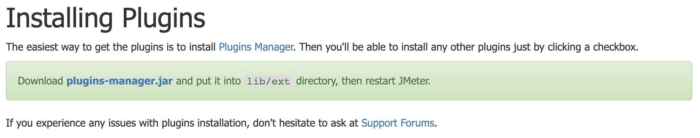

- https://jmeter-plugins.org/install/Install/
- 
- Basic Graphs
- Additional Graphs
	- 
-
- Active Threads
	- 
- RT
	- 
- TPS
	- 
-
- 资源监控
	- [perfmon-agent](https://github.com/undera/perfmon-agent)
		- 
		- nohup java -jar ./ CMDRunner.jar --tool PerfMonAgent --udp-port 7879 --tcp-port 7879 > log. log 2>&1 &
		- chmod 755 startAgent.sh
		- 