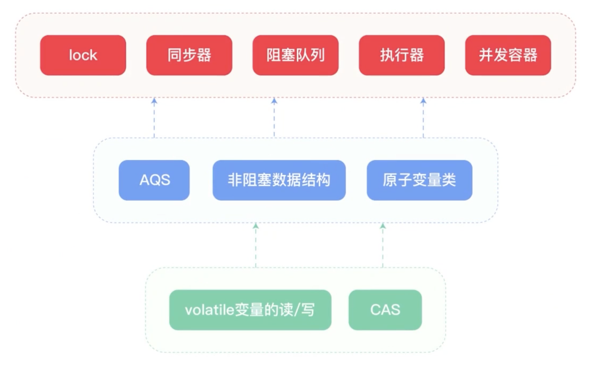

- JUC: java.uitl.concurrent 工具包
	- jdk1.5+
	- JSR 166 规范的实现
	- 大量使用了CAS
- CAS
	- Compare and Swap
		- 1. 线程读取当前内存中的值，这个值就是期待的值（expected value）。
		- 2. 线程计算出新的值（即要更新的值）。
		- 3. 线程尝试用 CAS 操作将新的值写入内存中。这个操作会比较内存中当前的值和之前读取的期待的值，如果相等则更新，否则不做任何操作。
		- 4. 如果 CAS 操作成功，则线程完成操作；如果 CAS 操作失败，则线程会重新读取内存中的值，重新计算新的值，然后再次尝试 CAS 操作。
	- {:height 388, :width 680}
	- 是一种乐观锁机制，通过原子性地比较当前内存中的值与预期值，如果相等则进行交换操作。
	- CAS 操作能保证线程安全的主要原因
		- **原子性：** CAS操作是原子性的，即在执行过程中不会被其他线程中断，要么执行成功，要么失败，不会出现线程切换的情况。这保证了多线程环境下对共享变量的操作是原子的，从而避免了竞态条件和数据不一致的问题。
		- **比较与交换：** 在比较的过程中，如果发现当前内存中的值与预期值不相等，则说明该共享变量在此时已经被其他线程修改了，此时CAS操作会失败，不会执行交换操作。这种不可分割性保证了在执行CAS操作期间其他线程不会修改共享变量，从而避免了竞态条件。
			- **比较：** CAS操作首先会比较当前内存中的值与预期值是否相等。这个预期值是我们期望的旧值。
			- **交换：** 如果当前内存中的值与预期值相等，则执行更新操作，将新值写入到内存中；否则，不做任何操作。
		- **无锁化：** CAS操作是一种无锁的同步机制，与传统的锁机制相比，它不需要线程阻塞和唤醒、不需要进入内核态，减少了线程上下文切换和系统调用的开销，提高了并发性能。
			- 通常会在一个循环中不断尝试执行CAS操作，直到操作成功。这种方式称为自旋（Spin）
	- ABA 问题
		- 共享变量的值被修改了两次的情况下。假设共享变量的初始值为A，在某个时刻被修改为B，然后又被修改回A，这样看似没有变化，但实际上已经发生了两次修改。
		- 解决方式
			- 业务逻辑上不在乎过程，只在乎结果是否是预期值，可以忽略ABA问题
			- 添加版本号，如 **AtomicStampedReference**
			- 添加修改标记，如 **AtomicMarkableReference**
- 锁的分类
	- 按 Lock 方式
		- 隐式锁
			- synchronized, 不需要显式的 Lock 和 UnLock
		- 显式锁
			- JUC 包中提供的锁，需要显示的 Lock 和 UnLock
	- 按特性
		- 乐观锁、悲观锁：按照线程在使用共享资源时，要不要锁住同步资源，划分为悲观锁和乐观锁
			- 悲观锁：JUC锁，synchronized
			- 乐观锁：CAS
		- 重入、不可重入：按照同一个线程是否可以重复获取同一把锁，划分为重入锁和不可重入锁
			- 重入锁： ReentrantLock、synchronized
			- 不可重入锁：基本没有了
		- 公平锁、分公平锁：按照多个线程竞争同一锁时需不需要排队，能不能插队，划分为公平锁和非公平锁。
			- 公平锁：new ReentrantLock（true）多个线程按照申请锁的顺序获取锁
			- 非公平锁：new ReentrantLock（false）多个线程获取锁的顺序不是按照申请锁的顺序（可以插队、synchronized
				- 优点：可以实现更高的吞吐量，因为它允许后到达的线程直接争夺锁，而无需等待，从而减少了线程切换的开销。
				- 缺点：非公平锁可能会导致线程饥饿（某些线程始终无法获得锁），因为总是有一些线程可能会被其他线程连续抢占锁。
		- 独享锁、共享锁：按照多个线程能不能同时共享同一个锁，锁被划分为独享锁和排他锁。
			- 独享锁：独享锁也叫排他锁，synchronized、ReentrantLock、ReentrantReadWritelock 的WriteLock写锁
			- 共享锁：ReentrantReadWriteLock的ReadLock读
		- 其他
			- 自旋锁
				- CAS: Atomic
				- synchronized 的轻量级锁（状态）
			- 分段锁
				- ConcurrentHashMap (jdk1.8+)
					- 首先将数据分成一段一段的存储，然后给每一段数据配一把锁，当一个线程占用锁访问其中一个段数据的时候，其他段的数据也能被其他线程访问。
			- 无锁/偏向锁/轻量级锁/重量级锁
				- synchronized独有的四种状态，级别从低到高
				- 是JVM为了提高synchronized锁的获取与释放效率而做的优化
				- 四种状态会随着竞争的情况逐渐升级，而且是不可逆的过程，即不可降级。
- 与 Synchronize 主要对比
	- 无法控制阻塞时长，阻塞不可中断
	- 不能细粒度控制，比如JUC的读写锁可以区分读写的场景
- 常用的JUC锁
	- [[ReentrantLock 重入锁]]
	- [[ReentrantReadWriteLock 重入读写锁]]
		- 维护一个读锁和一个写锁
		- 适合读多写少的场景
	- #StampedLock 冲压锁
		- ReentrantReadWriteLock 的增强版