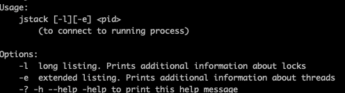
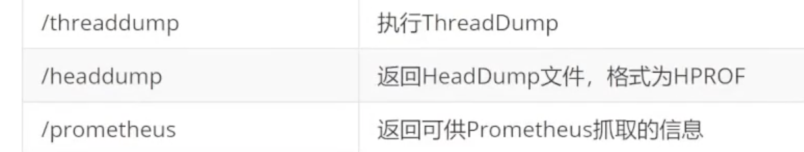

- jps
	- JVM Process status tool: JVM进程状态工具，查看进程基本信息
	- command `jps`
	- {:height 139, :width 280}
- jstat
	- JVM statistics monitoring tool :JVM统计监控工具，查看堆，GC详细信息
	- command `jstat -gc $pid $period $times`
	- 
	- command `jstat -gcutil $pid $period $times` 百分百计算
	- 
- jinfo
	- Java Configuration Info ：查看配置参数信息，支持部分参数运行时修改
	- command `jinfo -flags $pid`
	- 
- jmap
	- Java Memory Map：分析堆内存工具，dump堆内存快照
		- `jmap -histo:live $pid`
		- `jmap -dump:format=b,file=heapdump.hprof $pid`
		- 
- jhat
	- Java Heap Analysis Tool ：堆内存dump文件解析工具, JDK9 以后不支持了
	- `jmap -dump:format=b,file=heapdump.hprof $pid`
	- `jhat ./eapdump.hprof `
	- {:height 75, :width 439}
- jconsole
	- 
- jstack
	- Java Stack Trace:Java堆栈跟踪工具
	- 常用来查看锁， 线程数等信息
	- 
- VisualVM - GUI
- 三方工具
	- [GC Easy](https://gceasy.io/)
		- 
	- GCViewer
		- [GC Viewer](https://github.com/chewiebug/GCViewer)
	- Arthas
		- [Arthas](https://arthas.aliyun.com/doc/quick-start.html)
		- 
		- 
		- 
- Cloud
	- Grafana + Prometheus + Micrometer + Spring Actuator
		- Spring Actuator
			- 导入依赖坐标，访问监控地址 `/actuator`
				- ```xml
				  <dependency>
				  	<groupId>org. springframework. boot</groupId>
				  	<artifactId>spring-boot-starter-actuator</artifactId>
				  </dependency>
				  ```
			- 
		- Micrometer
			- 导入依赖，输出监控的日志信息 `/actuator/prometheus`
				- ```xml
				  <dependency>
				  	<groupId>io.micrometer</groupId>
				  	<artifactId>micrometer-registry-c</artifactid>
				  </dependency>
				  ```
			- applicatin.yml
				- ```yml
				  # 暴露/actuator/prometheus，如果配置了*，则可以不配置这行
				  management. endpoints.web.exposure.include: 'prometheus'
				  ```
			- {:height 292, :width 688}
		- 在Java虚拟机（JVM）调试中，有几个关键的性能指标对于服务的健康和性能至关重要：
			- 1. **垃圾回收（GC）情况：** GC的频率、持续时间和效率是重要的指标。频繁的GC和长时间的停顿可能会影响服务的性能和响应时间。
			- 2. **内存使用情况：** 监测堆内存和非堆内存的使用情况，包括内存的分配和释放。内存泄漏可能导致内存使用不断增加，最终影响系统稳定性。
			- 3. **线程情况：** 监控活动线程数、线程池的使用情况和线程死锁。线程过多或者死锁可能会导致系统性能下降或完全停止响应。
			- 4. **CPU利用率：** 观察CPU的使用情况，高CPU利用率可能表明代码存在性能问题或者需要优化。
			- 5. **I/O操作：** 监测磁盘、网络和文件系统的I/O操作情况。频繁的I/O操作可能会成为性能瓶颈。
			- 6. **异常和错误日志：** 查看日志文件中的异常和错误信息，这些信息可以指示出代码中潜在的问题。