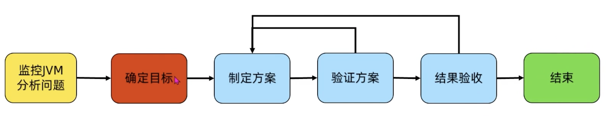

- [[JVM 工具包]]
- [[JVM 参数]]
- WHY
	- 降本增效：调优的最终目的都是为了应用程序使用最小的硬件消耗来承载更大的吞吐量
- WHEN
	- 系统吞吐量下降，或P90、P99响应增加
	- 堆内存持续上涨，到出现OOM
	- 频繁FullGC、GC停顿过长
	- 堆内存占用过高
- WHAT
	- 内存合理分配与使用
	- 垃圾收集器的选配
- HOW
	- 
	- 监控JVM分析问题：评估必要性，内存使用，GC频率，GC耗时
	- 确定目标：内存占用，响应延迟
	- 制定方案：配置内存及GC相关参数
	- 验证方案：测试环境对比方案前后差异，确定是否生效
	- 结果验收：灰度测试，全量发布
- Principles
	- 优先级原则：产品 -> 架构 -> 代码 -> 数据库 -> JVM
		- JVM是最后的手段
	- 观测性原则：发现问题解决问题，没问题不创造问题
		- 尽量不要动JVM的配置，性价比不高