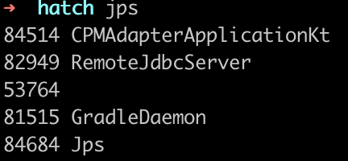
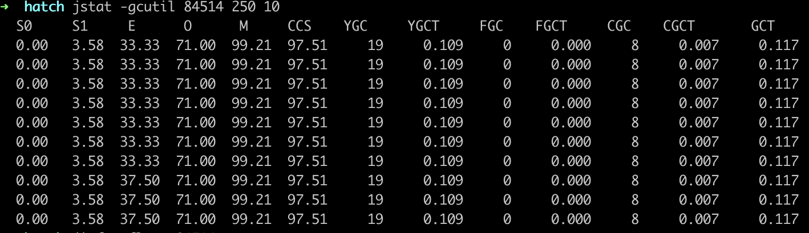

- JDK工具包
	- jps
		- JVM Process status tool: JVM进程状态工具，查看进程基本信息
		- command `jsp`
		- {:height 139, :width 280}
	- jstat
		- JVM statistics monitoring tool :JVM统计监控工具，查看堆，GC详细信息
		- command `jstat -gc $pid $period $times`
		- 
		- command `jstat -gcutil $pid $period $times` 百分百计算
		- 
	- jinfo
		- Java Configuration Info ：查看配置参数信息，支持部分参数运行时修改
		- command `jinfo -flags $pid`
		- 
	- jmap
		- Java Memory Map：分析堆内存工具，dump堆内存快照
	- jhat
		- Java Heap Analysis Tool ：堆内存dump文件解析工具
	- jstack
		- Java Stack Trace:Java堆栈跟踪工具
	- VisualVM - GUI
- WHY
- WHEN
- HOW