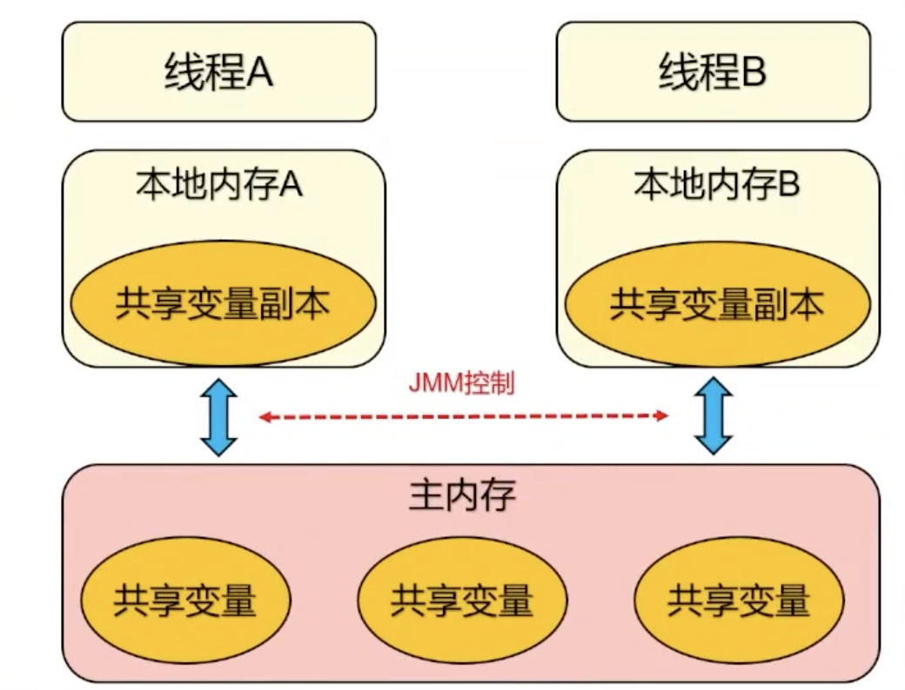
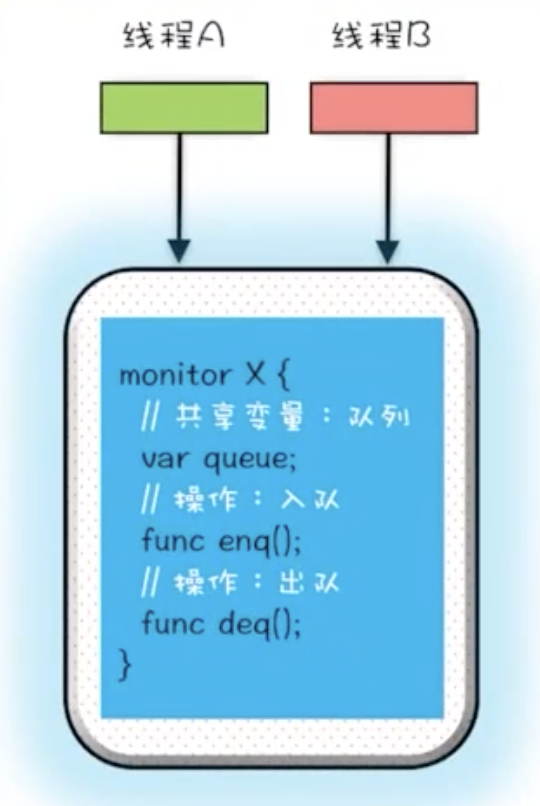
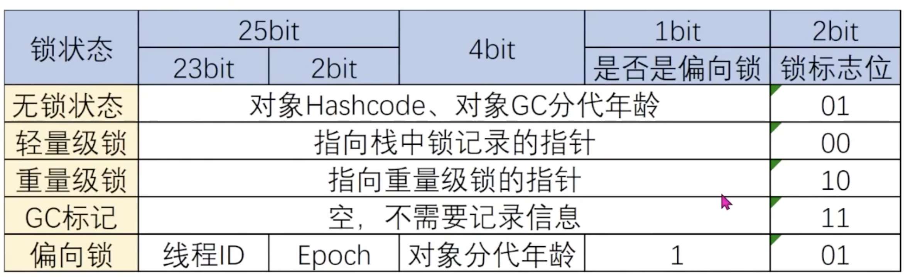
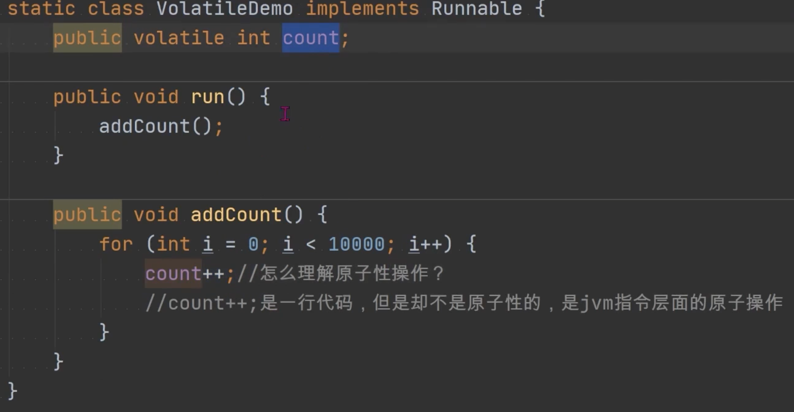

- JMM
	- #Java内存模型 Java Memory Model
	- Java为了保证满足原子 性、可见性及有序性，诞生了一个重要的规范JSR133，Java内存模型简称JMM
		- 定义了共享内存系统中多线程应用读写操作行为的规范，从而保证指令执行的正确性
			- 线程操作共享变量必须在本地内存中，不能直接操作主内存的
			- 线程间无法直接访问对方的共享变量，需经过主内存传递
		- 解决了CPU多级缓存、处理器优化、指令重排等导致的内存访问问题
		- 屏蔽各种硬件和操作系统的差异，在各种平台下对内存的访问都能保证效果一致
	- JMM通过控制线程与本地内存之间的交互，来保证内存可见
		- {:height 419, :width 506}
	- 核心概念
		- **主内存（Main Memory）**：主内存是所有线程共享的内存区域，其中包含所有的共享变量。所有的线程都可以访问主内存。
		- **工作内存（Working Memory）**：工作内存是每个线程私有的内存区域，线程的操作只在工作内存中进行。线程间不能直接访问对方的工作内存，线程之间的通信必须通过主内存来完成。
		- **内存屏障（Memory Barriers）**：内存屏障是一种同步机制，用于控制特定位置的内存操作顺序。在Java中，内存屏障用于确保指令重排序不会影响到程序的正确性。
		- **Happens-Before关系**：Happens-Before关系是Java内存模型中的一个重要概念，用于描述操作之间的顺序关系。如果一个操作Happens-Before另一个操作，那么第一个操作对第二个操作可见，且第一个操作的执行顺序在第二个操作之前。Happens-Before关系可以由程序顺序、volatile变量规则、锁规则和传递性推导得到。
		- **Volatile变量**：volatile关键字用于声明一个变量是易变的，即在多线程环境下对该变量的读写操作都会直接影响到主内存。使用volatile变量可以确保变量的修改对其他线程可见，并且禁止对volatile变量的指令重排序。
		- **Synchronized关键字**：synchronized关键字用于实现同步代码块或同步方法，确保同一时刻只有一个线程可以进入被同步的代码区域。synchronized块的执行具有原子性，同时会保证线程间的可见性和有序性。
	- Happens-Before 规则 (发生在之前)
		- 程序顺序规则：一个线程中的每个操作，happens-before于该线程中的任意后续操作
		- 锁规则：对一个锁的解锁，happens-before与随后对这个锁的加锁
		- Volatile变量规则：对一个volatile修饰的变量的写，happens-before与 任意后续对这个变量的读
		- 传递性：如果A happens-before B,B happens-before C，那么A happens-before
-
- #Synchronized
	- 可以修饰方法
		- 静态
			- 锁是当前类的Class对象
		- 非静态
			- 锁当前对象
	- 可以代码块
		- 被sync的对象 (当前对象，字节码对象，其他对象)
	- JMM 对于 Synchronized 的规定
		- 加锁前：必须把自己本地内存中共享变量的最新值刷到主内存
		- 加锁时：清空本地内存中的共享变量，从主内存中读取共享变量最新的值
	- 原理：Monitor
		- 每个对象都都有一个Monitor对象与之关联。
		- 线程对monitor执行lock和unlock操作，相当于对对象执行上锁和解锁操作。
		- 将共享变量和对共享变量的操作统一封装起来
		- {:height 274, :width 153}
	- 锁优化
		- jdk 1.6+
		- 偏向锁
			- 当只有一个线程时，偏向锁就会把整个同步措施消除
		- 轻量级锁
			- 只有两个线程交替竞争锁资源，如果线程竞争锁失败了不立即挂起，而是让它飞一会
				- 自旋一会，等待过程中尝试再获取锁
		- 对象头部标记锁的状态
		- 
-
- #volatile
	- JMM规则：对一个volatile修饰的变量的写，happens-before与任意后续对这个变量的读
	- 保证多线程场景下共享变量的可见性、有序性
		- 可见性：保证对此共享变量的修改，所有线程的可见性
		- 有序性：禁止指令重排序的优化，遵循JMM的happens-before规则
	- 原理：内存屏障
		- 内存屏障（Memory Barrier）是一种CPU指令，用于控制特定条件下的重排序和内存可见性问题。Java编译器会根据内存屏障的规则禁止重排序。
			- 写操作时：在写操作后加一条store屏障指令，让本地内存中变量的值能够刷新到主内存
			- 读操作时：在读操作前加一条load屏障指令，及时读取到变量在主内存的值
	- 优势：没有加锁，不会阻塞代码
	- 缺陷
		- 不保证原子性，对共享变量有要求（原子操作）
			- 对共享变量的写入操作不依赖其当前值：例如++和—-就不行
			- 共享变量没有包含在有其他变量的不等式中
		- 