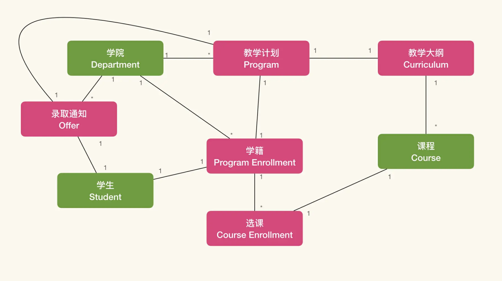
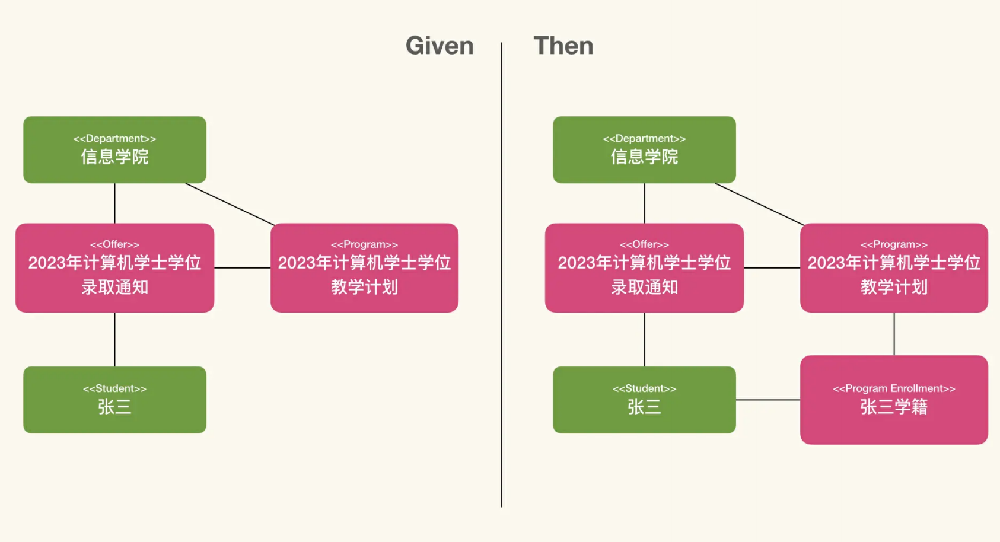
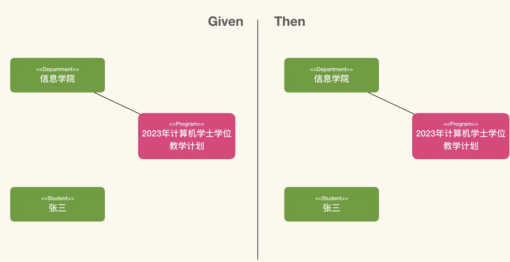

- 知识管理的过程
	- 识别认知行为模式
- 核心难度
	- 处理隐藏在业务知识中的复杂度
	- 模型就是对这种复杂度的简化与精炼
	- 模型展开
		- 使用模型，帮助我们应用凝结在模型中的业务知识
		- 
		- 
		- 
		- 模型展开了两次
			- 第一次是根据 Given 描述的场景，寻找样例数据，然后再用模型实例化地解释这个数据。
			- 第二次是根据 When 的描述，引入了数据改变，然后再用模型实例化地解释这个数据
- How to use LLM
	- LLM: Large Langauge Model
	- 构建思维链（Chain of Thought）
		- chatgpt 4，把model 转成 Memarid，然后给cot
		- 通过思维链辅助 LLM 理解模型应该如何展开
			- 模型：通过半结构化自然语言表示模型
			- 是如何将我们的模型表达为大语言模型能够理解的形式
			-