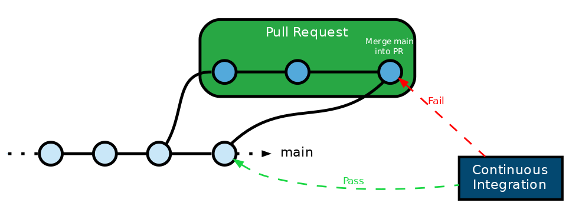

- 
- [https://blog.mergify.com/what-is-a-merge-queue/](https://blog.mergify.com/what-is-a-merge-queue/)
	- 当[合并结果流水线](https://docs.gitlab.cn/jh/ci/pipelines/pipelines_for_merged_results.html)启用时，流水线作业运行就像来自源分支的更改已经合并到目标分支一样。
	- 然而，目标分支可能正在迅速变化。当您准备好合并时，如果您有一段时间没有运行流水线，则目标分支可能已经更改。 现在合并可能会带来重大变化。
	- *合并队列*可以防止这种情况发生。合并队列是合并请求的排队列表，每个请求都在等待合并到目标分支中。
	- 许多合并请求可以添加到队列中。每个合并请求都运行自己的合并结果流水线，其中包括队列上*前面*的所有其他合并请求的更改。 所有流水线并行运行，节省时间。内部合并结果提交的作者始终是发起合并的用户
	- 如果合并请求的流水线失败，则不会合并破坏性更改，并且目标分支不受影响。合并请求从队列中移除，并且它后面的所有流水线重新启动。
	- 如果队列合并请求的流水线成功完成，则将更改合并到目标分支中，其它流水线继续运行。
	- 要将合并请求添加到合并队列，您需要推送到目标分支的权限。