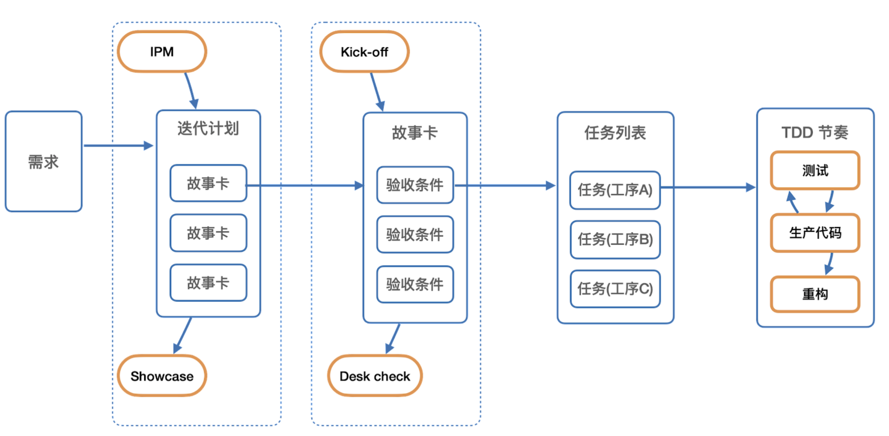
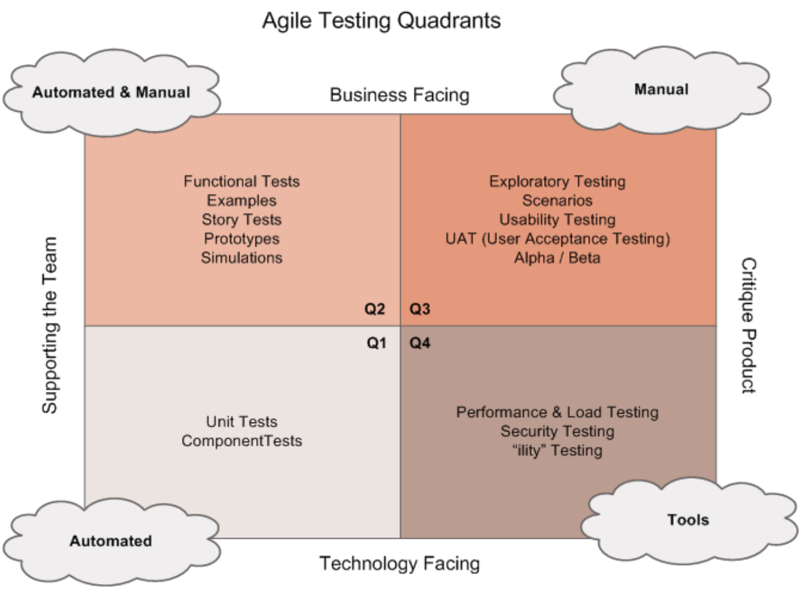
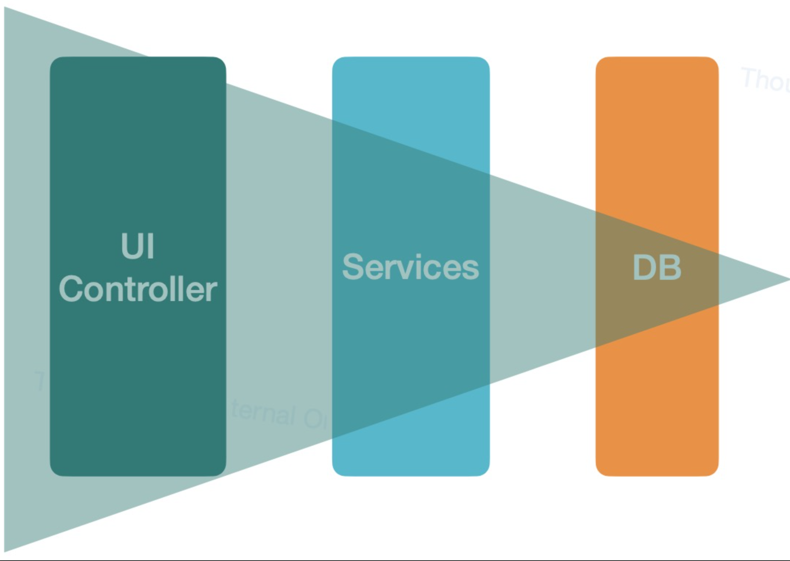
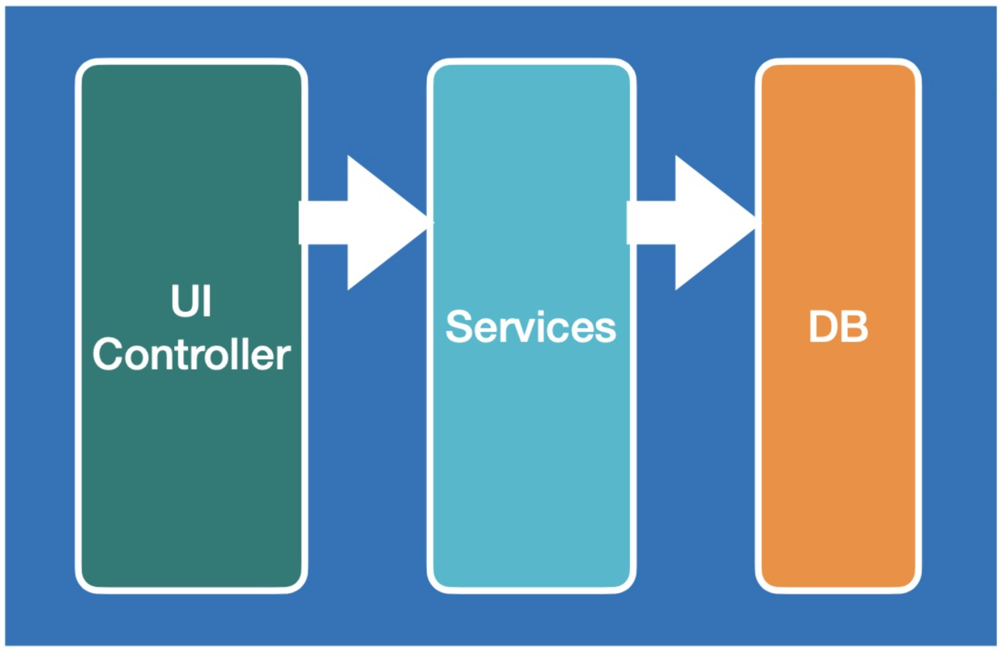
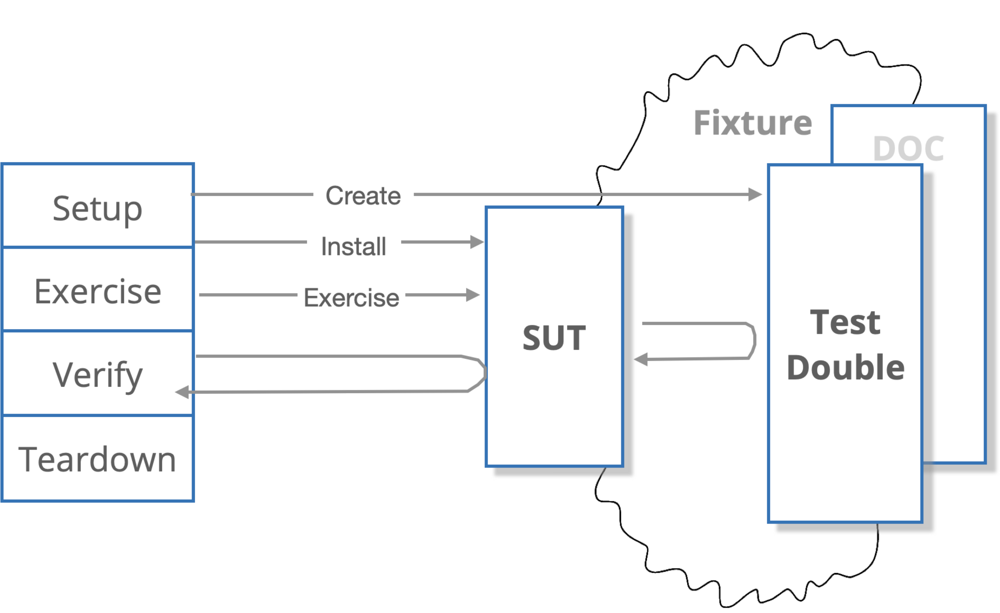

- **问题引言**
	- 我们在项目中，往往需要大量手工测试的工作，例如在项目发布新版本时的冒烟测试，在项目上线前的Bug Bash，在代码重构后的回归测试，在多系统对接时的集成测试等等。
	- 在软件开发过程中，影响QA的工作量的因素有很多，例如：
		- 项目规模和复杂性：较大规模和复杂的项目可能需要更多的QA资源。如果项目包含多个模块、子系统或集成的组件，可能需要更多的QA人员来覆盖测试需求。
		- 项目时间限制：如果项目有严格的时间限制，可能需要增加QA资源以确保在规定的时间内完成测试任务。
		- 测试类型和覆盖范围：不同的测试类型需要不同的资源。例如，如果项目需要进行广泛的功能测试、性能测试、安全测试等，可能需要更多的QA人员来涵盖这些方面。
		- 团队技能和经验：考虑到QA团队成员的技能水平和经验也很重要。如果团队中有经验丰富的QA成员，他们可能能够更高效地处理测试任务，减少所需的人力资源。
		- 自动化测试能力：如果项目中有自动化测试框架和工具可用，并且QA团队具备相应的技能和经验，那么可能可以减少所需的人力资源。自动化测试可以提高测试效率，并且可以在短时间内执行大量的测试用例。
	- 可以得到一个简单的观点：在项目的客观条件（规模、复杂度、时间、团队经验）无法改变的情况下，提高自动化测试的比例，减少手工测试，是提高QA的工作效率和质量是最直接的方式。
	- 在明确了目的之后，接下来的问题变成了：
		- 如何设计合理的自动化测试策略？
		- 如何保证团队能够落地已制定的测试策略？
-
- 如何判定达成目标？
	- 自动化测试大家都很清楚，是通过相关的测试工具或者框架，自动的运行测试，判断软件或代码是否能够基于不同的输入，产生期望的结果。
	- 如何判断测试策略是否合理？
		- 我们应该关注的是功能覆盖率，而非单纯的代码行覆盖率。熟悉软件的开发的人应该都知道，高的代码行覆盖率其实并不一定能代表高的软件质量，因为很可能有些测试是无效的，比如测试断言是有遗漏甚至是错误的。
		- 功能覆盖的场景应该来源于业务。避免测试断言有遗漏甚至是错误的最简单的方法就是从业务需求中拆解测试场景。
			- 
		- 测试要有明确的目的。测试的编写和维护也是有成本的，每个测试应该都有明确的目的，可以基于测试的目的选择合适的测试类型和比例。
			- 
	- 哪些方面可以体现自动化测试的落地效果？
		- 软件变更失败率明显降低。通过自动化测试可以提早发现软件由于变更导致的问题的时间。
		- 更加放心的快速重构。通过自动化测试的方式替代大量的手工测试，大大提升了重构之后回归测试的效率。
		- 开发团队的速率稳步提升。发现和定位问题的速度明显提升，没有疲于救火的到处改BUG。
-
- 相关实践：
	- 架构决定测试结构
		- 什么是架构，所谓架构，是指系统的基础组织形式，体现为组件、组件间的关系以及环境，架构也是指导系统设计和演化的原则
		- 测试策略通常是围绕着架构而制定的，在制定测试策略的时候，需要明确的架构作为支撑，例如前端的MVVM，大概率可以分为Model的测试，View的测试和ViewModel的测试。
		- 通常可以用两类视角来分析架构
			- 进程间架构
				- 
				- 进程间三层架构：
					- UI Controller，比如 AngularJS 或者 React 等前端系统，运行在客户的浏览器上，因此是一个独立进程。这一层只会调用到 Services 进程中的 API ，扩展成本最低。
					- Services 后端服务进程，这一层只会调用 DB 进程，扩展成本居中。
					- DB 比如 MySQL 或者 Oracle 等实例进程。这一层资源的扩展成本最高。
				- 每一层都是以独立进程的形式存在。如此划分，是出于通过漏斗模型有效处理资源的设计考虑——漏斗模型是指层越靠后的资源，使用和扩展成本越高。
			- 进程内架构
				- 
				- 这三层都在同一进程内：
					- UI Controller 用来支撑前端界面。只会调用 Services 层提供的接口。
					- Services 抽象出来的一系列的处理业务逻辑的服务。只会调用到数据访问层中的接口。
					- DB 不是指真实的数据库，而是指封装了对数据库交互的数据访问层。
				- 每一层都以独立的 package 存在。进程内分层架构主要是考虑关注点的隔离以及如何有效地控制变化的传播，因此在分层时，每一层对下一层都是一个抽象，上层只依赖于接口而不依赖于底层的实现。
		- 结合测试替身设计合理的测试策略
			- 通过分析架构，可以得到信息：
				- 使用技术栈，如语言、框架、工具等信息
				- 组件或进程间的依赖关系
			- 使用测试替身
				- 
				- 在软件开发中，我们很难避免对象或组件依赖，这些依赖的存在可能增加测试的时间和成本，比如有些被依赖的组件速度很慢或难以控制，也可能存在开发时被依赖的组件还没有完成的情况。这些都会对测试的编写和运行产生负面影响，降低工程效能。使用测试替身可以隔离架构依赖，分离被测对象，避免被测对象受到依赖组件的影响，有效降低测试的运行时间和开发成本。
				- 基于四阶段测试模式，我们将测试执行时对被测对象和测试替身的使用流程可视化出来，其中，SUT（System Under Test）为被测对象，DOC（Depended On Component）为被测对象所依赖的组件。引入测试替身（Test Double）替换掉 DOC，这样就可以有效地控制 SUT 的依赖，降低 DOC 自身的复杂性对 SUT 的影响。通常，准备阶段（Setup）需要创建合适的测试替身并装配 SUT，执行阶段（Exercise）运行 SUT 并调用相关依赖，执行完成后在验证阶段（Verify）验证测试的结果。
				- 根据使用场景和目的的不同，有五种测试替身：
					- Test Stub，控制 DOC 对 SUT 的间接输入
					- Test Spy，在 Test Stub 的基础上记录和验证 SUT 对 DOC 的间接输出
					- Mock Object，验证 SUT 和 DOC 的交互是否正确
					- Fake Object，提供与真实 DOC 相同或有缩减的功能
					- Dummy Object，占位符，测试中不会实际使用它
	- 聚焦Tasking，避免脆弱的测试
		- 在实践中，不稳定的测试和脆弱的测试是自动化测试中常见的问题。例如：
			- 有的测试时而成功时而失败，结果很随机
			- 有的测试在本地环境执行成功，上到 CI 就会失败
			- 有的测试昨天没有问题，今天怎么执行都会失败
			- 有的测试成功与否取决于其他团队的服务是否正常运行
		- 从目标上看，我们希望测试能够提供以下几点好处：
			- 问题发现的时机：要求测试前移，尽早发现问题，在开发阶段编写自动化测试保证内部质量。
			- 问题发现的能力：要求尽可能多的覆盖到软件的功能点，不能遗漏。
			- 问题定位的精准度：要求对给定的问题，能够定位到尽可能少的代码行数中，这就要求尽可能细的测试粒度。
			- 问题发现和定位的速度：要求编写有效的、执行效率高的自动化测试。
		- 从实现成本角度上看，自动化测试需要：
			- 易于编写：有容易理解和使用的测试脚手架和测试编写规范。
			- 易于维护：测试能够清晰地反应意图并保持测试的独立性，编写健壮、稳定、可维护的测试。
			- 恰到好处的测试粒度与数量：通过不同的测试类型和粒度保证有效的功能覆盖，同时不盲目追求某种测试和测试数量保证问题定位效率。
		- 测试有助于发现和定位问题，编写和维护测试的成本也不可忽视。在目标和实现成本两个角度的关注点中，多数都是相辅相成的，需要注意的是平衡测试粒度，获得测试成本和收益的最优解。因此，我们希望：
			- 宏观上结合架构设计测试策略，以合适的测试类型覆盖不同的架构组件，以恰当的测试替身隔离架构依赖。
			- 编写具体测试时，依照测试策略先构建测试再编写代码，同时保持测试的独立性，清晰地反应测试意图。
		- 所以，为了减少脆弱的测试，我们倡导面向功能编写测试，当我们拿到一个Story故事卡的时候，首先会基于AC验收标准将Story拆解成一个个子任务，每个任务围绕如何测试来编写，具体可以参阅实践篇中《TDD》和《工序》的内容。
	- 建立审查机制
		- Onboarding Review
			- 所谓 Onboarding，即团队上新人的时候，给新人准备物料和传递上下文的过程，帮助新的团队成员快速理解业务上下文，掌握技术解决方案。
			- 我们建议在Onboarding的内容中，一定要包括对于工序或测试策略等与自动化测试相关的说明，例如：项目现有哪些组件，这一类组件应该如何测试，测试策略是什么，相关依赖如何替身，用到了哪些工具，实例代码是什么等等。
			- 给新人 Onboarding 的过程中即是一种对新人的培训，同事也是对现有测试策略审查的过程，我们可以思考是否需要调整测试策略，比如：
				- 是否存在更好的实现方式
				- 架构、业务是否发生了变化
		- Task Review
			- 提到 Task Review 可能大家比较陌生，这其实是 Code Review的一个进阶版，我们发现传统的Code Review通常费时费力，而且通常给团队带来的价值有限，因为Code Review的时候，其他人由于不熟悉别人的上下文，很难快速判断出别人的 Code 是否存在原则上的问题，例如与测试策略不符，有架构腐坏的问题，不能完全满足业务等。久而久之，Code Review 关注更多的往往是代码的坏味道，类似与一次次人工的代码扫描，与机器扫描无异。然而，我们恰恰希望 Code Review 能发现机器代码扫描无法发现的问题。
			- 围绕 Task 的 Code Review，前面提到，如果 Task 是有Story故事卡拆分而来的，并且Task是基于如何测试的维度来编写的，那么你就可以开展 Task Review：
				- 简单介绍一些故事卡的业务上下文，说明AC的具体要求，解释Task，这时，其他人关注的是Tasking 任务拆分的合理性，如果不合理，代码就不用继续看了
				- Review 测试，审查测试的实现是否和 Task中描述的一致，是否有遗漏场景。
				- Review 实现，审查实现，快速判断代码实现的合理性即可。
			- 整个 Task Review的过程不仅仅是审查开发人员的代码是否有问题，如果大部分人不能基于现有的测试策略合理的做好任务拆分，那么也可能代表着测试策略本身可能需要调整了。
	- 自动化
		- 自动终止流水线，所谓自动化测试，那么必然需要保证测试能够自动化运行，最简单的方式就是在CI/CD的流程中加入质量门，确保在测试不通过的时候自动终止构建的流水线。
		- 建立流水线 Dashboard，有条件的话，建议在团队一眼可以看到的地方，采用大屏的方式实时展示自动化测试的结果，培养团队关注自动化测试的氛围。
		- 利用 Hook 自动提醒，大部分构建工具或者平台都可以配置各自Hook钩子，可以利用这些Hook，搭建不同的告警来提醒团队测试出现问题，需要及时解决。