- #Nonfairsync 和 #FairSync 都继承自抽象类Sync
	- 而Sync类继承自抽象 AbstractQueuedSynchronizer （简称#AQS ）
	- 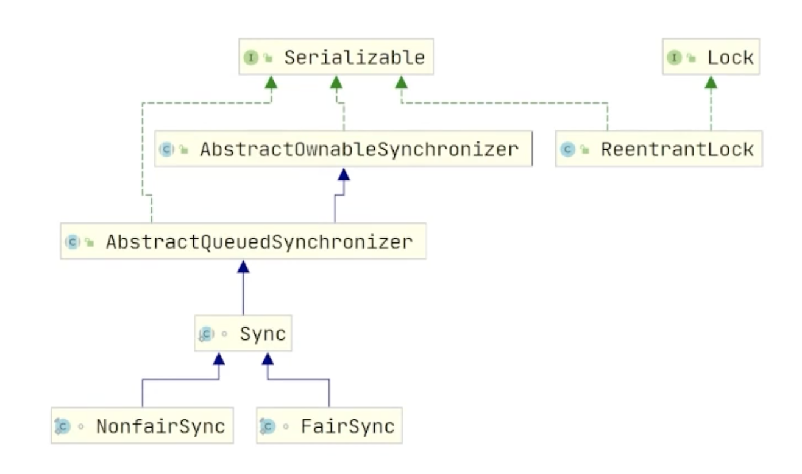
	-
- #AQS
	- 类似synchronized的 #Monitor
	- AbstractQueuedSynchronizer 抽象队列同步器
		- 利用一个FIFO（先进先出）等待队列来管理线程的阻塞和唤醒，以及对共享资源的访问控制
		- 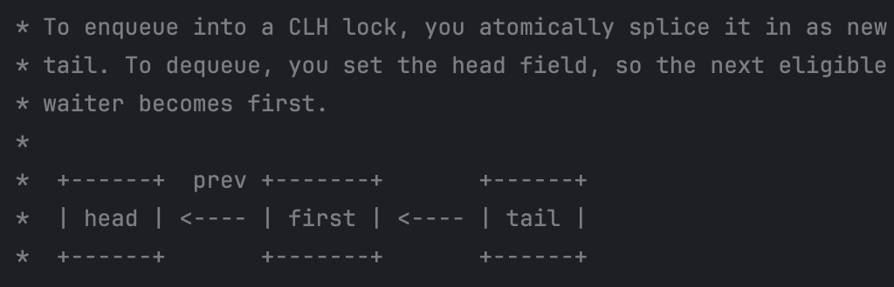
		- 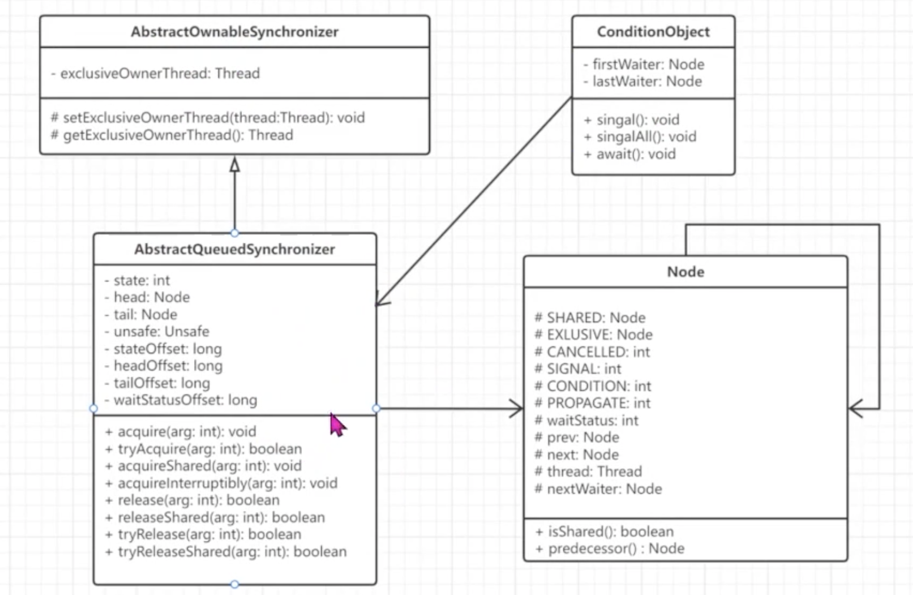
		- 核心组件
			- **State** 同步状态
				- 是AQS控制的对象的状态，使用 volatile 修饰。
				- 可以是任何表示资源状态的整数或者是一个布尔值。不同的同步器可以根据自己的需要定义和使用不同的状态
					- 比如，ReentrantLock中的同步状态可以表示锁的持有次数，Semaphore中的同步状态表示可用的许可数量等
			- **Waiting Queue** 等待队列
				- 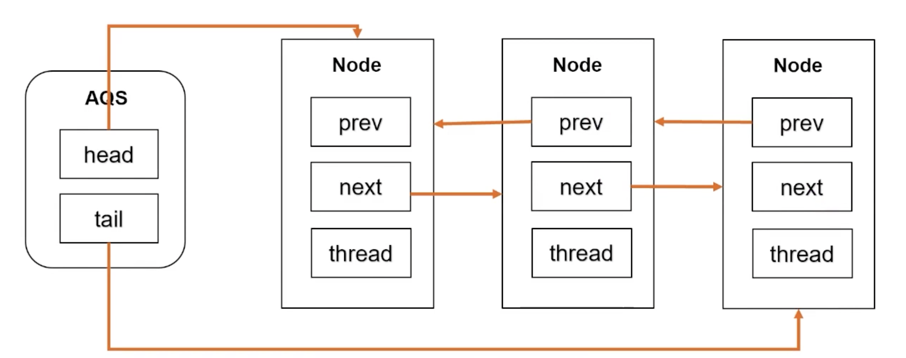
				- 是一个FIFO的双向队列
					- 保证了等待时间最长的线程优先获得资源
				- 存储被阻塞的线程，每个Node存储一个thread
					- 当一个线程请求某个资源，而该资源已被其他线程占用时，该线程会被加入到等待队列中，被阻塞挂起
				- 通过节点 head 和 tail 记录队首和队尾元素
		- 乐观锁策略
			- AQS内部使用 #CAS 操作来实现对同步状态的原子更新
			- 使用 volatile 保证证线程之间的数据正确同步
		- 核心方法
			- Lock 获得锁
				- 尝试获取资源，如果成功获取，则继续执行
					- tryAcquire
						- 判断锁的状态
						- CAS 改状态
						- 判断是否是重入
						- 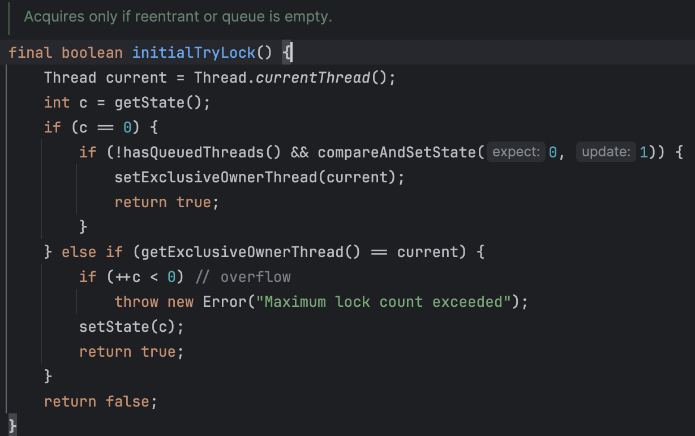
						- 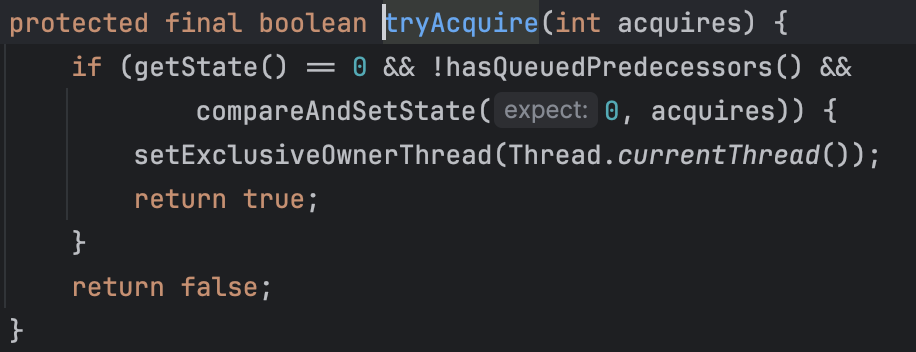
				- 如果资源已被其他线程占用，则当前线程会被加入到等待队列中
					- acquire
						- CAS 添加 Node (tail\head\prev\next)
							- 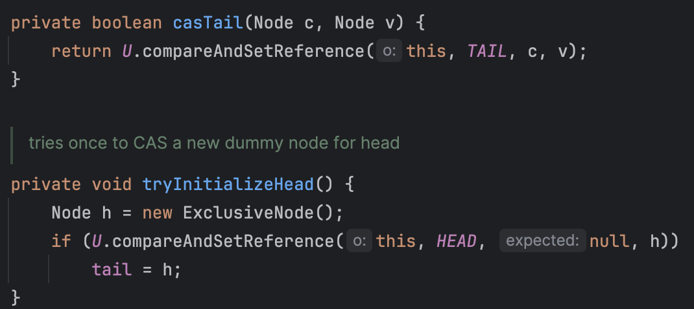
							- 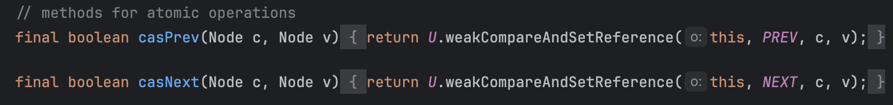
						- 无限自旋重试CAS
							- 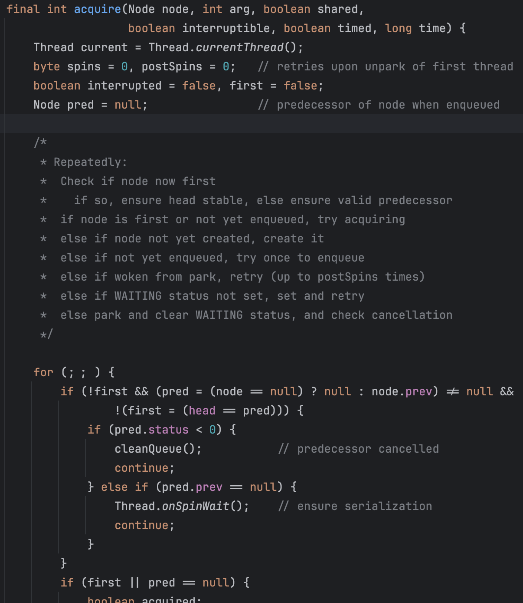
				- 将线程进入阻塞状态
					- 通过 LockSupport 阻塞当前线程 (还在自旋中未退出)
						- 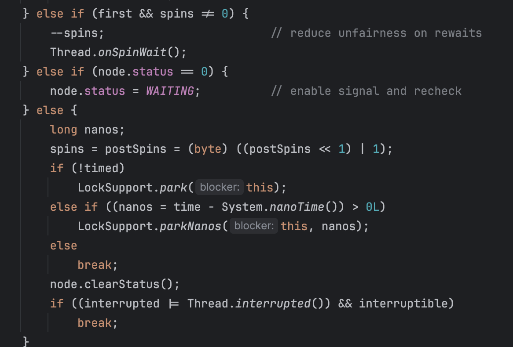
					- Native park
						- 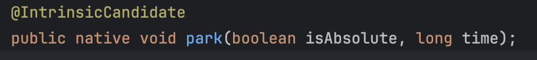
			- **Unlock** 释放锁
				- 释放资源，并且唤醒等待队列中的一个线程，使其有机会获取资源继续执行
				- 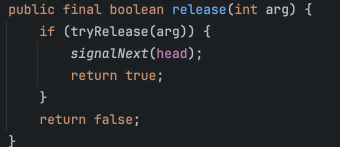{:height 186, :width 454}
				- 更新当前AQS状态
					- tryRelease
						- 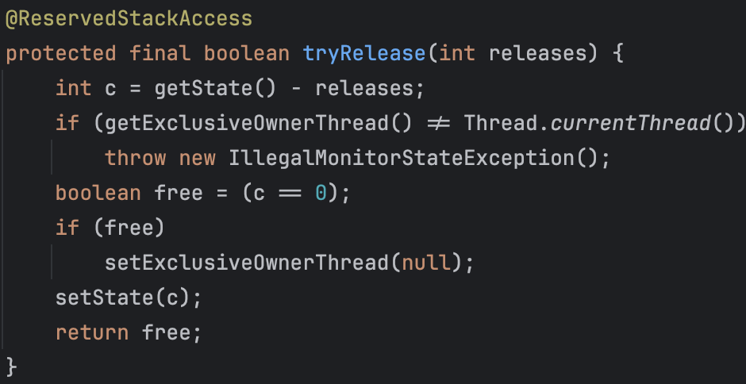
				- 唤醒下一个线程
					- signalNext
						- 修改 Node 状态，Node会在自旋中完成相关队列的跟新操作
						- 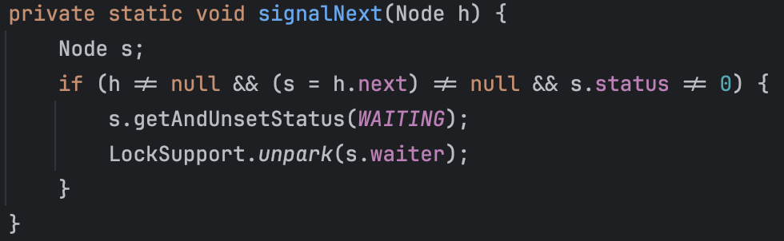
					- unpark 解除线程阻塞 (native)
-
- Fair & Unfair
	- 公平锁
		- 在 acquire 之前先判断同步队列中是否有线程在等待
			- 如果有，则跳过，等待中的线程会通过自旋acquire自动获得锁
		- hasQueuedThreads
			- 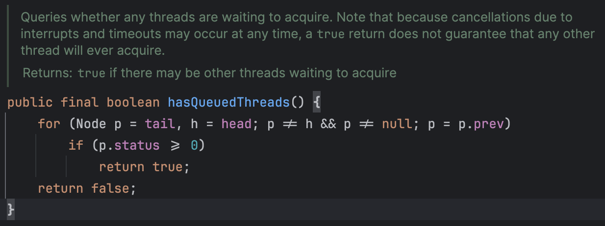
		- hasQueuedPredecessors
			- 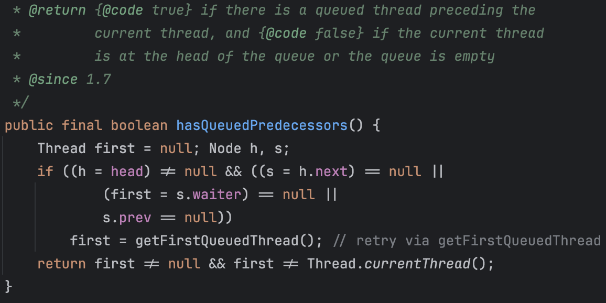
	- 非公平锁
		- 插队：所有线程直接竞争锁
		- 插队失败也会进入 #AQS 等待队列
-
- 重入锁
	- 加锁
		- 判断是否已经持锁，如果有，则记录重入的次数
		- 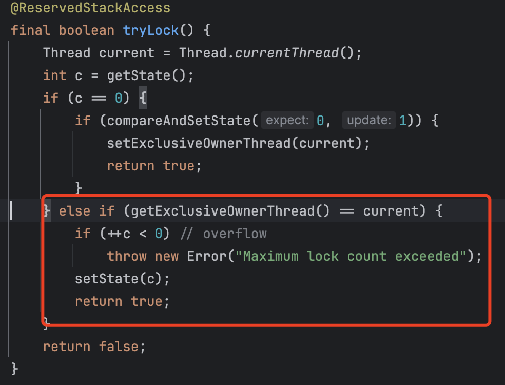{:height 403, :width 434}
	- 解锁
		- 减去release的次数直至0才会释放锁
			- 即重入x次，就需要解锁x次
			- 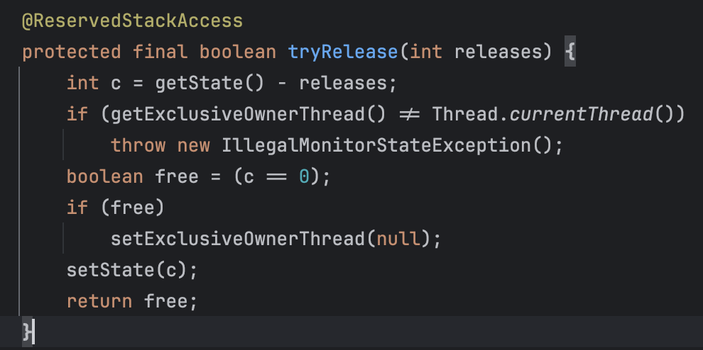{:height 257, :width 434}