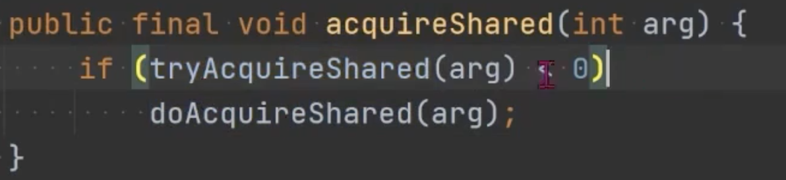
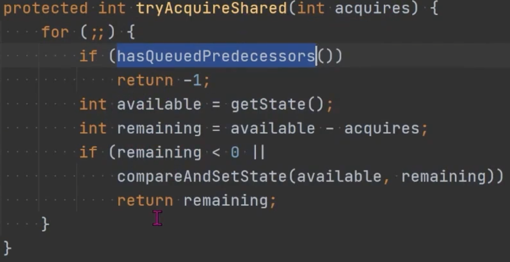

- 维护着一对锁
	- 读锁 (共享锁)
		- 同一时间，可以允许多个读线程同时访问
	- 写锁 (互斥锁)
		- 写线程访问时，所有读写线程都会阻塞
- 优势
	- 通过读锁和写锁分离，使得并发能力比一般的单一互斥锁有较大提升。
	- 适合读多写少的场景
- 特性
	- 支持公平非公平
	- 支持重入
	- 锁降级
		- 写锁可以降级为读锁
		- 读锁不能升级为写锁
- 样例
	- ```java
	  ReentrantReadWriteLock lock = new ReentrantReadWriteLock();
	  //写锁
	  lock.writeLock().lock();
	  //保证写操作是线程安全的
	  lock.writeLock().unlock();
	  
	  //读锁
	  Lock.readLock().lock();
	  //在读的时候允许多个线程访问，写的时候互斥
	  Lock.readLock().unlock();
	  ```
- 原理
	- 读锁和写锁共享状态标记，判断 available 来决定是否等待
	- {:height 143, :width 532}
	- {:height 284, :width 532}