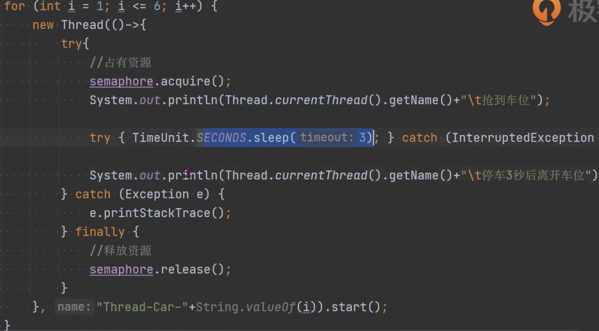

- #Semaphore 信号量
	- 限制和管理数量有限的资源的使用
	- 方法
		- new Semaphore(int permits) : 可以创建公平的非公平的策略
		- acquire() : 获取许可证，要么获取成功，信号量减1，要么阻塞等待唤
		- release()：释放许可证，信号量加1，然后唤醒等待的线程
		- {:height 390, :width 652}
- 场景：Hystrix、Sentinel 限流