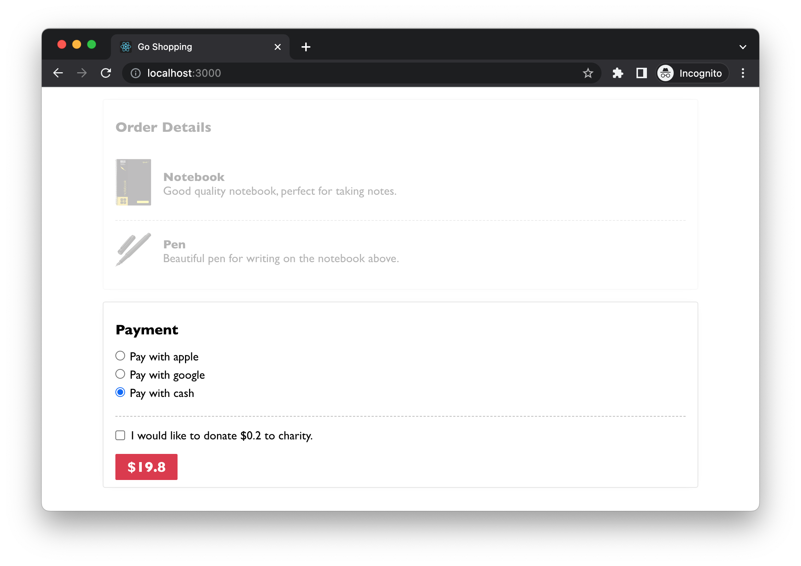
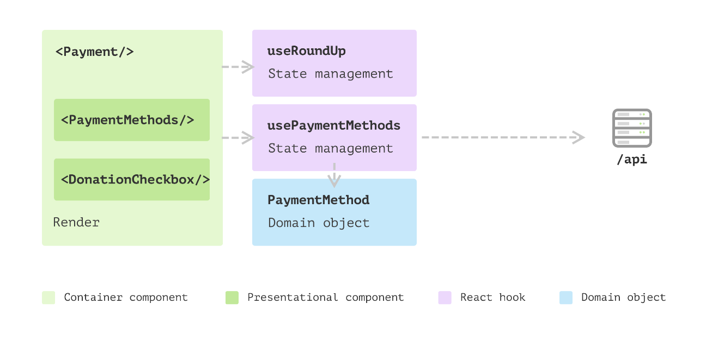
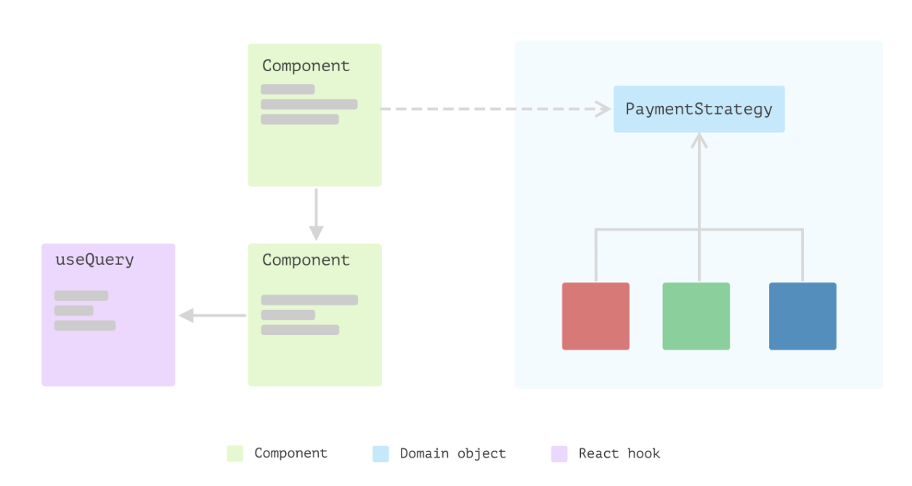

- 我们希望为客户提供一个选项，让他们可以在下单的同时向慈善机构捐赠少量资金作为小费。
	- 例如，如果订单金额为 19.80 美元，我们会询问他们是否愿意捐赠 0.20 美元。如果用户同意捐赠，我们将在按钮上显示总数。
	- 
- ### 新增内部状态：同意捐赠
	- ``` tsx
	      //src/Payment.tsx…
	      
	        const [agreeToDonate, setAgreeToDonate] = useState<boolean>(false);
	      
	        const { total, tip } = useMemo(
	          () => ({
	            total: agreeToDonate ? Math.floor(amount + 1) : amount,
	            tip: parseFloat((Math.floor(amount + 1) - amount).toPrecision(10)),
	          }),
	          [amount, agreeToDonate]
	        );
	      
	        ...
	      
	        return (
	          <div>
	            <h3>Payment</h3>
	            <PaymentMethods options={paymentMethods} />
	            <div>
	              <label>
	                <input
	                  type="checkbox"
	                  onChange={handleChange}
	                  checked={agreeToDonate}
	                />
	                <p>
	                  {agreeToDonate
	                    ? "Thanks for your donation."
	                    : `I would like to donate $${tip} to charity.`}
	                </p>
	              </label>
	            </div>
	            <button>${total}</button>
	          </div>
	        );
	  ```
-
	-
- ### Extract a hook
	- ``` tsx
	      //src/hooks/useRoundUp.ts…
	      
	      export const useRoundUp = (amount: number) => {
	        const [agreeToDonate, setAgreeToDonate] = useState<boolean>(false);
	      
	        const {total, tip} = useMemo(
	          () => ({
	            total: agreeToDonate ? Math.floor(amount + 1) : amount,
	            tip: parseFloat((Math.floor(amount + 1) - amount).toPrecision(10)),
	          }),
	          [amount, agreeToDonate]
	        );
	      
	        const updateAgreeToDonate = () => {
	          setAgreeToDonate((agreeToDonate) => !agreeToDonate);
	        };
	      
	        return {
	          total,
	          tip,
	          agreeToDonate,
	          updateAgreeToDonate,
	        };
	      };
	      
	      //src/components/Payment.tsx…
	      
	      export const Payment = ({ amount }: { amount: number }) => {
	        const { paymentMethods } = usePaymentMethods();
	      
	        const { total, tip, agreeToDonate, updateAgreeToDonate } = useRoundUp(amount);
	      
	        return (
	          <div>
	            <h3>Payment</h3>
	            <PaymentMethods options={paymentMethods} />
	            <div>
	              <label>
	                <input
	                  type="checkbox"
	                  onChange={updateAgreeToDonate}
	                  checked={agreeToDonate}
	                  />
	                <p>{formatCheckboxLabel(agreeToDonate, tip)}</p>
	              </label>
	            </div>
	            <button>${total}</button>
	          </div>
	        );
	      };
	      
	      const formatCheckboxLabel = (agreeToDonate: boolean, tip: number) => {
	        return agreeToDonate
	          ? "Thanks for your donation."
	          : `I would like to donate $${tip} to charity.`;
	      };
	  ```
-
- ### 拆分子组件
	- ``` tsx
	      //src/components/DonationCheckbox.tsx…
	      
	      const DonationCheckbox = ({
	        onChange,
	        checked,
	        content,
	      }: DonationCheckboxProps) => {
	        return (
	          <div>
	            <label>
	              <input type="checkbox" onChange={onChange} checked={checked} />
	              <p>{content}</p>
	            </label>
	          </div>
	        );
	      };
	      
	      //src/components/Payment.tsx…
	      
	      export const Payment = ({ amount }: { amount: number }) => {
	        const { paymentMethods } = usePaymentMethods();
	      
	        const { total, tip, agreeToDonate, updateAgreeToDonate } = useRoundUp(amount);
	      
	        return (
	          <div>
	            <h3>Payment</h3>
	            <PaymentMethods options={paymentMethods} />
	            <DonationCheckbox
	              onChange={updateAgreeToDonate}
	              checked={agreeToDonate}
	              content={formatCheckboxLabel(agreeToDonate, tip)}
	              />
	            <button>${total}</button>
	          </div>
	        );
	      };
	  ```
-
- 
- 可以将 Hook 想象成一个视图背后的状态机，每当 UI 中发生某些更改时，比如复选框更改事件。该事件将被发送到状态机以生成新状态，新状态将触发重新渲染。
- 由于 React 中的声明式 UI，阅读 UI 组件代码就像阅读一段 HTML 一样非常简单。
-
- ### 新的需求扩展
	- 随着业务扩展到其他国家，同样的逻辑在日本市场行不通，因为 0.1 日元作为捐款太小了，需要四舍五入到最接近的日元百位。对于丹麦，它需要四舍五入到最接近的十位。
	-
	- 添加参数
		- ``` tsx
		        ///<Payment amount={3312} countryCode="JP" />;
		        const useRoundUp = (amount: number, countryCode: string) => {
		          //...
		        
		          const { total, tip } = useMemo(
		            () => ({
		              total: agreeToDonate
		                ? countryCode === "JP"
		                  ? Math.floor(amount / 100 + 1) * 100
		                  : Math.floor(amount + 1)
		                : amount,
		              //...
		            }),
		            [amount, agreeToDonate, countryCode]
		          );
		          //...
		        };
		  ```
-
	- 相同的逻辑判断还会发生在其他地方
		- ``` tsx
		        const formatCheckboxLabel = (
		          agreeToDonate: boolean,
		          tip: number,
		          countryCode: string
		        ) => {
		          const currencySign = countryCode === "JP" ? "¥" : "$";
		        
		          return agreeToDonate
		            ? "Thanks for your donation."
		            : `I would like to donate ${currencySign}${tip} to charity.`;
		        };
		  ```
		- ``` tsx
		        <button>
		          {countryCode === "JP" ? "¥" : "$"}
		          {total}
		        </button>;
		  ```
-
-
- ### 利用多态性
	- ``` tsx
	      export interface PaymentStrategy {
	        getRoundUpAmount(amount: number): number;
	      
	        getTip(amount: number): number;
	      }
	      
	      export class PaymentStrategyAU implements PaymentStrategy {
	        get currencySign(): string {
	          return "$";
	        }
	      
	        getRoundUpAmount(amount: number): number {
	          return Math.floor(amount + 1);
	        }
	      
	        getTip(amount: number): number {
	          return parseFloat((this.getRoundUpAmount(amount) - amount).toPrecision(10));
	        }
	      }
	      
	      export const useRoundUp = (amount: number, strategy: PaymentStrategy) => {
	        const [agreeToDonate, setAgreeToDonate] = useState<boolean>(false);
	      
	        const { total, tip } = useMemo(
	          () => ({
	            total: agreeToDonate ? strategy.getRoundUpAmount(amount) : amount,
	            tip: strategy.getTip(amount),
	          }),
	          [agreeToDonate, amount, strategy]
	        );
	      
	        const updateAgreeToDonate = () => {
	          setAgreeToDonate((agreeToDonate) => !agreeToDonate);
	        };
	      
	        return {
	          total,
	          tip,
	          agreeToDonate,
	          updateAgreeToDonate,
	        };
	      };
	      
	  ```
	- 