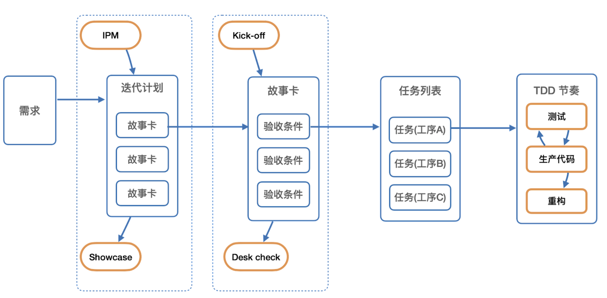
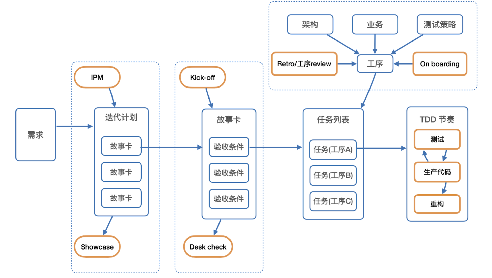
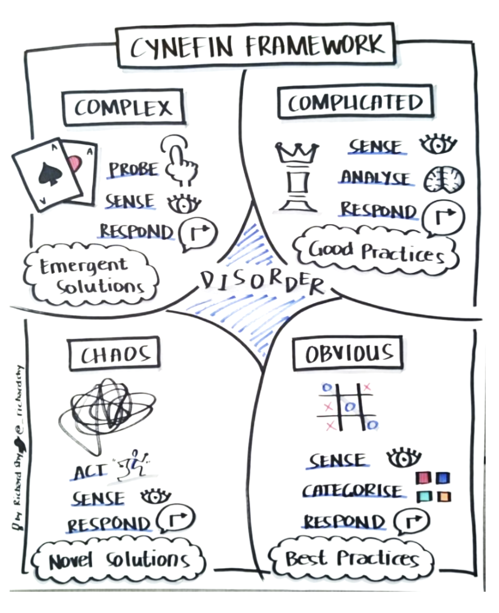
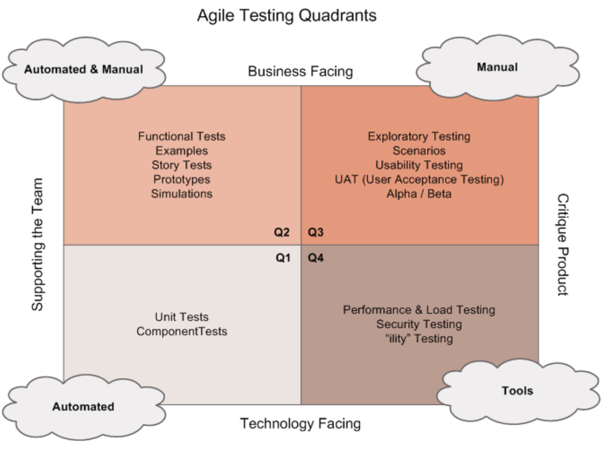

- What
	- 工序：软件的实现模式（Implementation Pattern）
		- 从任务列表的角度看：工序体现了任务的类型
		- 从架构的角度看：工序是组件的最佳实现和测试策略
	-
	- 工程实践方法从宏观上来看是需求不断被分解的过程：
		- 需求被拆分为不同的故事卡（story）
		- 每张故事卡中定义多个验收条件（AC）
		- 每个验收条件被拆分为多个任务（task）
		- 
	-
	- 围绕工序的社交活动
		- On boarding - Task / Tech check 循环
			- 围绕工序进行相关的培训，帮助新同事快速上手工作。
			- 检验新同事是否真正理解了工序，是否能够高效地使用工序。
		- On boarding - Retro/工序 review 循环
			- 是否存在更好的实现方式
			- 架构、业务、测试策略是否发生了变化
			- 调整工序，重新进行 On boarding 培训
		- 
		-
	- 时间控制：团队效能管理方法
	- 通过 Spike 打样并建立基线
		- 挑选故事卡，通过工序来实现故事卡。
		- 评估测试策略的有效性和实现效率，并选择合适的技术栈与框架来完成脚手架和框架代码的搭建。
		- 为每个工序记录其实现所花费的时间。
		- 根据完成时间和团队能力水平定义效能基线，作为团队成员是否胜任的依据。
	- 在 On Boarding 时进行胜任管理
	- 开卡、验收与效能追踪
	- 工序回顾与架构守护
	-
	- Why
	- 使更多日常工作处于有序的认知模式下，提高软件开发的工程效能
		- **Cynefin Framework**
			- 认知行为模式分析方法，帮助理解组织认知行为模式
			- 其中，”Cynefin“ 的威尔士语发音是/ku-nev-in/.
			- 
	-
	- 工序是对实际代码编写的显式化指导，以此来降低不可言说知识的比例
		- 把业务、架构、实现和测试策略转化为具体的工序，当接到故事卡时，任务分解就不是无序的分解，而是基于工序来产生任务
		- 工序的使用提高了认知水平，使得我们可以通过这一支点，逐步向期望的杠杆率（8X）靠近
		- 引入工序有助于提升团队认知水平，内化测试和自动化，提升工程效能
		- 4个速度
			- 软件的构造速度、软件的修改速度
				- 通过测试与自动化来保证和提升：构造有效的测试策略以保证基础效能。
			- 问题的发现速度、问题的定位速度
				- 通过知识与认知管理来保证和提升：通过有效的“社交”活动以提高知识管理的效率，保证有效的认知状态。
	-
	- How
	- 工序来源于架构、业务和测试策略：
		- 建模：
			- 从业务上下文中，识别出业务系统与领域系统，形成大的模块边界。
		- 进程间架构：
			- 针对业务与系统的基础 CFR，选择适合的架构风格，完成进程间架构愿景
		- 进程内架构：
			- 在不同的进程边界内，给出该进程的进程内架构组件
		- 定义测试策略：
			- 选择合适的测试替身技术才能保证测试的有效性。
			- 
		- 定义工序：
			- 进程内组件、测试类型和测试策略共同构成了进程内工序。
	-
	- 示例
		- Antennae工序
		- Hive UI工序
		- Foraging UI工序
			- 结合测试策略，Foraging UI 工序如下:
				- Fake VM使用cypress测试view
				- Fake VM使用 cypress 视觉测试view
				- Fake Model使用vitest测试测试VM
				- Stub Websocket Server, 使用 Pact Message Consumer Test 验证 Receiver 接收消息
				- Stub Websocket Server, 使用 Pact Message Provider Test 验证 Sender 发送消息
				- Pact-foraging-ui: Stub Server, 使用 Pact Consumer Test 验证  API 调用
				- Fake VM，使用 react testing library 测试 Local ModelContext hook
				- Fake Collaborative Context，使用react testing library测试 Remote ModelContext hook
				- Fake Model，使用 vitest 验证 Controller 可以 Sync 远端数据到 Local
	-
	- 结合测试策略，Foraging UI 工序如下:
		- Fake VM使用cypress测试view
		- Fake VM使用 cypress 视觉测试view
		- Fake Model使用vitest测试测试VM
		- Stub Websocket Server, 使用 Pact Message Consumer Test 验证 Receiver 接收消息
		- Stub Websocket Server, 使用 Pact Message Provider Test 验证 Sender 发送消息
		- Pact-foraging-ui: Stub Server, 使用 Pact Consumer Test 验证  API 调用
		- Fake VM，使用 react testing library 测试 Local ModelContext hook
		- Fake Collaborative Context，使用react testing library测试 Remote ModelContext hook
		- Fake Model，使用 vitest 验证 Controller 可以 Sync 远端数据到 Local
	- 实例
		- BeeArt 4.0 Iterations
	-
#### AC1 可以上传本地表格到session中
	- Given 我在表单栏点击上传表格
	- When 我成功将表格上传至session
	- Then 我能看到session内新增一个表单
	- And 我就位于我当前上传表格的tab页
	- And 表单名字和原有名字保持一致
	- And 原有表格的第一列被当作数据内容填充在便利贴文本中
		- Tasking
			- 新增添加数据表方法 addDataset，可以添加一个数据表 { id, name, entries }
				- DONEcontroller 添加 addDataset Fake Model使用vitest测试测试 Updater
				- DONEFake YDocStructuredDatasetUpdater，通过单元测试，验证添加dataset时，YDocStructuredDatasetUpdater可以更新本地Ydoc文档并触发sync Fake Model使用vitest测试测试 Updater
				- DONEFake StoreStructuredDatasetUpdater，通过单元测试，验证当远端添加dataset时，StoreStructuredDatasetUpdater可以同步更新本地Store Fake Model使用vitest测试测试 Updater
			- 上传组件
				- 上传空表格
					- DONE通过Cypress测试，模拟空数据表上传，验证是否正确触发StructuredDatasetUpdater Fake VM使用cypress测试view
				- 上传多数据数据表
					- DONE通过Cypress测试，模拟多数据数据表上传，验证是否正确触发StructuredDatasetUpdater Fake VM使用cypress测试view
				- DONE上传组件禁用逻辑，当表单个数 >=3 时禁用Fake VM使用cypress测试view
			- 数据表view改为一对多
				- DONE新增 tab 组件，可以列出当前的所有数据表名称（不带 .csv） Fake VM使用cypress测试view
				- DONEtab 组件，点击后可切换当前数据表Fake VM使用cypress测试view
				- DONE修改 数据表 footer 布局样式，数据总数上移Fake VM使用cypress测试view
			- 上传数据表后自动选中
				- DONE通过Cypress测试，模拟上传数据表，验证新表单是否被自动正确激活显示Fake VM使用cypress测试view
	-
#### AC1 可以上传本地表格到session中
	- Given 我在表单栏点击上传表格
	- When 我成功将表格上传至session
	- Then 我能看到session内新增一个表单
	- And 我就位于我当前上传表格的tab页
	- And 表单名字和原有名字保持一致
	- And 原有表格的第一列被当作数据内容填充在便利贴文本中
		- Tasking
			- 新增添加数据表方法 addDataset，可以添加一个数据表 { id, name, entries }
				- DONEcontroller 添加 addDataset Fake Model使用vitest测试测试 Updater
				- DONEFake YDocStructuredDatasetUpdater，通过单元测试，验证添加dataset时，YDocStructuredDatasetUpdater可以更新本地Ydoc文档并触发sync Fake Model使用vitest测试测试 Updater
				- DONEFake StoreStructuredDatasetUpdater，通过单元测试，验证当远端添加dataset时，StoreStructuredDatasetUpdater可以同步更新本地Store Fake Model使用vitest测试测试 Updater
			- 上传组件
				- 上传空表格
					- DONE通过Cypress测试，模拟空数据表上传，验证是否正确触发StructuredDatasetUpdater Fake VM使用cypress测试view
				- 上传多数据数据表
					- DONE通过Cypress测试，模拟多数据数据表上传，验证是否正确触发StructuredDatasetUpdater Fake VM使用cypress测试view
				- DONE上传组件禁用逻辑，当表单个数 >=3 时禁用Fake VM使用cypress测试view
			- 数据表view改为一对多
				- DONE新增 tab 组件，可以列出当前的所有数据表名称（不带 .csv） Fake VM使用cypress测试view
				- DONEtab 组件，点击后可切换当前数据表Fake VM使用cypress测试view
				- DONE修改 数据表 footer 布局样式，数据总数上移Fake VM使用cypress测试view
			- 上传数据表后自动选中
				- DONE通过Cypress测试，模拟上传数据表，验证新表单是否被自动正确激活显示Fake VM使用cypress测试view
	-
	- More：
	- 官方课程：
		- [黑马课程](https://sites.google.com/thoughtworks.com/dark-horse-course/homepage/%E8%AF%BE%E7%A8%8B%E5%AD%A6%E4%B9%A0/Scalable-Engineering-Excellence)
		- [敏捷101](https://sites.google.com/thoughtworks.com/aep-wiki/micro-lectures/101)
	- 八叉说：
		- [八叉说-组织架构与认知模型](https://www.bilibili.com/video/BV1gK411p7uc?from=search&seid=10625760873663036354)
		- [八叉说-为什么绝大多数组织都是金字塔结构](https://mp.weixin.qq.com/s?__biz=MjM5MjY3OTgwMA==&mid=2652468529&idx=1&sn=30ab00c4dbd4cfc46d34cd320450ac21&channel_session_id=&sessionid=svr_2abbb18ba26&scene=168&subscene=136#rd)
		- [八叉说-从单纯型官僚组织走向技术型官僚组织](https://mp.weixin.qq.com/s?__biz=MjM5MjY3OTgwMA==&mid=2652468740&idx=1&sn=c2784b85d1b61935afabff992e8c6012&channel_session_id=&sessionid=svr_2abbb18ba26&scene=168&subscene=136#rd)
		- [八叉说-无法被996管理的知识工作者](https://mp.weixin.qq.com/s?__biz=MjM5MjY3OTgwMA==&mid=2652467724&idx=1&sn=bb22689f2de5453a8032733dbbdb1091&channel_session_id=&sessionid=svr_2abbb18ba26&scene=168&subscene=136#rd)
		- [八叉说-如何衡量一个团队成员是否靠谱](https://mp.weixin.qq.com/s?__biz=MjM5MjY3OTgwMA==&mid=2652468265&idx=1&sn=1ec1a3931599f82112fe367dcf921a07&channel_session_id=&sessionid=svr_2abbb18ba26&scene=168&subscene=136#rd)
		- [八叉说-软件开发管理为什么这么难](https://mp.weixin.qq.com/s/qYvI2_K8m4FwTqGaMMjTdQ)
		- [八叉说-划分知识边界以提升团队效率](https://mp.weixin.qq.com/s?__biz=MjM5MjY3OTgwMA==&mid=2652467704&idx=1&sn=2cbbe98cdcc46c088f5bf1b450401a51&channel_session_id=&sessionid=svr_2abbb18ba26&scene=168&subscene=136#rd)
		- [八叉说-道可道非常道，从东方文化谈知识管理](https://mp.weixin.qq.com/s?__biz=MjM5MjY3OTgwMA==&mid=2652471709&idx=1&sn=2fe8d684ca0e9b7d6366672f692be918&channel_session_id=&sessionid=svr_2abbb18ba26&scene=168&subscene=136#rd)