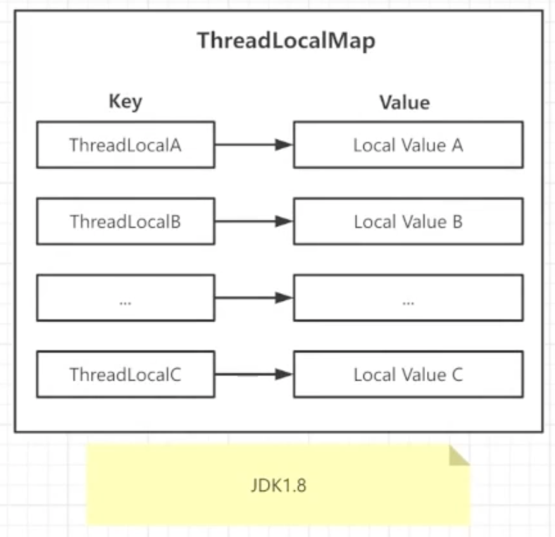
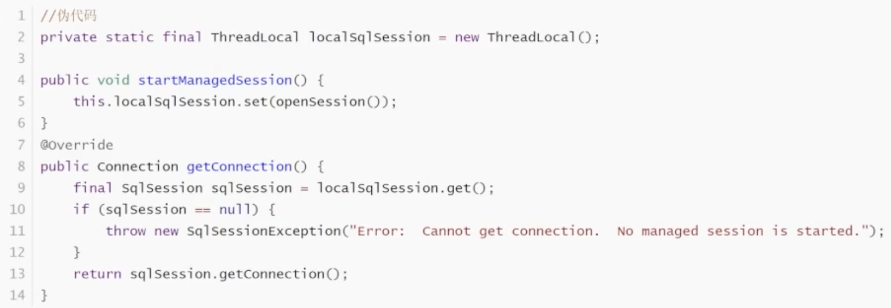
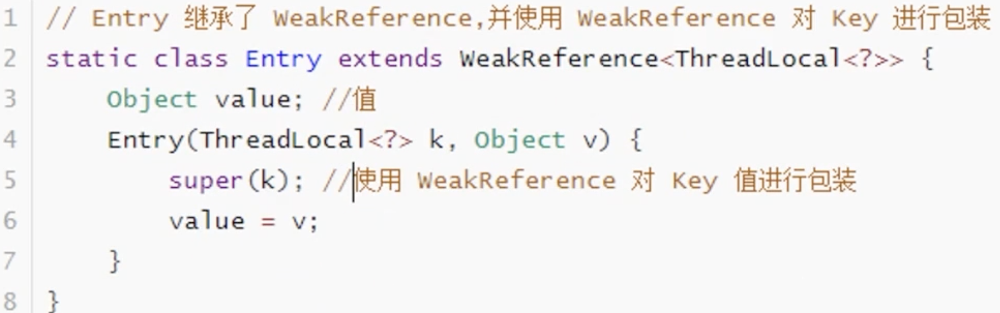
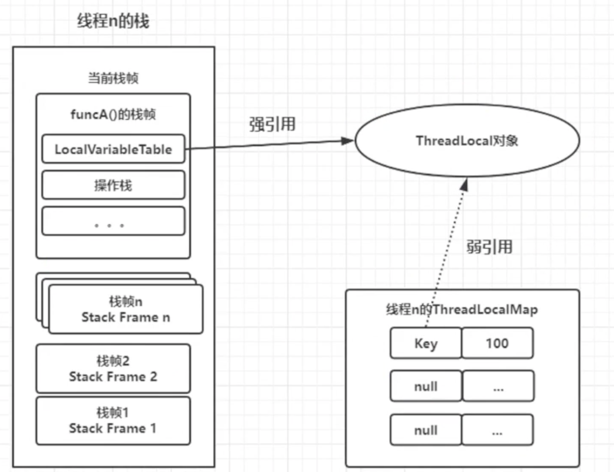

- #ThreadLocal 线程本地变量
	- 在多线程并执行过程中，将变量存储在ThreadLocal中，每个线程中都有独立的变量
	- 不会出现线程安全问题
	- 通过 ThreadLocalMap 实现，一个线程一个 ThreadLocalMap
	- Thread -> ThreadLocalMap --> Entry(ThreadLocalN, LocalValueN)*n
	- {:height 480, :width 470}
- 场景
	- 跨函数参数传递
		- Token/Session
			- 同一个线程，跨类，跨方法传递参数时可以使用ThreadLocal，每个线程绑定一个
	- 保证线程安全
		- SqlSession
			- 每个线程绑定一个数据库连接，避免多个线程访问同一个数据库连接
			- 
-
- ThreadLocal 使用弱应用
	- 防止内存泄漏
		- 对 Key进行弱应用处理
			- 如果使用强引用，即使线程结束了，ThreadLocal 对象仍然被 ThreadLocalMap 引用，导致 ThreadLocal 对象无法被回收
			- 保证线程和ThreadLocal对象生命周期一致
		- 
		- 
		-
	- {{embed ((654da127-ec71-4a4e-99d0-f65c335c1350))}}