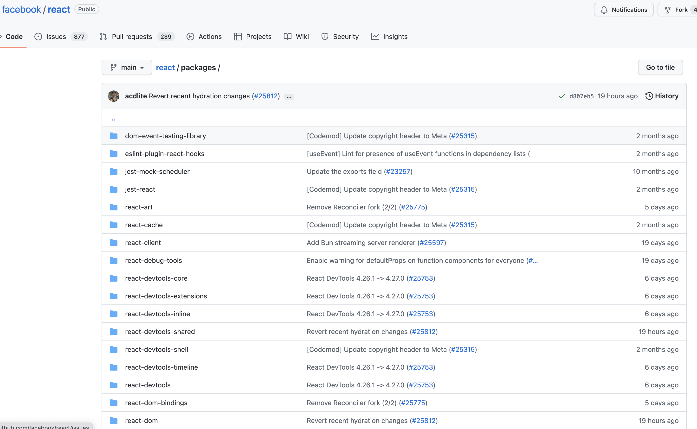
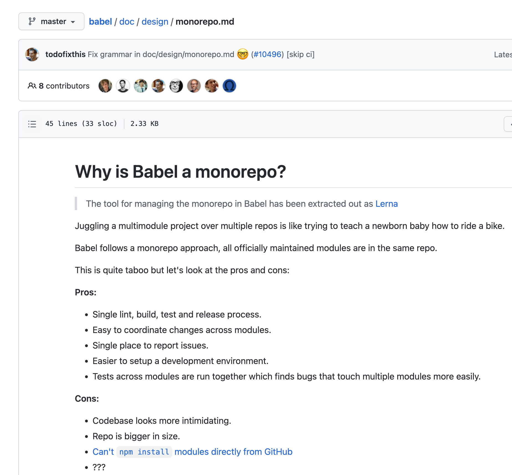
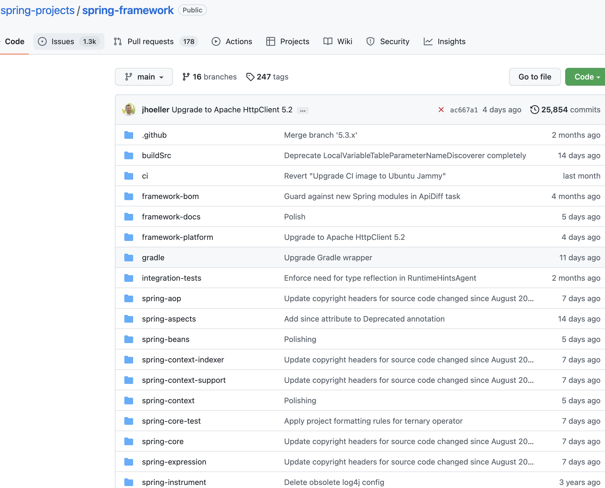
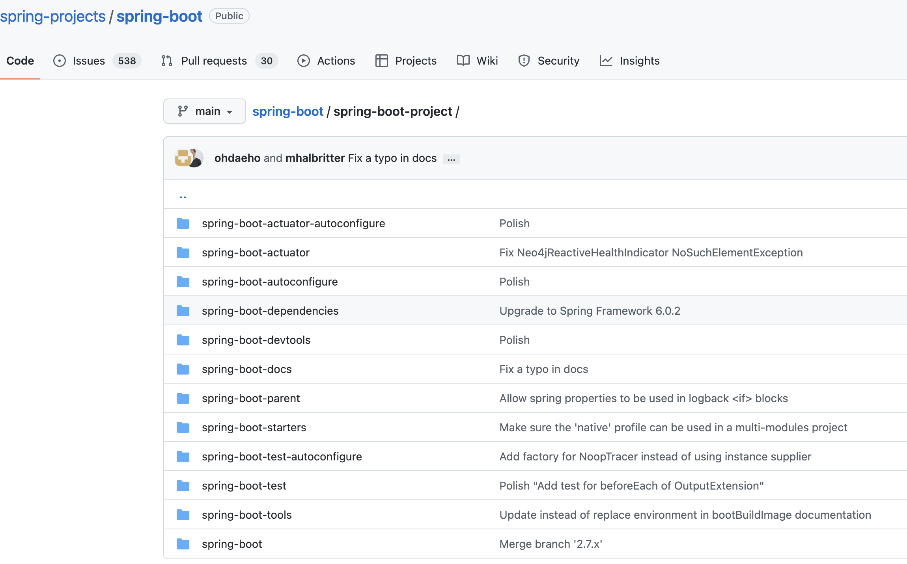

- Monorepo 是什么？
	- A version-controlled code repository that holds many projects. While these projects may be related, they are often logically independent and run by different teams.
-
- #Monorepo vs #Single-repo vs #Multi-repo
	- 
-
- 一些故事
	- Airbnb 爱彼迎
		- Start with " The monorail "
			- 一个单体的 Ruby on Rails 应用程序。最初 Airbnb 实行了一种称为民主发布的策略，这意味着任何开发人员都可以随时发布到生产环境
		- 当公司开始呈指数级增长时，代码库也随之增长。合并更改变得越来越难。
			- Merge queue
			- Enhanced monitoring
		- 拆分微服务，创建了两个 monorepos
			- 一个用于前端，一个用于后端
			- 两者都包含数百种服务、文档、用于部署的 Terraform 和 Kubernetes 资源，以及所有维护工具
	- Uber 优步
		- Android 客户端，在一开始就采用了 [[Monorepo]]
			- 5年后，如果代码不冻结，我们甚至无法在 Android Studio 中滚动
			- 缓慢的 #Git 和 缓慢的构建
			- 任何人破坏都会导致无法对产品进行构建，随着公司越大，就越容易遇到一个 broken master
		- 当 Uber 达到中等规模时，团队决定采用 [[Multi-repo]]
			- 只构建需要的应用程序，构建变的很快，大家很开心
		- 又过了一段时间，新的问题出现了
			- 管理数千个存储库的开销巨大，消耗了大量宝贵的时间
			- 每个小组都有自己的编码风格、框架和测试实践
			- 管理依赖关系也变得更加困难，依赖地狱怪物抬起了丑陋的头
			- 团队正在分裂，很难将所有内容集成到一个产品中
		- 优步工程师重新组合并决定再给 [[Monorepo]] 一次机会
			- 优化工具：
				- changed IDEs
				- implemented a merge queue
				- used differential builds to speed up deployments
	- Pinterest
		- 1300 多个存储库
			- 代码散布得太细，每个团队都有自己的代码库，很难重用代码
			- 不同的代码库有不同的风格和结构，构建过程质量标准变化很大
			- 构建和部署太难
		- 合并到 4 个 [[Monorepo]]
			- 基于主干的开发
			- 频繁地合并和发布
			- 标准化开发流程和规范
	- BeeArt
		- 3.0 #Multi-repo 迁移阿里云的时候有60+ repos
		- 4.0 #Monorepo 迁移阿里云的时候一个repo，一个pipeline
-
- Monorepo 文化
	- 从 #CVS 开始，经历 #SVN，再到 #Git，据说有30年历史了
	- 许多开源项目都在使用
		- #React
			- 
		- #Babel
			- 
		- #spring-framework
			- 
		- #spring-boot
			- 
		-
	-
- Benefits
	- **Visibility**: everyone can see everyone else’s code.
	- **Simpler dependency management**: sharing dependencies is easy. All modules are hosted in the same repository.
	- **Single source of truth**: one version of every dependency means there are not versioning conflicts and no dependency hell.
	- **Consistency**: enforcing code quality standards and a unified style is easier when you have all your codebase in one place.
	- **Shared timeline**: breaking changes in APIs or shared libraries are exposed immediately, forcing different teams to communicate ahead and join forces.
	- **Atomic commits**: atomic commits make large-scale refactoring easier. A developer can update several packages or projects in a single commit.
	- **Unified CI/CD**: you can use the same CI/CD deployment process for every project in the repo.
	-
- Defect
	- **Bad performance**: difficult to scale up. Commands like  `git blame`  may take unreasonably long times, IDEs begin to lag and productivity suffers, and testing the whole repo on every commit becomes infeasible.
	- **Broken main/master**: a broken master affects everyone. This can be seen as either disastrous or as a good motivation to keep tests clean and up to date.
	- **Ownership**: maintaining ownership of files is more challenging, as systems like Git or Mercurial don’t feature built-in directory permissions.
	- **Code reviews**: notifications can get very noisy. For instance, GitHub has limited notifications settings that are not best suited for a snow slide of pull requests and code reviews.
-
-
-
- 如何选择
	- 根据 [[康威定律]] 所述，沟通对于打造出色的产品至关重要。
		- 选择一个仓库策略不仅仅是一个技术问题，还关系到团队的文化和沟通方式，需要根据你想要的工作方式来决定。
		- Example
			- #Multi-repo: 每个团队或个人独立管理着不同的 project repos. 偶尔可能协作，但会有严格的协作流程，开发人员只关注他们自己负责的部分，而忽略全局。
			- #Monorepo: 作为一个center hub, 每个开发人员、运维工程师、测试人员都在这里工作、交流，遇到问题会第一时间集中解决，鼓励大家沟通，打破信息孤岛。
	-
- 一些有帮助的实践
	- 适当的工具是有效 #monorepo 的关键
		- IDE 优化
		- 根据 change 的 scope 进行差异化构建
		- [[Merge queue]]
		- 更高效的智能构建工具 #bazel #Buck
		- 脚手架工具 #NX #lerna
	- 定义统一的目录组织，便于 discovery
		- 技术栈划分 or 业务划分
	- 基于主干的开发