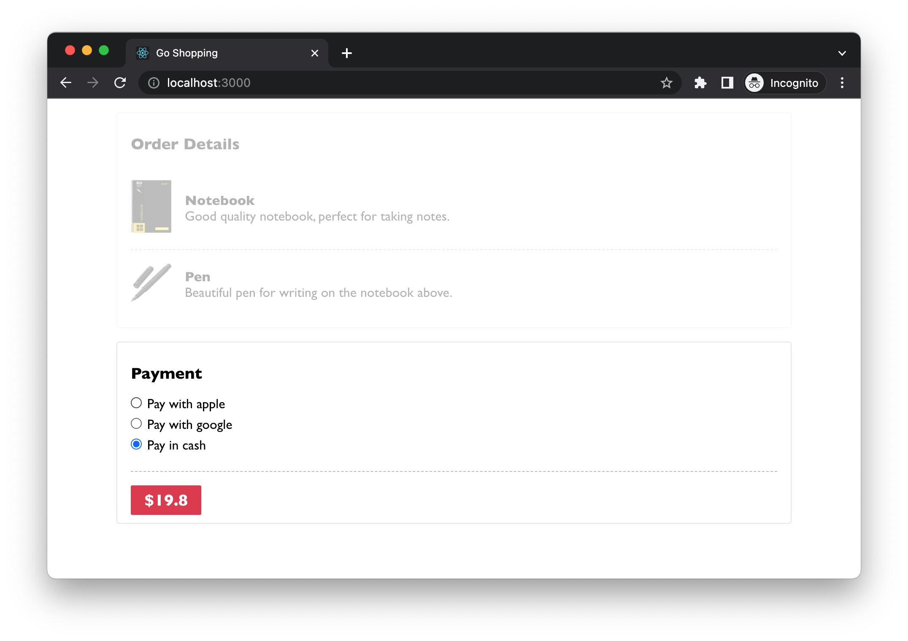
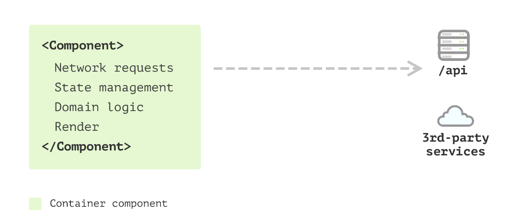
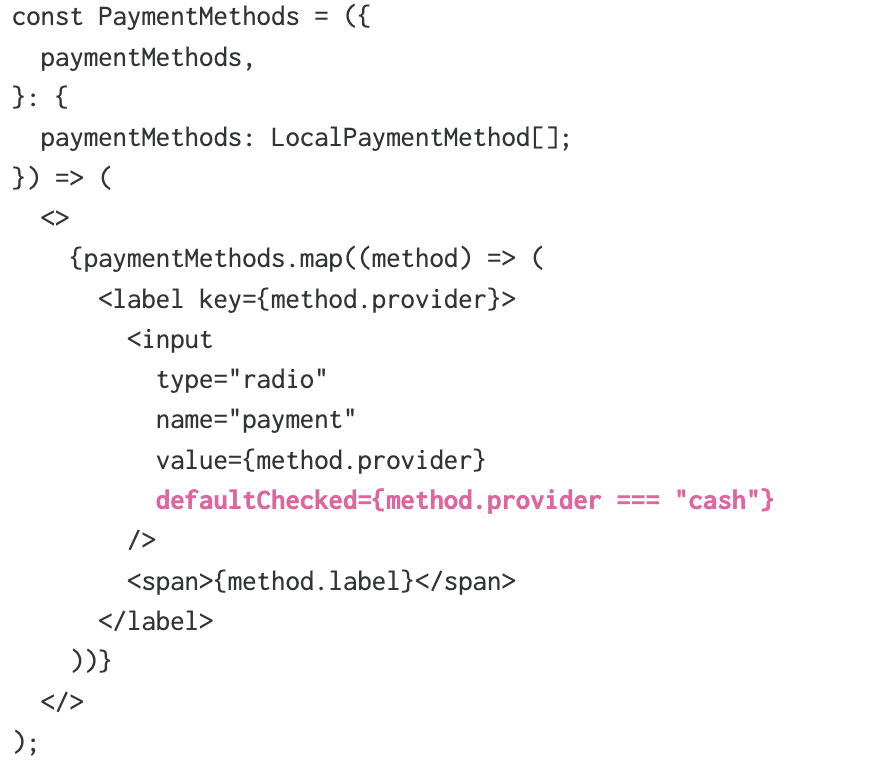
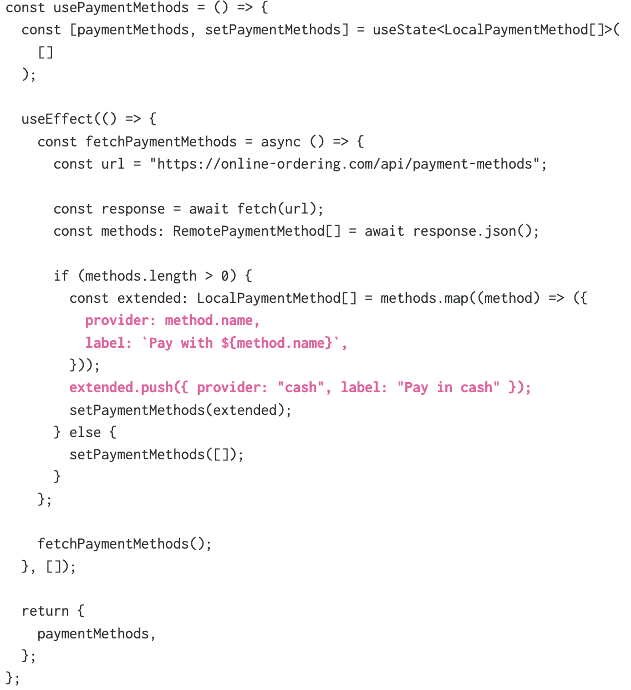
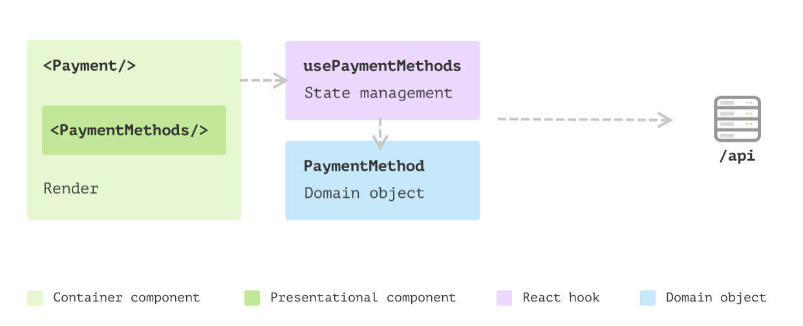

- 某在线订购应用程序，客户可以挑选一些产品并将其添加到订单中，然后需要选择一种付款方式进行支付。
	- 
- ``` tsx
  //src/Payment.tsx…
  
  export const Payment = ({ amount }: { amount: number }) => {
    const [paymentMethods, setPaymentMethods] = useState<LocalPaymentMethod[]>(
      []
    );
  
    useEffect(() => {
      const fetchPaymentMethods = async () => {
        const url = "https://online-ordering.com/api/payment-methods";
  
        const response = await fetch(url);
        const methods: RemotePaymentMethod[] = await response.json();
  
        if (methods.length > 0) {
          const extended: LocalPaymentMethod[] = methods.map((method) => ({
            provider: method.name,
            label: `Pay with ${method.name}`,
          }));
          extended.push({ provider: "cash", label: "Pay in cash" });
          setPaymentMethods(extended);
        } else {
          setPaymentMethods([]);
        }
      };
  
      fetchPaymentMethods();
    }, []);
  
    return (
      <div>
        <h3>Payment</h3>
        <div>
          {paymentMethods.map((method) => (
            <label key={method.provider}>
              <input
                type="radio"
                name="payment"
                value={method.provider}
                defaultChecked={method.provider === "cash"}
                />
              <span>{method.label}</span>
            </label>
          ))}
        </div>
        <button>${amount}</button>
      </div>
    );
  };
  ```
-
- 
- 该组件中的关注点：
	- 如何初始化网络请求
	- 如何将数据映射到组件可以理解的本地格式
	- 如何呈现每种支付方式
	- 组件本身的呈现逻辑
-
- ### 视图和非视图代码的拆分
	- 用 [提取函数](http://refactoring.com/catalog/extractFunction.html) 创建一个 Hook: `usePaymentMethods`
	- ``` tsx
	      //src/Payment.tsx…
	      
	      const usePaymentMethods = () => {
	        const [paymentMethods, setPaymentMethods] = useState<LocalPaymentMethod[]>(
	          []
	        );
	      
	        useEffect(() => {
	          const fetchPaymentMethods = async () => {
	            const url = "https://online-ordering.com/api/payment-methods";
	      
	            const response = await fetch(url);
	            const methods: RemotePaymentMethod[] = await response.json();
	      
	            if (methods.length > 0) {
	              const extended: LocalPaymentMethod[] = methods.map((method) => ({
	                provider: method.name,
	                label: `Pay with ${method.name}`,
	              }));
	              extended.push({ provider: "cash", label: "Pay in cash" });
	              setPaymentMethods(extended);
	            } else {
	              setPaymentMethods([]);
	            }
	          };
	      
	          fetchPaymentMethods();
	        }, []);
	      
	        return {
	          paymentMethods,
	        };
	      };
	      
	      export const Payment = ({ amount }: { amount: number }) => {
	        const { paymentMethods } = usePaymentMethods();
	      
	        return (
	          <div>
	            <h3>Payment</h3>
	            <div>
	              {paymentMethods.map((method) => (
	                <label key={method.provider}>
	                  <input
	                    type="radio"
	                    name="payment"
	                    value={method.provider}
	                    defaultChecked={method.provider === "cash"}
	                    />
	                  <span>{method.label}</span>
	                </label>
	              ))}
	            </div>
	            <button>${amount}</button>
	          </div>
	        );
	      };
	  ```
-
- ### 提取子组件拆分视图
	- ``` tsx
	      //src/Payment.tsx…
	      
	      const PaymentMethods = ({
	        paymentMethods,
	      }: {
	        paymentMethods: LocalPaymentMethod[];
	      }) => (
	        <>
	          {paymentMethods.map((method) => (
	            <label key={method.provider}>
	              <input
	                type="radio"
	                name="payment"
	                value={method.provider}
	                defaultChecked={method.provider === "cash"}
	                />
	              <span>{method.label}</span>
	            </label>
	          ))}
	          </>
	      );
	      
	      export const Payment = ({ amount }: { amount: number }) => {
	        const { paymentMethods } = usePaymentMethods();
	      
	        return (
	          <div>
	            <h3>Payment</h3>
	            <PaymentMethods paymentMethods={paymentMethods} />
	            <button>${amount}</button>
	          </div>
	        );
	      };
	  ```
-
- ### Data modelling 封装逻辑
	- 分散的逻辑在不同的地方会使得修改变得困难 --- 逻辑泄漏
	- 
	- {:height 579, :width 539}
	- ``` tsx
	      //src/PaymentMethod.ts…
	      
	        class PaymentMethod {
	          private remotePaymentMethod: RemotePaymentMethod;
	        
	          constructor(remotePaymentMethod: RemotePaymentMethod) {
	            this.remotePaymentMethod = remotePaymentMethod;
	          }
	        
	          get provider() {
	            return this.remotePaymentMethod.name;
	          }
	        
	          get label() {
	            if(this.provider === 'cash') {
	              return `Pay in ${this.provider}`
	            }
	            return `Pay with ${this.provider}`;
	          }
	        
	          get isDefaultMethod() {
	            return this.provider === "cash";
	          }
	        }
	  ```
	- `PaymentMethod`我们可以将数据和行为集中到一个地方的类
	- ``` tsx
	      //With the class, I can define the default cash payment method:
	      const payInCash = new PaymentMethod({ name: "cash" });
	      
	      //src/usePaymentMethods.ts…
	      const convertPaymentMethods = (methods: RemotePaymentMethod[]) => {
	        if (methods.length === 0) {
	          return [];
	        }
	      
	        const extended: PaymentMethod[] = methods.map(
	          (method) => new PaymentMethod(method)
	        );
	        extended.push(payInCash);
	      
	        return extended;
	      };
	      
	      export const PaymentMethods = ({ options }: { options: PaymentMethod[] }) => (
	        <>
	          {options.map((method) => (
	            <label key={method.provider}>
	              <input
	                type="radio"
	                name="payment"
	                value={method.provider}
	                defaultChecked={method.isDefaultMethod}
	                />
	              <span>{method.label}</span>
	            </label>
	          ))}
	          </>
	      );
	  ```
-
- 新的结构：
	- 
	- #### 好处：
		- 一个类封装了围绕 `PaymentMethod` 的所有逻辑。它是一个域对象，没有任何与 UI 相关的信息。测试和修改逻辑比嵌入到视图中要容易得多。
		- 新提取的组件 `PaymentMethods` 是一个纯函数组件，只依赖于一个域对象数组，不需要触及任何外部状态，测试和重用变得非常容易。
		- 功能的每个部分都很清楚，我们可以快速定位到正确的地方而无需阅读所有代码。