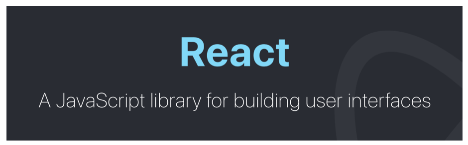
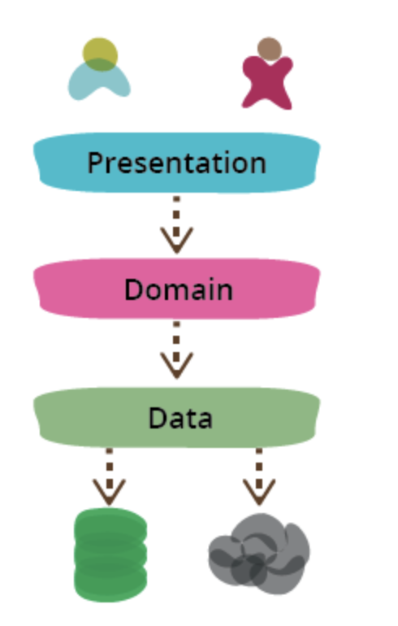
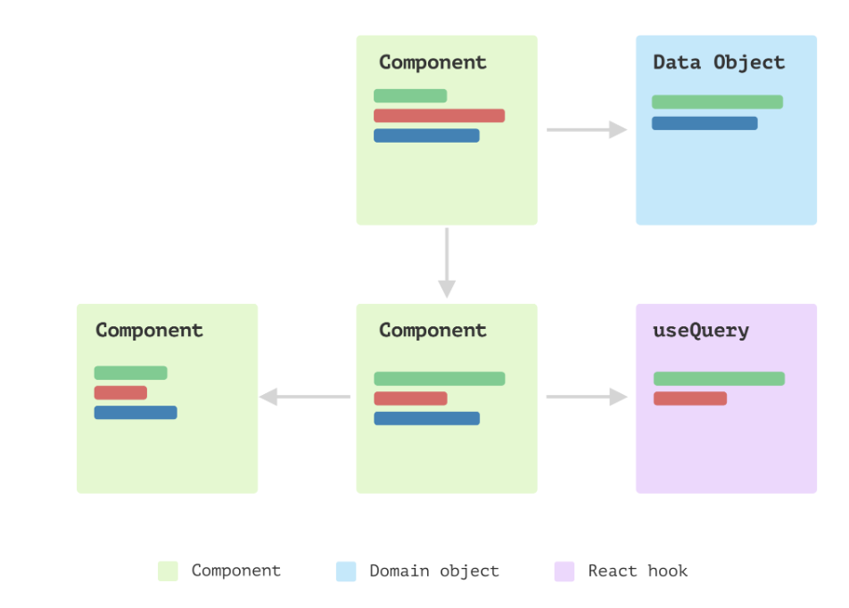
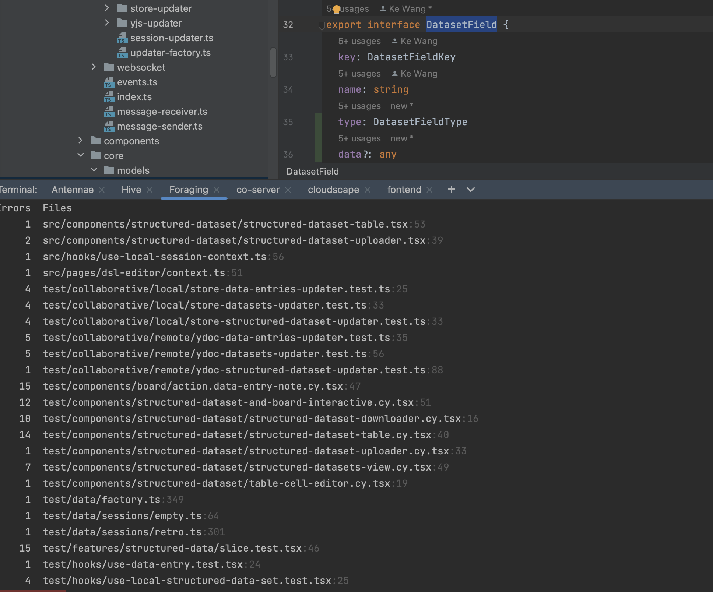
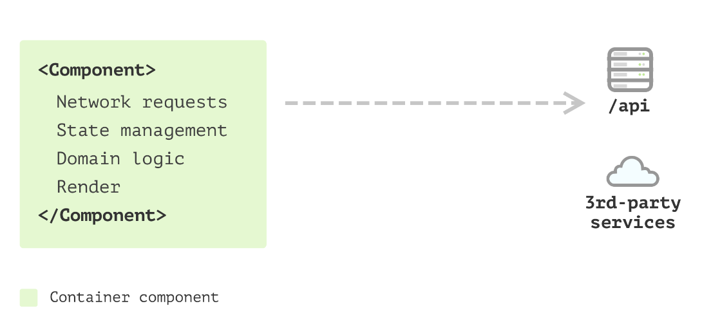
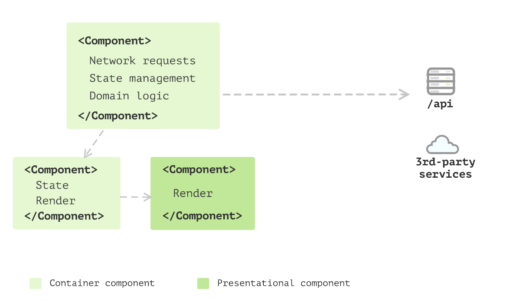
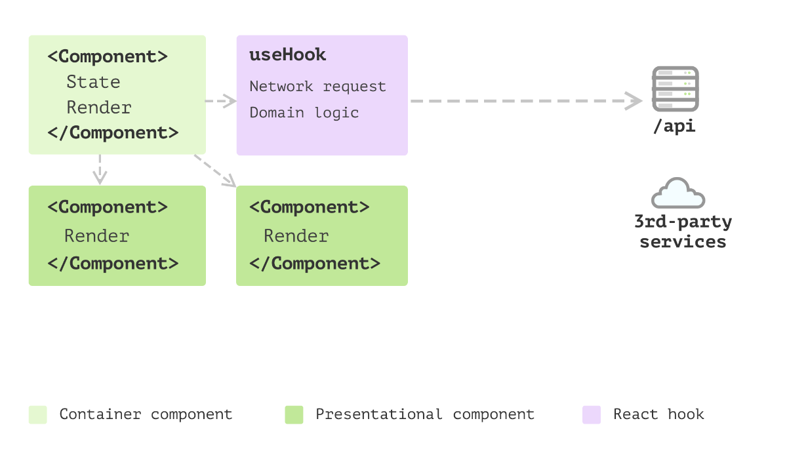
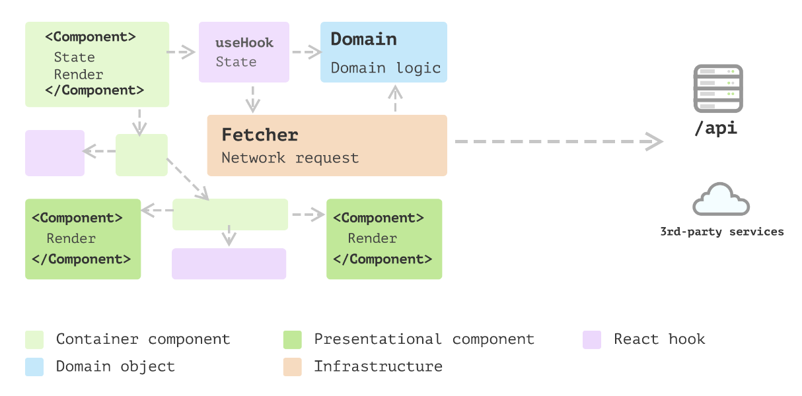
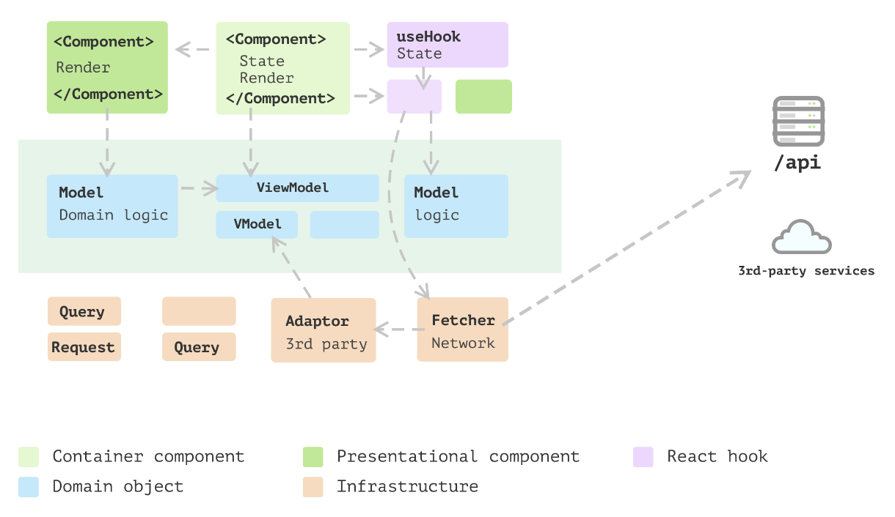

- When building large-scale React applications, it's important to modularize your codebase in a way that makes it easy to manage and scale. One way to do this is by using established UI patterns that can be reused throughout your application.
-
- ## React is a humble library for building views
	- 专注于 Web 开发的一个特定方面，即 UI 组件，并在应用程序的设计及其整体结构方面提供了充分的自由
	- 
	- UI组件的关注点：将数据映射到 DOM
-
- ## Web应用不只有UI
	- router
	- local storage
	- cache at different levels
	- network requests
	- 3rd-party integrations
	- security
	- performance
	- logging
	- ...
-
	- 当引入其他关注点时，组件的简单性被破坏
		- 例如，在使用数据的地方编写数据获取，构建逻辑
		- ```
		        useEffect(() => { 
		          fetch("https://address.service/api") 
		            .then((res) => res.json()) 
		            .then((data) => { 
		              const addresses = data.map ((item) => ({ 
		                street: item.streetName, 
		                address: item.streetAddress, 
		                postcode: item.postCode, 
		              })); 
		        
		              setAddresses(addresses); 
		            }); 
		        }, []); 
		        
		        // 实际渲染...
		  ```
-
- ## 关注点分离原则
	- 不同的关注点分离成不同的模块或组件，使每个模块只关注自己的领域，并将与其他关注点相关的代码隔离开来。（一次只需要专注于一件事）
		- 将视图与无视图逻辑分开
		- 根据职责进一步拆分视图和无视图逻辑，并将它们放在 *正确的位置*。
	- 好处：
		- 可维护性：底层域逻辑中的更改不必过多担心表面视图，反之亦然。
		- 可复用性：增加域逻辑在其他地方的可重用性，因为它们不与任何其他部分耦合。
		- 可读性：理解应用程序所需的精神负担就会大大减少，而且你每次只需要关注一件事。
	-
- ## Presentation Domain Data Layering
	- {:height 598, :width 308}
	- It's biggest advantage (for me) is that it allows me to **reduce the scope of my attention** by allowing me to think about the three topics relatively independently -- [Martin Fowler](https://martinfowler.com/bliki/PresentationDomainDataLayering.html)
-
- ### 霰弹枪手术问题
	- 每当我们需要修改代码以修复错误或添加新功能时，我们都必须接触几个模块。当测试不充分时，更改十分更容易出错。
	- 
	- 
-
- ### 代码样例
	- [[关注点分离代码样例]]
	- [[Shotgun surgery 代码样例]]
	- [[Extract a network client 代码样例]]
-
-
- ## 拥有这些层的好处
	- 可维护：通过将组件分成不同的部分，可以更轻松地定位和修复代码特定部分的缺陷。这可以节省时间并降低在进行更改时引入新错误的风险。
	- 可重用：分层结构更加模块化，可以更容易地重用代码和构建新功能。即使在每一层中，以视图为例，也往往更具可组合性。
	- 可读：更容易理解和遵循代码的逻辑。这对于正在阅读和使用代码的其他开发人员尤其有用。这是对代码库进行更改的核心。
	- 可扩展：随着每个单独模块的复杂性降低，应用程序通常更具可扩展性，因为它更容易添加新功能或进行更改而不影响整个系统。这对于预计会随着时间发展的大型复杂应用程序尤其重要。
	- 可迁移到其他 tech stack：我们可以在不更改底层模型和逻辑的情况下替换视图层。这一切都是因为领域逻辑被封装在纯 JavaScript（或 TypeScript）代码中，并且不知道视图的存在。
-
- ## The evolution of a React application
	- ### Single Component Application
		- 
	- ### Multiple Component Application
		- {:height 431, :width 716}
	- ### State management with hooks
		- 
	- ### Business models emerged
		- 
	- ### Layered frontend application
		- 