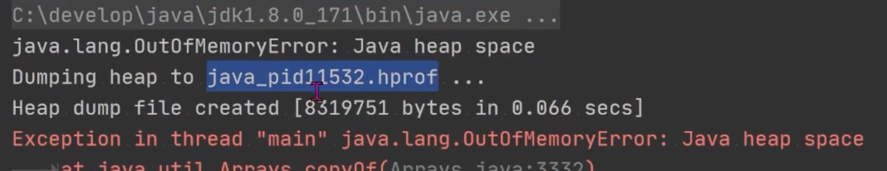
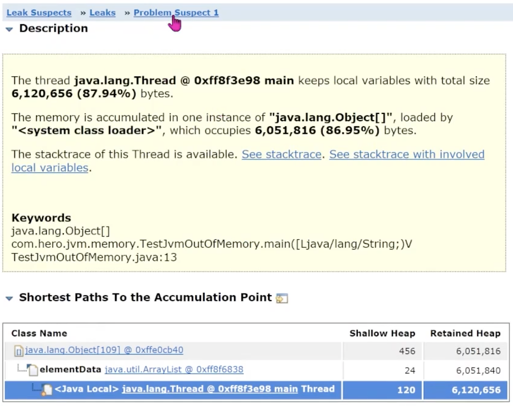

- 模拟内存溢出
	- 向List集合中添加100万个字符串，每个字符串由1000个UUID组成
	- ```java
	  public class Test]vmOutOfMemory {
	    public static void main(String[] args) {
	      List<Object> list = new ArrayList<>();
	      for (int i = 0; i < 10000000; i++) {
	  	    string str = "";
	      	for (int j = 0; j < 1000; j++) {
	  		    str += UUID.randomUUID().tostring();
	          }
	  	    list.add(str);
	      }
	      System.out.println("ok");
	    }
	  }
	  ```
	- 配置JVM
		- ```shell
		  -Xms 8m - Xmx8m -XX: +HeapDumpOnOutOfMemoryError
		  ```
	- 结果
		- 
	- MAT 分析
		- 
		- 如果过大，也可以使用Jhat（不够直观）