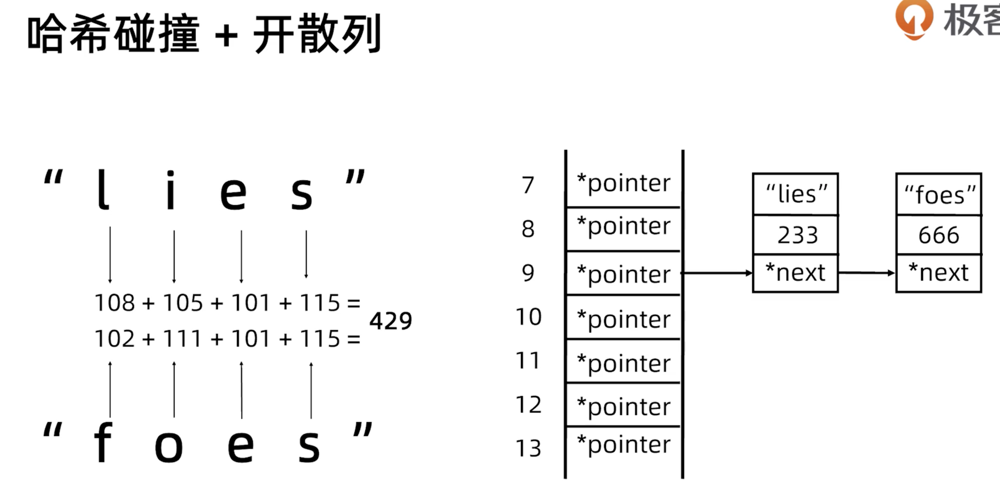
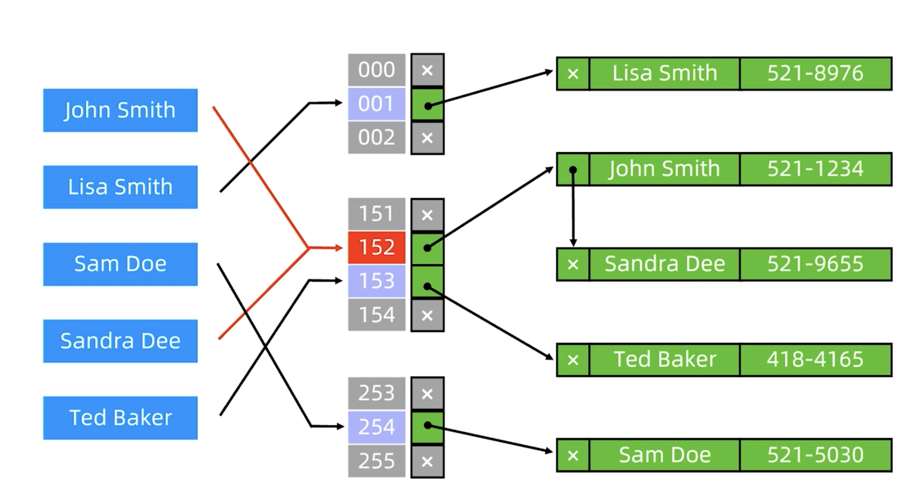

- #哈希表
	- Hash Table
	- 原理
		- 两部分组成：
			- 一个数据结构：存储key, value，通常是链表、数组
			- Hash 函数：通过key，返回数据结构value的索引
		- data_structure[hash(key)]=value
	- 哈希碰撞 Collisions：两个不同的key计算出同样的Hash结果
		- 发生碰撞是不可避免的
		- 好的hash函数可以减少碰撞的几率，让数据尽可能均匀分布
	- 开散列 (挂链法)
		- 常见的碰撞解决办法
		- Hash 函数依然用于计算数组下标
		- 数组的每个位置存储一个链表的表头指针（我们称它为表头数组）
		- 每个链表保存具有同样 Hash 值的数据
		- 
		- 
		- 时间复杂度
			- 最好：0(1)
				- 没有发生碰撞
			- 最坏：0(n)
				- 全部key发生碰撞
	- 集合和映射
		- set: 存储不重复的元素
			- 有序：平衡二叉树, 0(logN)
			- 无序：一般用hash实现， O(1)
		- map：存储不重复的键值对
			- 有序：平衡二叉树, 0(logN)
			- 无序：一般用hash table实现， O(1)
	- Java 中的数据结构
		- HashTable
			- 线程安全，使用了synchronized关键字
			- value 不能为 null
		- HashMap
			- 线程不安全
			- *TREEIFY_THRESHOLD*=8
				- 当 value 链表长度 >= 8，则转换为tree
				- 树化后提高查询性能，时间复杂度：0(logN)
			- *UNTREEIFY_THRESHOLD*=6
				- 当 value 数量 <= 6，则 tree 退化为链表
				- 链表时间复杂度：0(n)
		- ConcurrentHashMap
			- 线程安全，使用了 [[ReentrantLock]]
				- 性能更优
				- 锁了粒度更细，分段锁减少竞争
			- *TREEIFY_THRESHOLD*=8
			- *UNTREEIFY_THRESHOLD*=6
			- key 和 value 都不能为 null
	- 实战
		- [[1.两数之和]]
		- [[874.模拟行走机器人]]
		- [[49.字母异位词分组]]
		- [[30.串联所有单词的子串]]
		-