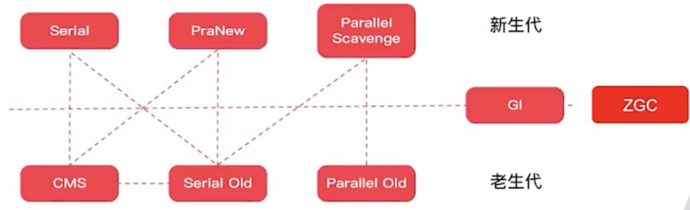
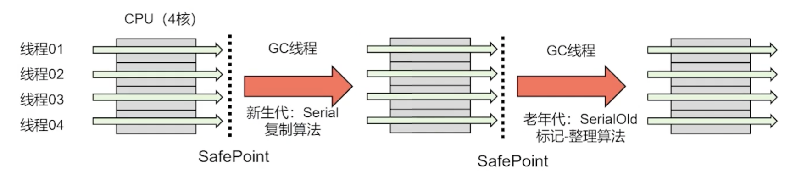
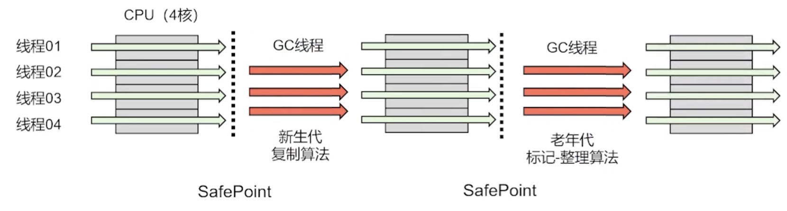
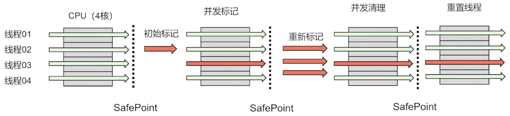
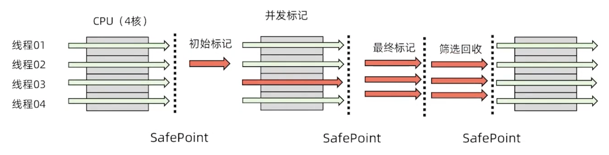

- 新生代（复制算法）
	- Serial, ParNew, Parallel Scavenge
- 老年代（标记-清除、标记-整理）
	- SerialOld, Parallel Old, CMS
- 整堆
	- G1, ZGE
- 分代组合，效果不同
	- 
-
- 串行收集器
	- 单线程
		- Serial
			- 新生代垃圾收集器
			- 复制算法
		- SerialOld
			- 老年代垃圾收集器
			- 标记整理算法
	- 进行垃圾收集时，必须暂停所有用户线程
		- 
		- SafePoint 用户挂起的点
			- 循环的末尾
			- 方法返回前
			- 调用方法的call之后
			- 抛出异常的位置
- 并行收集器 - 吞吐量优先 (jdk8 - PS + PO)
	- 多线程 - 并行
		- Parallel Scavenge
			- 新生代使用并行回收器
			- 复制算法
		- Parallel Old
			- 老年代使用并行回收器
			- 标记整理算法
	- 吞吐量优先收集器，垃圾收集需要暂停用户线程
		- 
		- 吞吐量 = 用户代码运行时间/(用户代码运行时间 + GC时间)
			- JVM的TP越接近1越好
- 并行收集器 - 响应优先
	- 多线程 - 并行
		- ParNew
			- 年轻代收集器，Serial的多线程版本
			- 复制算法
			- 单核不建议使用
		- CMS
			- 老年代收集器
			- 标记清除算法，有内存碎片，低延时
			- 不用暂停，用户现场和收集现场一起执行
			- 不等待满了才收集，达到阈值就收集
			- 
- 整堆 - 全能型
	- G1 GarbageFirst - JDK 1.9
		- 新生代老年代都适用
		- 面向服务端应用的全功能型垃圾收集器，**大内存** 企业配置的主要是G1
		- 吞吐量和低延时都行的整堆垃圾收集器
		- 内存
			- 最大堆 64GB，
			- 最小堆内存 2GB
			- 低于此值不建议使用
		- 算法：
			- 全局使用 **标记-整理** 算法收集
			- 局部采用 **复制算法** 收集
		- 可预测的停顿：能让使用者指定GC消耗时间，默认是200ms
			- 如果时间过小，则会放弃回收价值低的垃圾不回收
		- 
	- ZGC - JDK11 引入，JDK15 稳定版
		- 极低延迟
			- <1ms 最大暂停时间（JDK16-是10ms,JDK16+是<1ms），不会随着堆内存增加而增
		- 大内存小内存都适用
			- 8MB - 16TB
		- 算法
			- 使用 **标记-整理** 算法收集
	- Generational ZGC - JDK 21
- Minor GC、Major GC和 Full GC
	- 新生代收集（Minor GC/YoungGC）
		- 指目标只是新生代的垃圾收集。MinorGC非常频繁，回收速度比较快。
	- 老年代收集（Major GC/Old GC）
		- 指目标只是老年代的垃圾收集，Major GC 一般比 Minor GC 慢10倍以上。目前只有CMS收集器会有单独收集老年代的行为。另外请注意"Major GC”这个说法现在有点混淆，在不同资料上常有不同所指，需按上下文区分到底是指老年代的收集还是整堆收集。
	- 整堆收集（Full GC）
		- 收集整个Java堆和方法区的垃圾收集。
	- 混合收集（Mixed GC）
		- 指目标是收集整个新生代以及部分老年代降垃圾收集。目前只有G1收集器会有这种行为。