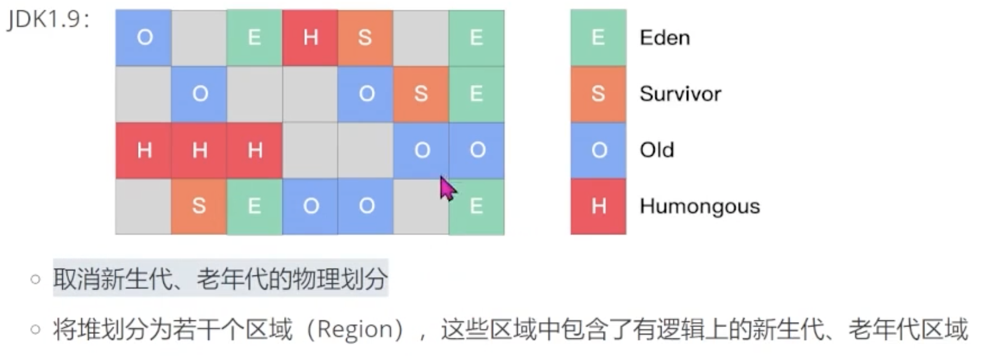

- Heap
	- JVM 中所管理的最大的内存区域
	- GC 主要的区域
- 内存划分
	- 老年代 Old
	- 新生代 Young
		- 为什么新生代里面需要有两个Survivor区域？
		- Eden
		- Survivor
	- [[PermGen 永久代]] - JDK1.7之前
		- 方法区的一种实现
	- Virtual 区 - JDK1.7之前
	- [[Metaspace 元空间]] - JDK1.8
		- 取消了 PermGen 和 Virtual
		- 不在占用虚拟机内存，而是本地内存
	- JDK1.9
		- 取消新生代、老年代的物理划分
		- 将堆划分为若干个区域（Region），这些区域中包含了有逻辑上的新生代、老年代区域
		- 新增Humongous 大区域
		- 
- WHY
	- 如何划分与GC机制有关
	- 分代收集理论 - Generational collection
		- 时间和空间的有效利用
		- 三大假说：
			- 弱代假说 - Week Generational Hypothesis
				- 绝大多数对象都是朝生夕灭的
				- 新生代：更频繁的回收，能以较低代价回收到大量的空间
			- 强代假说 - Strong Generational Hypothesis
				- 熬过越多次垃圾收集过程的对象就越难以消亡
				- 老年代：用较低的频率回收
			- 卡片表假说 - Card Table Hypothesis
				- 只有一小部分对象会被引用的地方发生变化，而大多数对象的引用关系保持不变
				- JVM使用卡片表来跟踪哪些对象的引用关系发生了变化，GC 只关注标记为变化的区域，而不需要扫描整个堆内存。