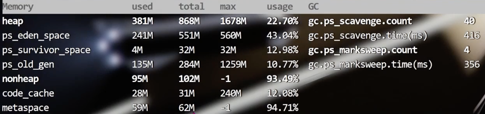

- 各种指标监控结果
	- 
	- 
	- 
	- 
-
- 关键指标：
	- 年轻代、老年代、元数据大小
		- Allocated vs PEAK
	- 吞吐量 = 应用程序运行时间 / (应用程序运行时间 + GC运行时间)
	- 延时
		- Avg GC Time
		- Max Pause GC Time
	- GC
		- 次数
		- 回收空间
		- 耗时
- 问题：
	- 元空间分配不合理，太多
		- 多少合适？
			- 元空间 (给实际peak的2倍，8的倍数)
				- 如Peak是59m, 可以尝试给到128m
			- 堆
				- 老年代的3-4倍
					- 如274m * 4 = 1096m
			- 年轻代
				- 至1-1.5倍FullGC之后的老年代空间占用
					- 如 274m * (1-1.5) = 408
		- ```shell
		  # 调整参数，基于当前系统运行情况这是最佳配置
		  JAVA_OPT="${JAVA_OPT} -Xms1096m -Xmx1096m -Xmn408m -XX:Metaspacesize=128m -XX:MaxMetaspacesize=128m"
		  
		  JAVA_OPT="${JAVA_OPT} -XX:+PrintGCDetails -XX:+PrintGCTimeStamps -XX:+PrintGCDateStamps -
		  XX: +PrintHeapAtGC -X1oggc: ${BASE_DIR}/1ogs/gc-best-heap-metaspace. 10g"
		  ```
	- 启动时触发了多次 Full GC
	-
- 对比验证
	- 