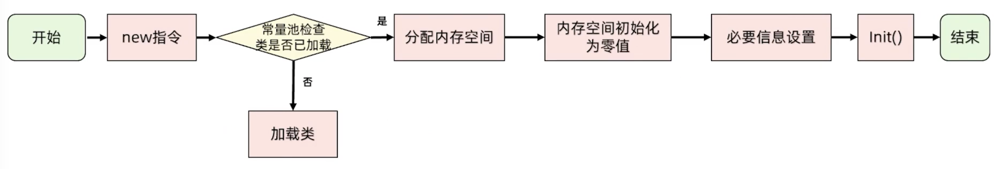
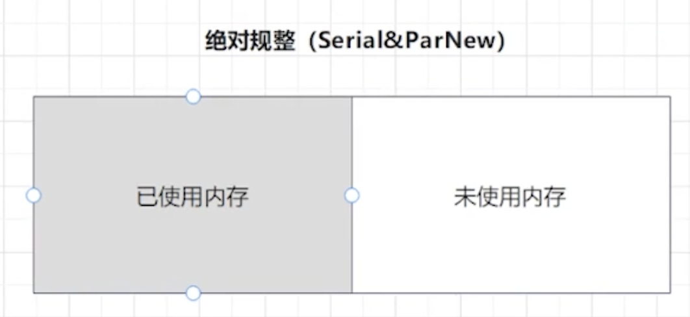
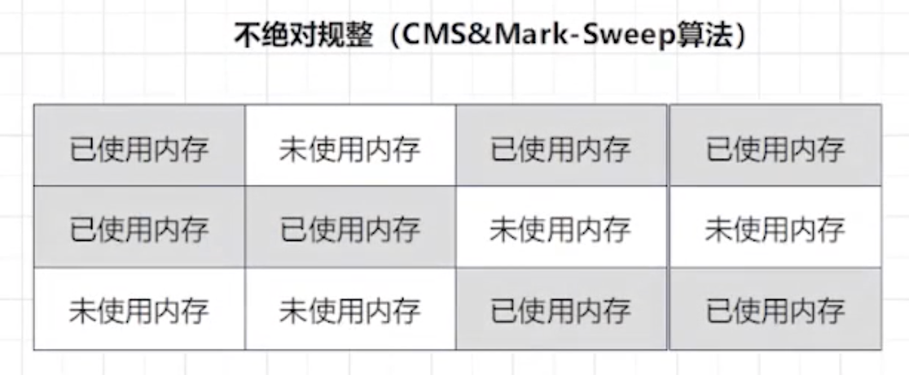
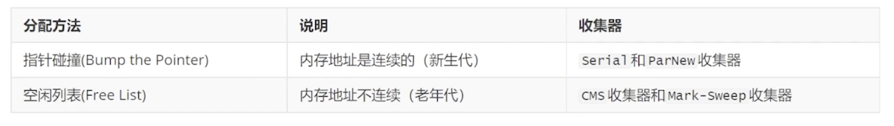
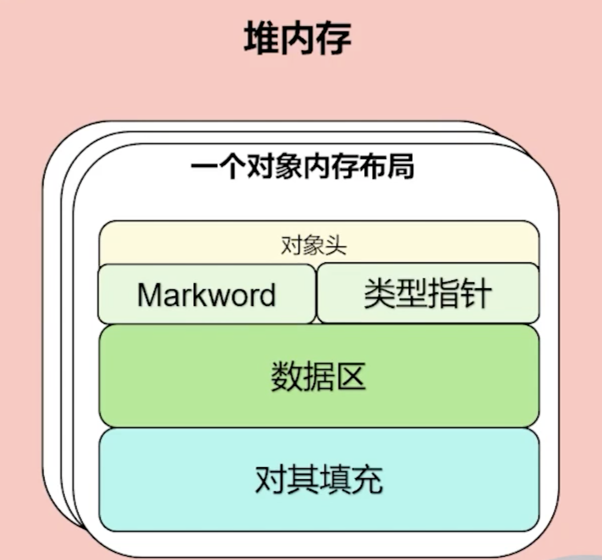
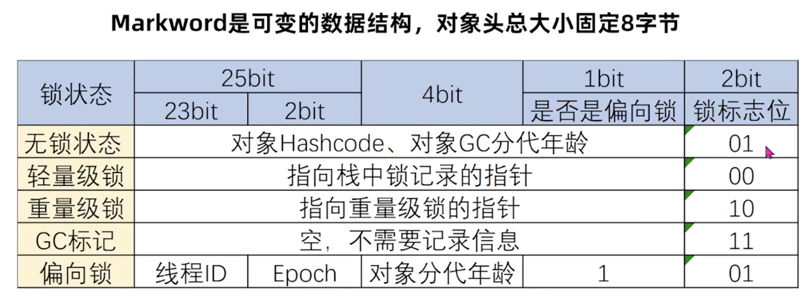
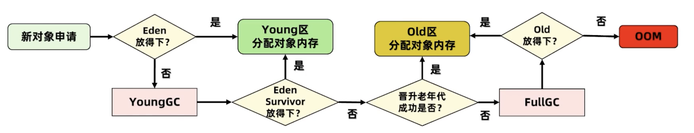
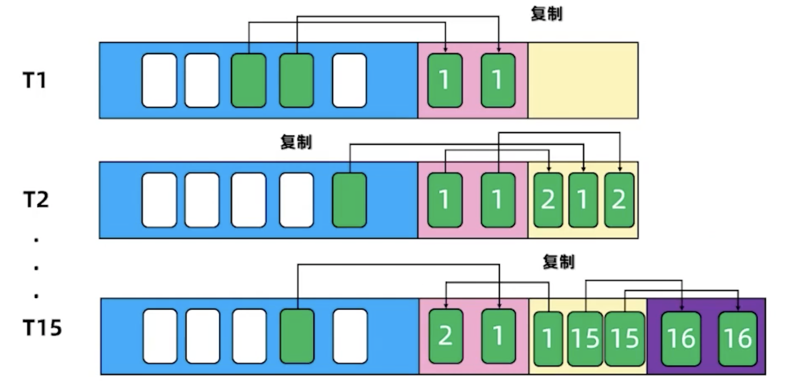
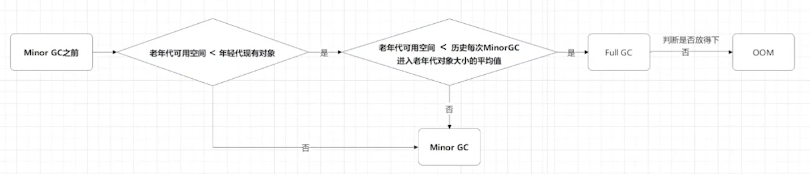

- 生命周期
	- 
	- 常量池检查：检查new指令是否能在常量池中定位到这个类的符号引用，检查类之前是否被加载过
	- 分配内存空间：
		- 新生代 - 指针碰撞：GC不带压缩功能，Serial和ParNew
			- {:height 228, :width 546}
		- 老年代 - 空闲列表：GC带压缩功能，CMS
			- {:height 302, :width 548}
		- 
		- 多线程内存分配安全问题
			- 分配主流程：首先从TLAB里面分配，如果分配不到，再使用CAS从堆里面划分
				- CAS乐观锁
					- JVM虚拟机采用CAS失败重试的方式保证更新操作的原子性 [[并发编程CAS原理详解]]
				- TLAB（Thread Local Allocation Buffer）
					- 本地线程分配缓存，预分配
	- 对象的内存布局
		- 
		- 对象头： 8字节，数组是12字节
			- 对象类的元数据，类型指针
			- 对象哈希码
			- GC分代年龄
			- 锁状态
			- Markword
				- 
		- 实例数据：对象内部的成员变量
		- 对齐填充：8字节对象，保证对象大小是8字节的整数倍
		-
	-
	- 如何才会进入老年代？
		- 大多数对象都会进入Eden区
		- 进入老年代的四种情况
			- 年龄太大: MinorGC15次【-XX:MaxTenugngThresh】
			- 动态判断：超过Survivor的50%，此时就会把年龄n及以上的对象都放入老年代 [-XX:Target需rvivorRatio]
			- 大对象：-XX:PretenureSize - 1MB
			- GC后Eden/Survivor放不下
		- 
		- 
	- 内存担保
		- 空间担保机制：当新生代无法分配内存的时候，我们想把新生代的对象转移到老年代，然后把新对象放入腾空的新生代。
		- 