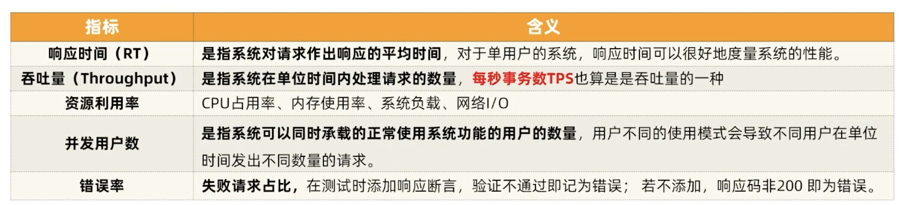
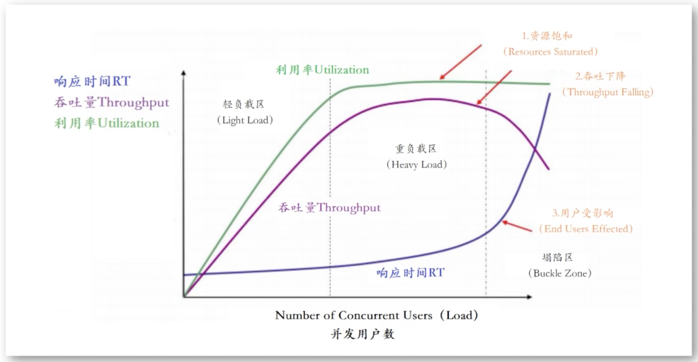

- 指标
	- 
	- **响应时间（Response Time）**：响应时间是从发出请求到获得第一个响应的时间。它表示了用户或客户端在使用系统时感知到的延迟。较短的响应时间通常被认为是更好的性能指标。
	- **吞吐量（Throughput）**：吞吐量是系统在一定时间内处理的请求数量或事务数量。它可以用来衡量系统的处理能力，通常以每秒处理的请求数（TPS）或每秒事务数（TPS）来表示。
	- **并发用户数（Concurrent Users）**：并发用户数是同时访问系统的用户数量。测试系统在不同并发用户下的性能可以帮助确定系统的最大负载能力。
	- **资源利用率（Resource Utilization）**：资源利用率指的是系统在运行过程中使用的硬件资源，如CPU、内存、磁盘和网络带宽。了解资源利用率可以帮助识别性能瓶颈和资源不足。
	- **错误率（Error Rate）**：错误率是指在性能测试期间发生的错误或异常的数量。这包括请求超时、HTTP错误、数据库错误等。较低的错误率通常表示更好的性能。
	- **吞吐量饱和度（Throughput Saturation）**：吞吐量饱和度是指系统在达到最大吞吐量时的状态。这可以帮助确定系统的极限性能。
	- **响应时间分布（Response Time Distribution）**：除了平均响应时间之外，了解响应时间的分布情况也很重要。这可以帮助确定性能是否稳定，或者是否存在异常的响应时间。
	- **性能趋势（Performance Trends）**：性能测试通常需要在不同的时间点进行，以便观察性能随时间的变化。这可以帮助检测潜在的性能退化问题。
- 主要考虑指标
	- RT + TPS + Resource Utilization
	- 并发和各项指标的关系
		- 
		- 2333
			- 两个点
				- 最优用户并发数 (重负载左侧)
				- 最大用户并发数 (重负载右侧)
			- 三条线
				- RT
				- TP
				- UT
			- 三个区
				- 轻负载区 Light Load
				- 重负载区 Heavy Load
				- 塌陷区 Buckle Zone
			- 三个状态
				- 用户受影响
				- 吞吐下降
				- 资源饱和