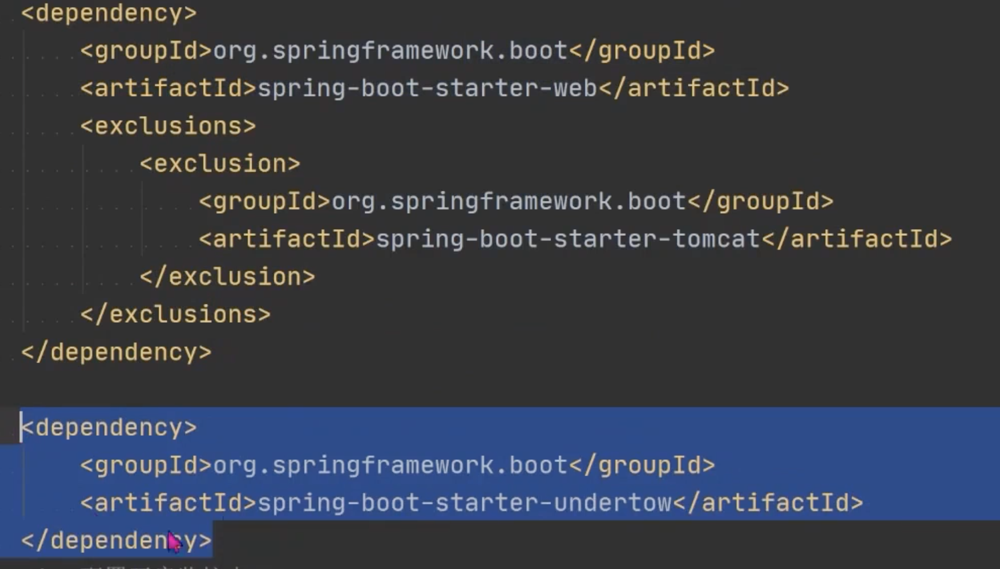
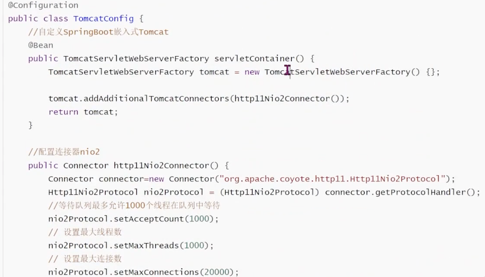
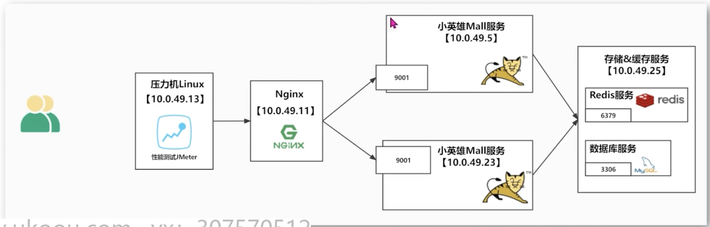
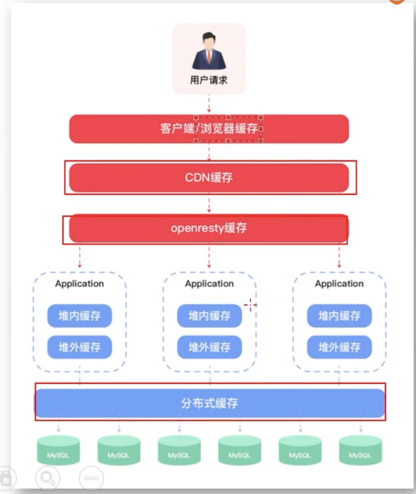
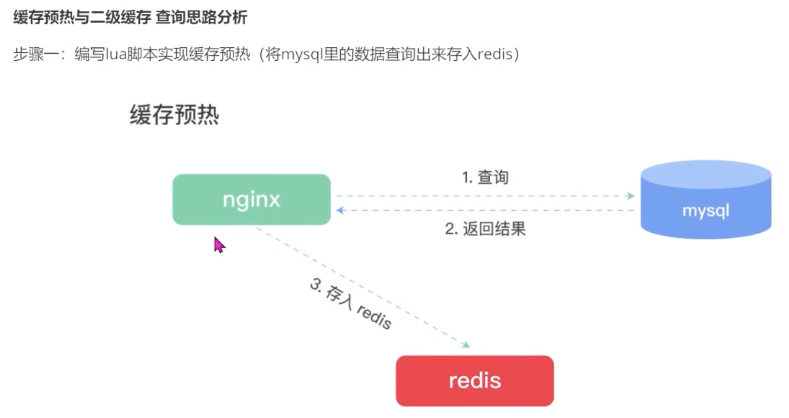
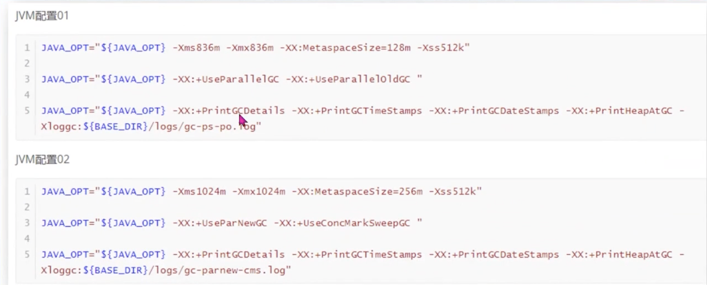

- 目的：用最小的硬件消耗来承载更大的吞吐量
- Web服务器
	- SpringBoot 嵌入式Tomcat
		- maxThreads
			- 默认200
		- acceptCount
			- 等待队列最多等待数
			- 默认1000
		- maxConnections
			- 同时接受最大连接数，-1为不限制
			- 默认 10,000
			- 请求数超过最大连接数后，会进入等待数
		- 可以使用actuator 查看具体配置是否生效
			- management.endpoints.web.base-path
	- Tomcat调优
		- maxThreads
			- 影响TPS的因素之一，但不是越多越好
				- 创建线程是有成本的
					- xxs=1m
				- 太多的线程切换会导致性能下降
			- 经验值：1C2G线程数200，4C8G线程数800
				- 在高负载场景下，TPS提升近1倍，RT大幅降低
	- Undertow
		- Undertow红帽公司开发的一款基于NIO的高性能web嵌入式服务器
			- 轻量级Servlet容器，比Tomcat更轻量级
				- 没有可视化操作界面，没有其他诸如JSP模板引擎的功能
			- 只专注于服务器部署，性能略好于Tomcat服务器
				- 低延时不明显甚至不如tomcat
				- 稳定性好于Tomcat
			- 支持spring boot starter 快速切换tomcat到undertow
				- 
- 网络I/O模型
	- Java的几种IO模型
		- I/O
			- 流、byte
			- 阻塞式
			- 同步
			- 低性能
		- NIO Java 1.4
			- 块、缓存
			- 非阻塞
			- 同步
			- 高性能
		- AIO or NIO2 Java 1.7
			- reactive 事件和回调
			- 异步
			- 非阻塞
			- 超高性能
	- Tomcat IO模型修改
		- 
	- RT大幅降低
- 数据库
	- 提高TPS，降低RT 性价比最高的方式
	- 表结构优化
	- SQL优化
	- 数据库配置
		- 连接数
		- 超时
		- 缓存
		- 索引
- OpenResty
	- 一个基于 Nginx 与 Lua 的高性能 web 平台
		- 用于构建高性能的API服务、反向代理、负载均衡、Web应用程序加速以及处理HTTP请求等任务
		- 处理大量并发连接时表现出色
	- 
	- 资源配置：
		- 静态资源分离
		- 动态资源压缩
	- 多核CPU支持
- 缓存
	- 提升用户体验
	- 减少网络请求
	- 分级缓存
		- 方便缓存：架构分层，面向对象
		- {:height 618, :width 374}
		-
		- 缓存预热
			- 
		- 二级缓存
			- 
- JVM
	- 大部分问题可以通过架构和代码优化解决，JVM是不得已的手段
	- What
		- 内存
		- GC
			- GC 暂停
				- 大概率对P99的RT产生影响
	- When
		- TPS \ RT 异常
		- Heap 内存（老年代）持续增长达到最大值
		- Full GC 频繁
		- GC 停顿时间过长（超1s）
		- OutOfMemory
		- 本地缓存过大
	- How
		- 合理使用内存
		- GC高效回收垃圾对象，释放内存空间
		- 
	- 指标
		- 堆内存使用率 ＜=70%；
		- 老年代内存使用率<=70%；
		- avg pause <= 1s
		- Full GC 次数0或 avg pause interval >= 24小时；
		- 创建更多的线程
-