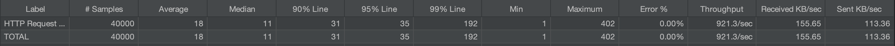

- 目标：评测SpringBoot项目的吞吐量上限
	- threads: 20, ramp-up: 5s, loop: 2000
	- 对比
		- spring web
			- jdk: 21, spring 3.1.4
			- run source
				- 
			- run jar
				- 
			- 通过增加并发数到220，TPS可以到1400，稳定在1300左右开始下降
		- spring reactive
			- jdk: 21, spring 3.1.4
			- 
			- 通过增加并发数到220，TPS可以到1950，稳定在1920左右开始下降
		- spring reactive native
			- jdk: 21, spring 3.1.4
			- {:height 37, :width 546}
			-
			- 通过增加并发数到220，TPS可以到1850，稳定在1800左右开始下降
		- quarkus reactive
			- jdk: 17, quarkus: 3.4.1
			- 
			- 通过增加并发数到220，TPS可以到490，稳定在420左右开始下降
		- quarkus reactive native
			- jdk: 17, quarkus: 3.4.1
			- 
			- 通过增加并发数到220，TPS可以到400，稳定在390左右开始下降
- 步骤
	- 创建测试计划
	- 测试配置：
		- 线程组
			- 线程数：需要启动的线程总数
			- ramp-up: 指定时间内把线程全部启动
			- 循环次数：单个线程循环次数
		- http请求
			- keepalive
				- 允许在单个TCP连接上发送和接收多个HTTP请求和响应。这个功能的引入旨在减少为每个HTTP请求/响应对建立和拆除新的TCP连接所需的开销
				- 需要加载多个资源（例如网页中的图像、样式和脚本文件）时。这减少了连接建立和拆除的开销，使通信更加高效。
		- 断言
			- response 断言
			- duration 断言
		- 结果监听器
			- 查看结果树 View Result Tree
				- 每一次压测请求
			- 汇总报告 Summary Report
			- 聚合报告 Aggregate Report
				- 聚合各个指标，比如样本、平均值、通吐量、最大值、最小值
			- 聚合图 Aggregate Graph
			- 图结果 Graph Results
	- 执行测试
	- 结果分析
		- 中值: 50% 都在xx ms之内
		- 样本 (Sample）：发送请求的总样本数量
		- 响应时间（RT）：平均値，P90, P95, P99, Min, Max
		- 异常(Error）：出现错误的百分比
		- 吞吐量 (Throughput）：被测试接口的吞吐能力
		- 友送与接收数据量：KB/sec