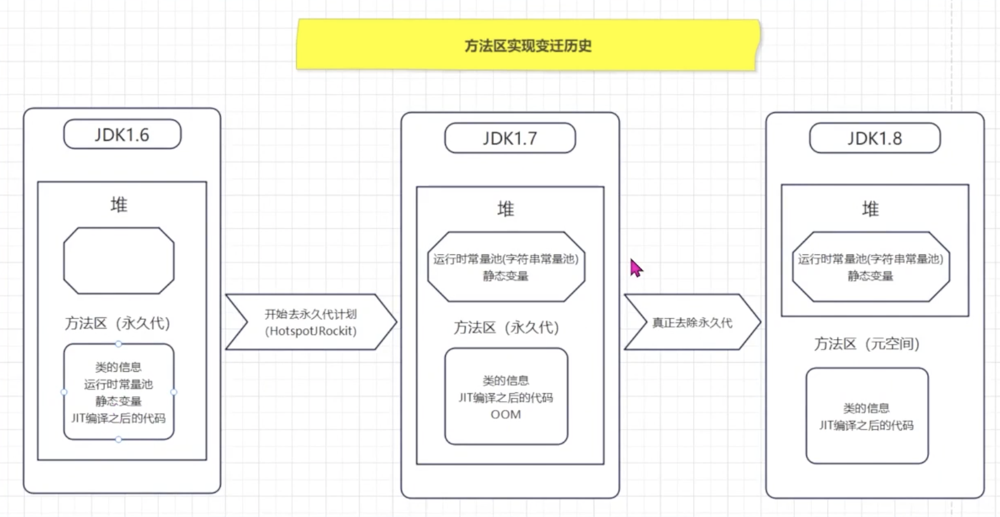

- Method Area
	- 线程共享
	- 存储类的结构
		- Java编译后代码 (字节码)
		- {:height 400, :width 473}
		- 类信息，Class
		- 方法信息，Method name, params, return
		- 字段信息，Field type, name
		- 类变量，JDK1.7 之后在堆中存储
		- 方法表，method table
		- [[运行时常量池]]，JDK1.7 之后在堆中存储
			- 字面量类型 #字面量
			- 引用类型 -> 内存地址
		- JIT 编译器编译之后的代码缓存
- 两种实现
	- [[PermGen 永久代]]
		- JDK1.7
		- 存储位置：JVM进程内的内存空间
		- 存储内容：方法区的内容
	- [[Metaspace 元空间]]
		- JDK1.8
		- 存储位置：本机内存空间
		- 存储内容
			- 只存储类的 #元信息
			- #变量和 #运行时常量池 都挪到了堆中
- Why
	- [[Metaspace 元空间]] 替代 [[PermGen 永久代]]
		- 降低内存溢出风险
		- 永久代大小不可预知，配置困难
		- 降低GC复杂度
- History
	- 