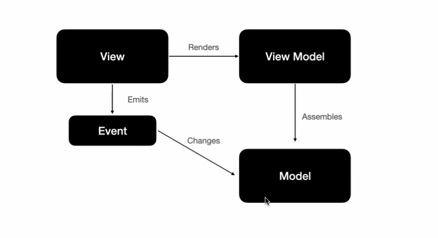
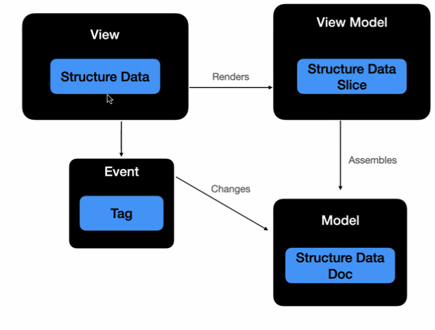

- 架构风格是架构的种类，比如 layers 和 component
	- 分层的交互模式是，component可以同层或者往下层调用，不能往上层调用
	- Do：组件应该放入恰当的层里
	- Don't：不应该出现有两个层里的组件
	- 符合当前的架构约束才是好代码
	- 不符合就属于架构腐坏
- 工序是围绕架构模式展开的
	- 
- Tasking 和模型展开是围绕架构展开的
	- 
- 工序（抽象）-> Tasking (具体)
	- 模型 （抽象）-> 模型展开 (具体)