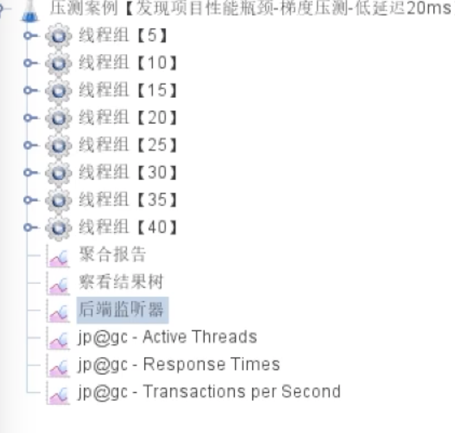
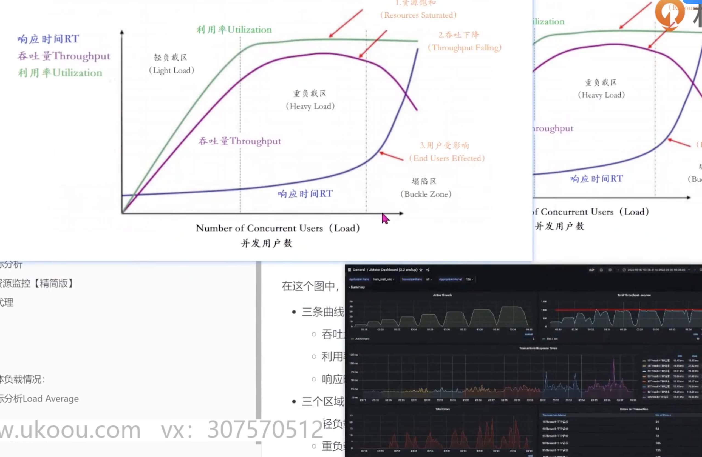
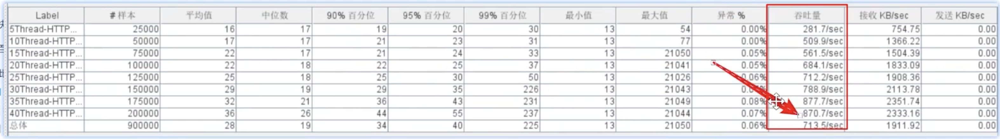

- 情况01-模拟低延时场景，用户访问接口并发逐渐增加的过程
	- 预计接口的响应时间为20ms
		- 线程梯度：5、10、15、20、25、30、35、40个线程
		- 循环请求次数5000次
		- 时间设置：Ramp-up period(inseconds)的值设为对应线程数
		- 测试总时长：约等于20ms x 5000次 x 8=800s=13分
		- 配置断言：超过3s，响应状态码不为20000，则为无效请求
- JMeter
	- 
	- {:height 99, :width 636}
-
- 测试结果
	- 
	- 
	-
	- 结论：
		- 系统的负载不高，CPU、内存正常，说明系统资源利用率不高。说明带宽已到瓶颈
			- 优化方案：
				- 减小接口数据包
				- 提升带宽
		- 系统的负载不高，CPU、内存、IO正常，RT 触顶，错误率攀升，说明Web服务器最大并发数已到瓶颈
			- 优化方案：
				- RT=500ms，TPS=800
				- 服务端线程数=800/(1000ms/500ms)=400 Thread/s
		- TPS在上升到一定的值之后，异常率较高
			- I/O模型
			- 网络环境