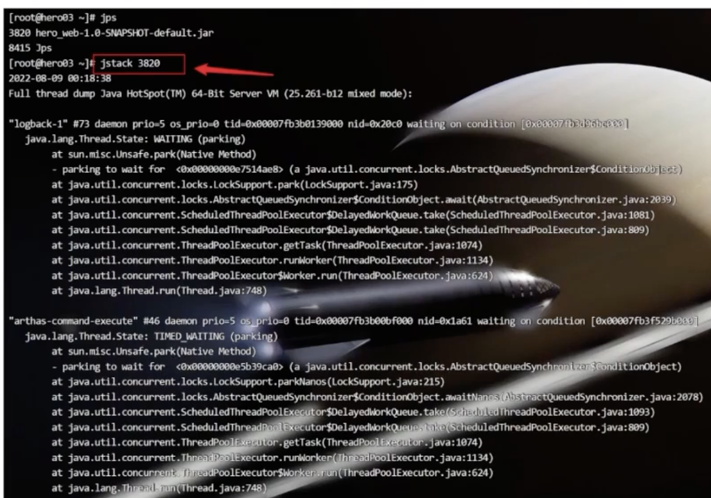
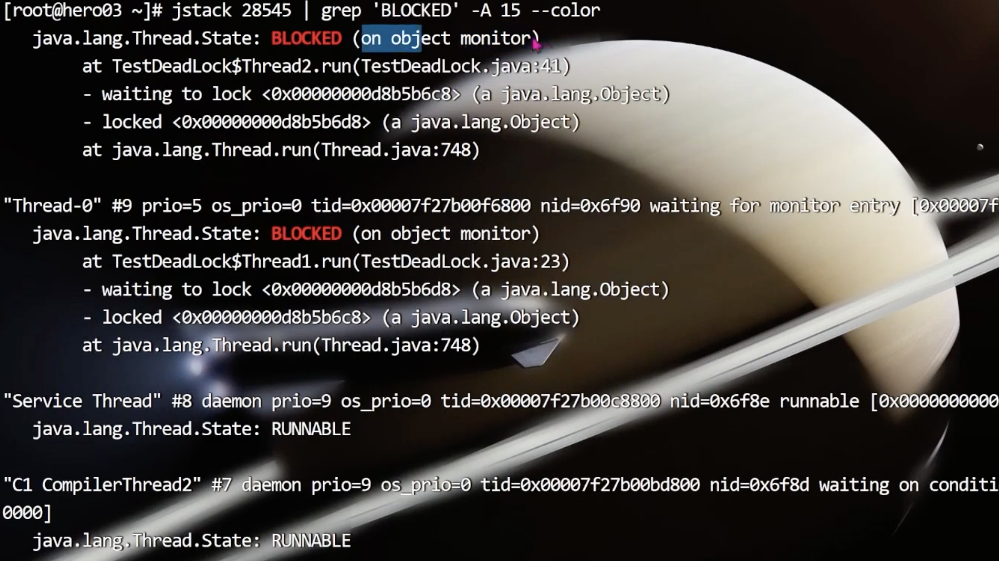
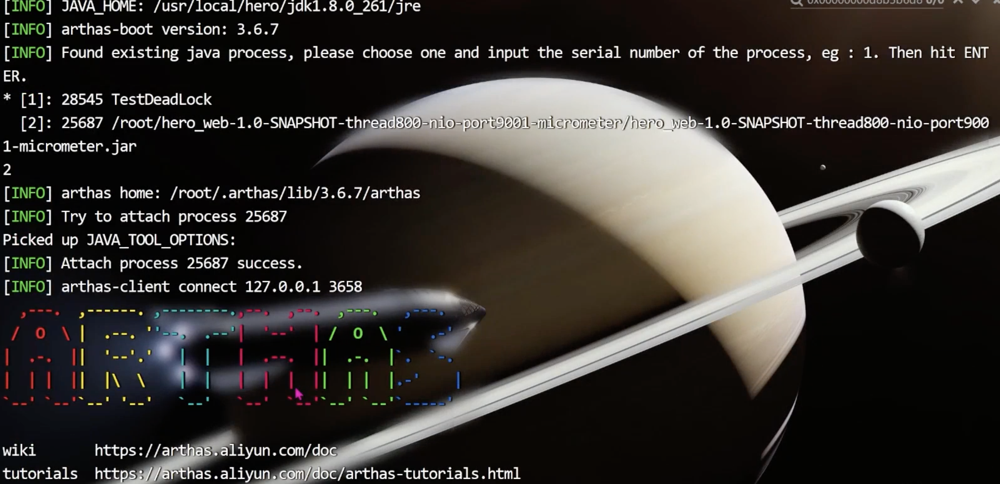
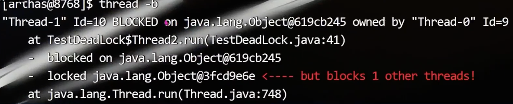

- 现象
	- JVM 线程执行过程中 CPU负载突然升高
		- 死锁、死循环
	- jstack 查看现场快照
		- 
- 模拟死锁
	- ```java
	  public class TestDeadLock {
	    private static Object obj1 = new object) ;
	    private static Object obj2 = new object) ;
	  	
	    public static void main(String[] args) {
	      new Thread(new Thread1()).start();//启动线程01
	      new Thread(new Thread2()).start();//启动线程02
	    }
	    
	    //线程01
	    private static class Thread1 implements Runnable {
	      @override
	      public void run() {
	        synchronized (obj1) {
	          system.out.printIn("Thread1 拿到了 obj1 的锁！");
	          try {
	            // 停顿2秒的意义在于，让Thread2线程拿到obj2的锁
	            Thread. sleep (2000) ;
	          } catch (InterruptedException e) {
	            e. printStackTrace);
	          }
	          synchronized (obj2) {
	            System.out.println("Thread1 拿到了 obj2 的锁！");
	          }
	        }
	      }
	    }
	    
	    //线程02
	    private static class Thread2 implements Runnable {
	      @override
	      public void run() {
	         synchronized (obj2) {
	           system.out.printIn("Thread2 拿到了 obj2 的锁！");
	           try {
	            	// 停顿2秒的意义在于，让Thread2线程拿到obj2的锁
	            	Thread. sleep (2000) ;
	            } catch (InterruptedException e) {
	              e. printStackTrace);
	            }
	            synchronized (obj1) {
	              System.out.println("Thread2 拿到了 obj1 的锁！");
	            }
	         }
	      }
	    }
	    
	  }
	  ```
- jstack 分析
	- ```shell
	  jstack 18487 | grep 'BLOCKED' -A 15 --color   
	  ```
	- 
- Arthas 分析
	- 
	- `thread -b`
		- 
	-