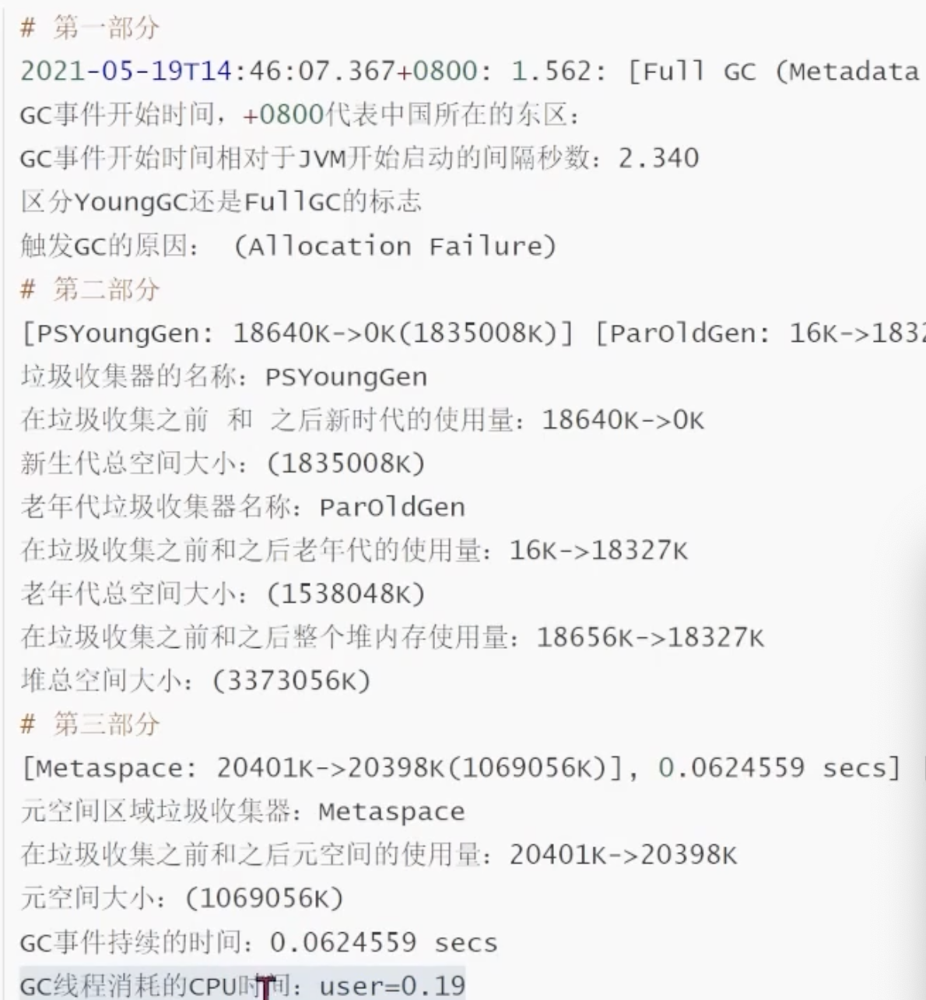

- GC日志
	- ```shell
	  ＃配置GC日志输出
	  JAVA_OPT="$ {JAVALOPT} -XX:+PrintGCDetails -XX:+PrintGCTimeStamps -XX:+PrintGCDateStamps -XX:+PrintHeapAtGC -
	  Xloggc: ${BASE_DIR}/1ogs/gc-default.log
	  ```
- 
-
- [GCeasy.io](https://gceasy.io/)
- [GCViewer](https://www.tagtraum.com/gcviewer.html)
-