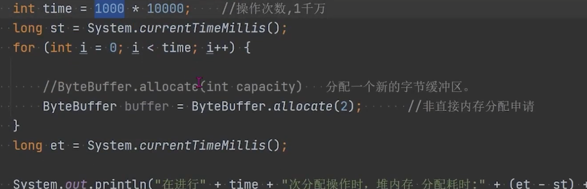
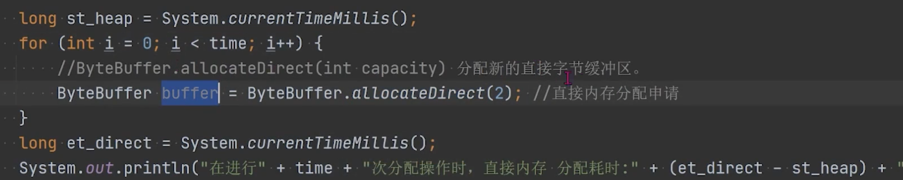
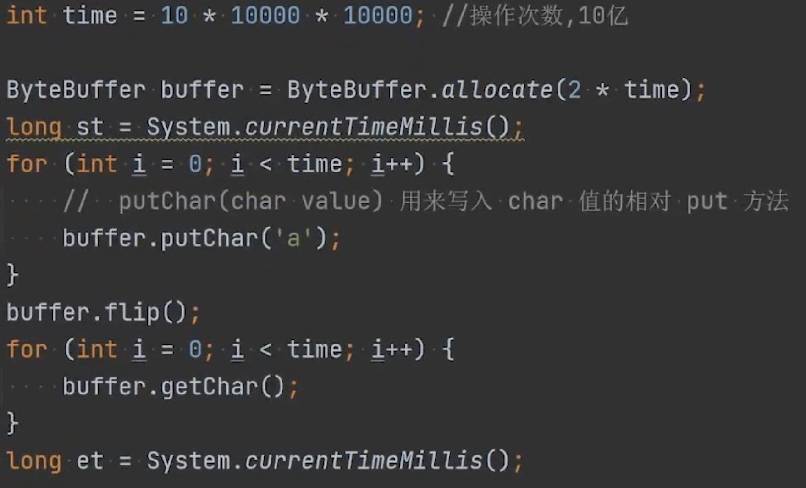
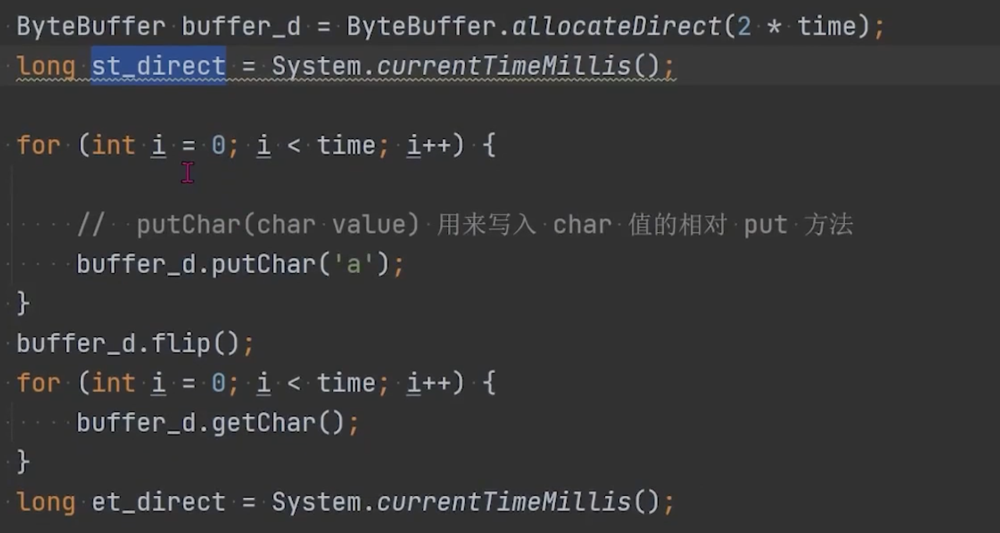

- 在JDK1.4中，新加入了NIO，引入了Channel和Buffer的IO方式，可以使用native方法直接分片对外内存，然后通过DirectByteBuffer对象可以操作直接内存
- 与堆内存比较
	- | 内存区域 | 分配空间 | 读写操作 |
	  |----------|----------|----------|
	  | 堆内存 | 性能好   | 效率低   |
	  | 直接内存   | 性能差   | 效率高   |
- WHY
	- 非直接内存（堆内存）作用链：本地IO >直接内存 >非直接内存->直接内存->本地IO
	- 直接内存作用链：本地IO->直接内存->本地IO
- WHEN
	- 大数据需要存储，它的生命周期很长
	- 适合频繁的IO操作，例如：网络并发场景
-
- Case:
	- 内存分配
		- 1 千万次
		- 堆内存 `allocate`
			- cost: 116ms
			- 
		- 直接内存 `allocateDirect`
			- cost: 5671ms
			- 
	- 内存读写
		- 10亿次
		- 堆内存
			- cost: 1360ms
			- 
		- 直接内存
			- cost: 707ms
			- 
			-