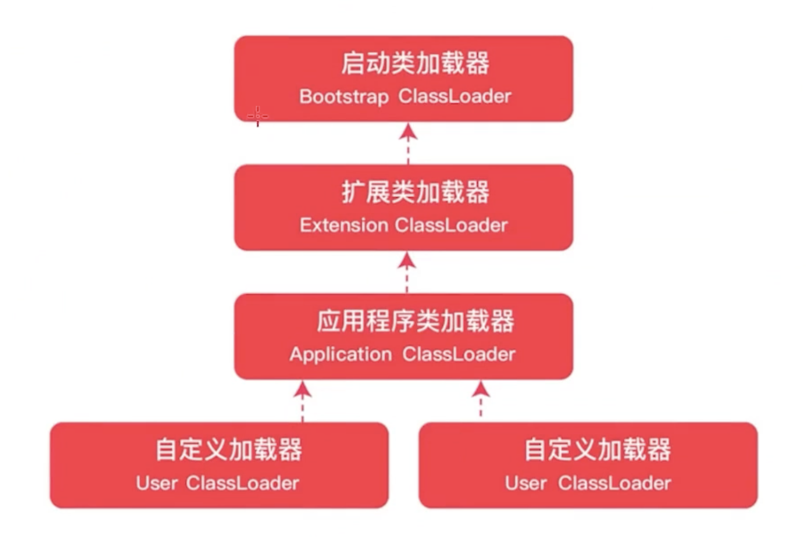
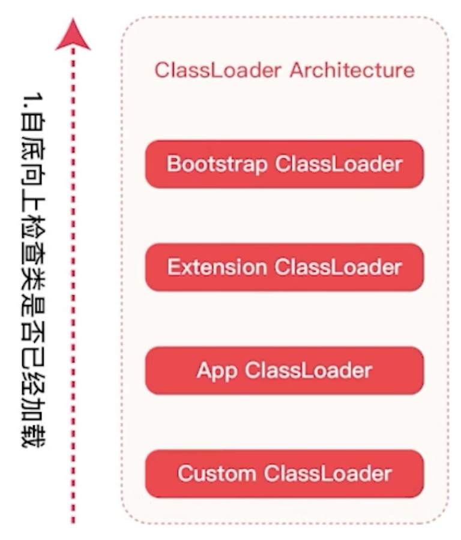
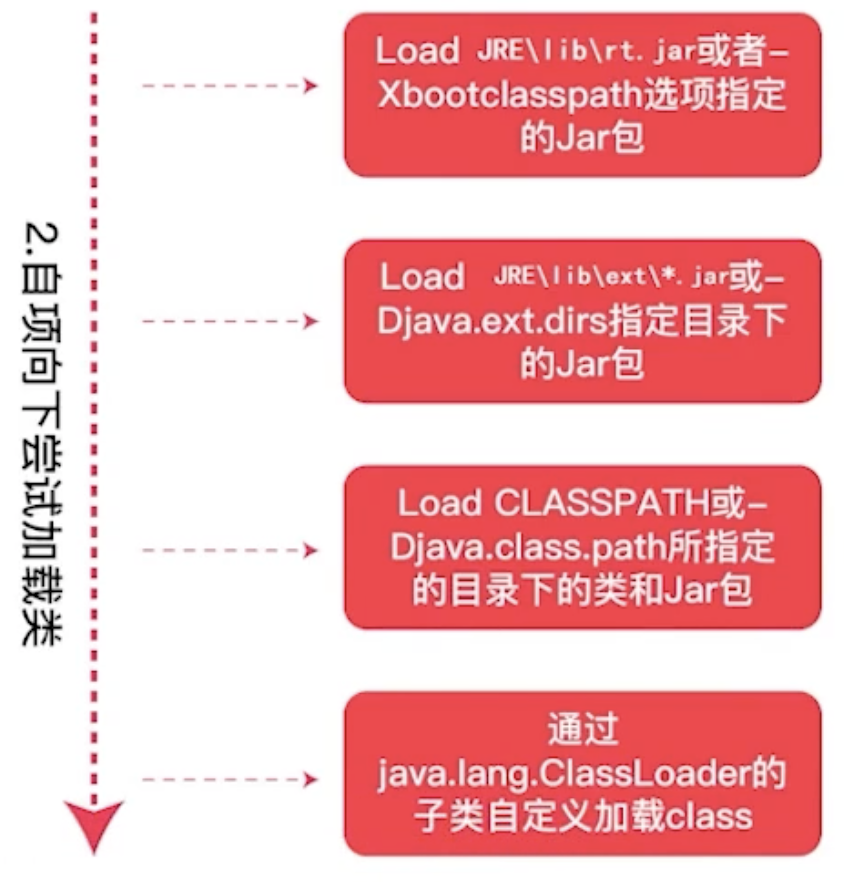
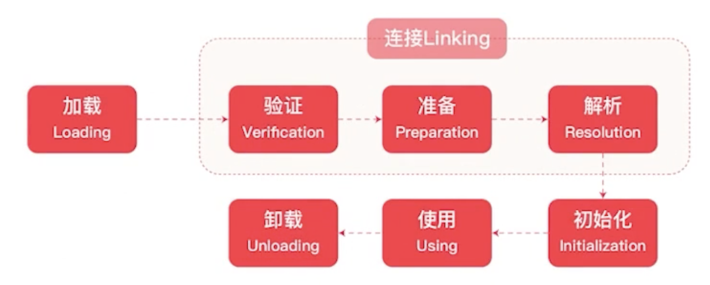
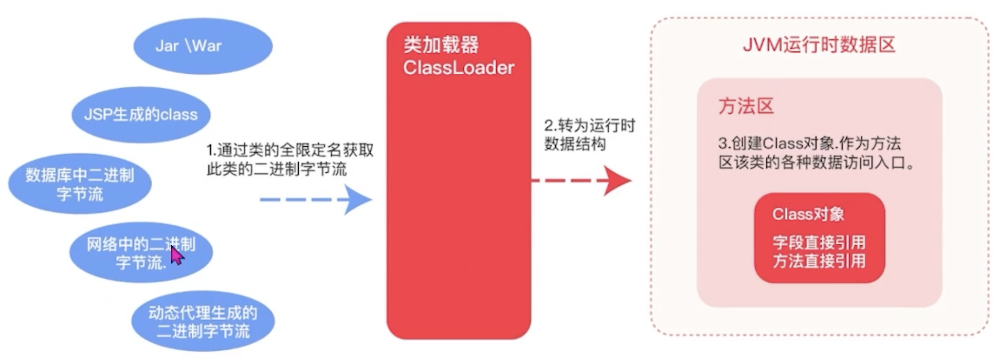

- 类加载器
	- JVM的类加载都是通过ClassLoader及其子类来完成的
	- 
	- Bootstrap ClassLoader
		- 加载JAVA_HOME\\lib - rt.jar
	- Extension ClassLoader
		- 加载JAVA_HOME\\lib\\ext
	- Application ClassLoader
		- 加载用户路径的classpath
	- User ClassLoader
		- 应用之外自定义类文件，比如动态字节码
- 执行顺序
	- 检查自底向上，先检查叶子类
		- {:height 400, :width 285}
	- 加载自顶向下，先加载root或父类
	  id:: 65322232-21e2-4da1-8460-2b5617f2044f
		- {:height 347, :width 286}
- 类加载的时机
	- 初始化 new
		- new Student();
	- 静态加载 static - getStatic、putStatic、invokeStatic
		- Student.age
		- Student.method();
	- 反射 java.lang.reflect
		- Class.forname
	- 有父类，先加载父类
		- Student extends Person
	- main
		- 当JVM启动时，需要制定一个main，先加载主类
- 类的生命周期
	- 一个类的一生
		- 根据类全限定名称 -> 加载class到内存中，二进制字节流
		- 字节流静态数据 -> 方法区（永久代，元空间）
		- 创建字节码Class对象
	- 
- 类加载途径
	- jar war jsp 的class文件
	- 数据库中的二进制流
	- 网络中的二进制流
	- 动态代理生成的二进制流
	- 
- 自定义类加载器
	- ```java
	  public class MyClassLoader extends ClassLoader {
	      private final String classpath;
	  
	      public MyClassLoader(String classpath) {
	          this.classpath = classpath;
	      }
	  
	      @Override
	      public Class<?> findClass(String name) throws ClassNotFoundException {
	          byte[] data = getData(name);
	          if (data.length != 0) {
	              defineClass(name, data, 0, data.length);
	          }
	          throw new ClassNotFoundException();
	      }
	  
	      private byte[] getData(String className) {
	          String path = classpath + File.separatorChar +
	                  className.replace('.', File.separatorChar) + " .class";
	          try (InputStream in = new FileInputStream(path);
	               ByteArrayOutputStream out = new ByteArrayOutputStream()) {
	              byte[] buffer = new byte[2048];
	              int len;
	              while ((len = in.read(buffer)) != -1) {
	                  out.write(buffer, 0, len);
	              }
	              return out.toByteArray();
	          } catch (Exception e) {
	              return new byte[0];
	          }
	      }
	  }
	  
	  @Test
	  void load() throws Exception {
	    final MyClassLoader myClassLoader = new MyClassLoader("/Users/zhanggang/workspace/hatch/leetcode-test/leetcode-test/build/classes/java/main/classloader");
	    final Class<?> myclass = myClassLoader.loadClass("classloader.MyClass");
	    final Object myObject = myclass.getDeclaredConstructor().newInstance();
	    final Method say = myclass.getMethod("say");
	    final Object rs = say.invoke(myObject);
	    System.out.println(rs);
	    //jdk.internal.loader.ClassLoaders$AppClassLoader@1de0aca6
	    System.out.println(myclass.getClassLoader().toString());
	    assertEquals("MyClass say hello", rs);
	  }
	  ```
- [[双亲委派机制]]
	- 委派给父类的加载器去加载