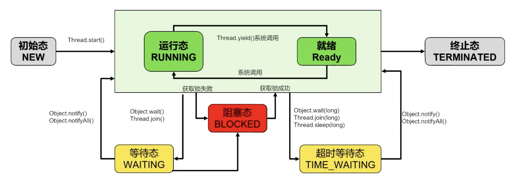

- 是进程中的一个执行单元，负责当前进程中的任务的执行，一个进程会产生很多线程
- 每个进程都有独立内存空间。线程之间的堆空间和方法区共享，线程栈空间和程序计数器是独立的。线程消耗资源比进程小的多（创建和关闭）
- #线程切换
	- 时间片算法
		- 一个CPU同一时刻只能被一个线程使用，为了提升效率CPU采用时间片算法将CPU时间片轮流分配给多个线程。在分配的时间片内线程执行，如果没有执行完毕，则需要 **挂起** 然后把CPU让给其他线程。
	- #线程上下文
		- 线程执行位置记录在程序计数器
			- CPU切换线程，会把当前线程的执行位置记录下来，用于下次执行时找到准确位置
		- 线程执行位置的 **记录** 与 **加载** 过程就叫做上下文切换
			- 上下文切换过程
				- 挂起线程01，将线程在CPU的状态（上下文）存储在内存
				- 恢复线程02，将内存中的上下文在CPU寄存器中恢复
				- 调转到程序计数器所指定的位置，继续执行之后的代码
				- {:height 252, :width 461}
- 生命周期
	- 六种状态
		- 常规：New \ Runnable \ Terminated
		- 特殊：Blocked \ Waiting \ Timed_Waiting
		- 
	- Wait 和 Sleep 的区别
		- |不同点|Sleep|Wait|
		  |-|-|-|
		  |锁|不会释放锁，无论是否有锁都可以调用|会释放锁，当前线程没有持有锁则会报错|
		  |调用方|`Thread` 类中定义的方法，通过线程对象直接调用|`Object` 类中定义的方法，可以被任何 Java 对象调用。|
		  |唤醒方式|在指定时间之后自动唤醒|`notify()` 或 `notifyAll()` 方法来唤醒|
		  |常用场景|实现线程的时间间隔、延迟执行等|常用于线程间交互/通信|
	- notify 和 notifyAll
		- notify
			- 唤醒在调用对象上等待的单个线程
			- 如果有多个线程在调用对象上等待，操作系统将根据调度算法选择其中的一个线程唤醒，并让其继续执行
		- notifyAll
			- 唤醒在调用对象上等待的所有线程
		- 如果没有等待的线程，notify 和 notifyAll 也不会产生任何影响，都不会报错
		- notify 和 notifyAll 和 wait 一样，调用时必须持有了对象的锁，否则会报错
			- java.lang.IllegalMonitorStateException: current thread is not owner
			- ```java
			  public class ThreadWait {
			      private static final Logger log = Logger.getLogger(ThreadWait.class);
			  
			      public static void main(String[] args) throws InterruptedException {
			          final Object lock = new Object();
			  
			          for (int i = 0; i < 5; i++) {
			              MyThread thread = new MyThread(lock);
			              thread.start();
			          }
			  
			          Thread.sleep(200);
			          synchronized (lock) {
			              lock.notifyAll();
			          }
			  //        synchronized (new Object()) {
			  //            //java.lang.IllegalMonitorStateException: current thread is not owner
			  //            lock.notifyAll();
			  //        }
			      }
			  
			      static class MyThread extends Thread {
			          private final Object lock;
			  
			          public MyThread(Object lock) {
			              this.lock = lock;
			          }
			  
			          @Override
			          public void run() {
			              synchronized (lock) {
			                  try {
			                      log.info("Thread1 " + Thread.currentThread().getName() + " is waiting...");
			                      lock.wait(); // 在获取锁的情况下调用 wait() 方法
			                      log.info("Thread1 " + Thread.currentThread().getName() + " is awakened.");
			                  } catch (InterruptedException e) {
			                      log.error(e);
			                      Thread.currentThread().interrupt();
			                  }
			              }
			          }
			      }
			  }
			  ```
		- 类似`concurrent`的await 和 singal \ singalAll
			- ```java
			  public class ThreadWaitWithConcurrent {
			      private static final Logger log = Logger.getLogger(ThreadWaitWithConcurrent.class);
			  
			      public static void main(String[] args) throws InterruptedException {
			          final ReentrantLock lock = new ReentrantLock();
			          final Condition condition = lock.newCondition();
			  
			          for (int i = 0; i < 5; i++) {
			              MyThread thread = new MyThread(lock, condition);
			              thread.start();
			          }
			  
			          Thread.sleep(200);
			          lock.lock();
			          log.info("weak up");
			          condition.signalAll();
			          lock.unlock();
			      }
			  
			      static class MyThread extends Thread {
			          private final ReentrantLock lock;
			          private final Condition condition;
			  
			          public MyThread(final ReentrantLock lock, final Condition condition) {
			              this.lock = lock;
			              this.condition = condition;
			          }
			  
			          @Override
			          public void run() {
			              lock.lock();
			              try {
			                  log.info("Thread1 " + Thread.currentThread().getName() + " is waiting...");
			                  condition.await();
			                  log.info("Thread1 " + Thread.currentThread().getName() + " is awakened.");
			              } catch (InterruptedException e) {
			                  log.error(e);
			                  Thread.currentThread().interrupt();
			              }
			              lock.unlock();
			          }
			      }
			  }
			  ```
- 核心问题：
	- [[线程安全]]
	- [[线程并发的三大特性]]